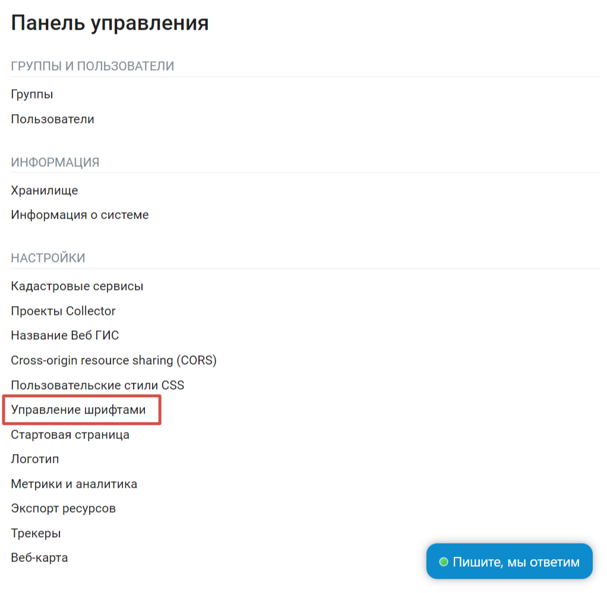
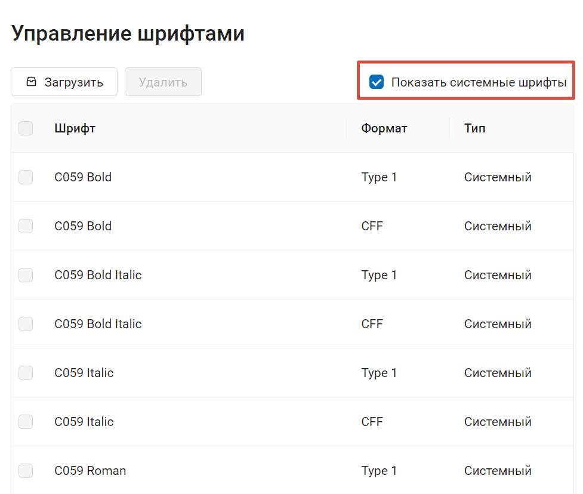
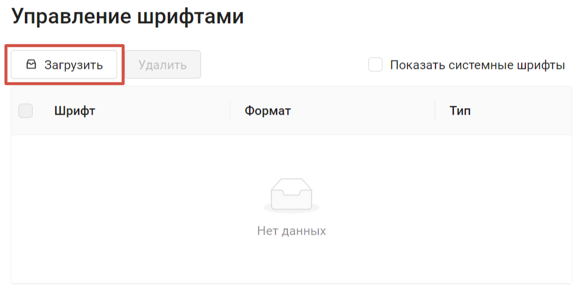
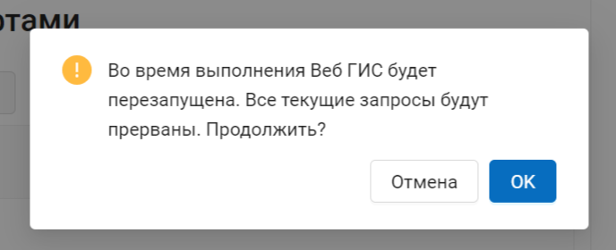
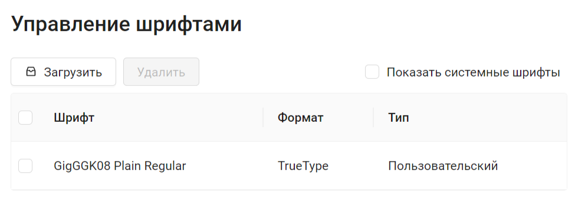
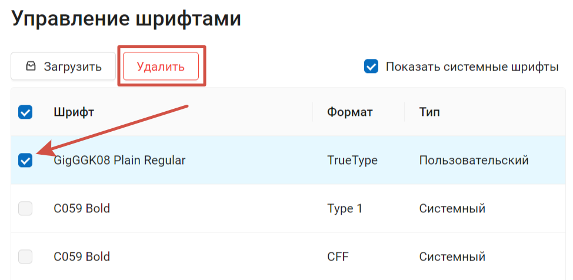

.. sectionauthor:: Юлия Григоренко <grigorenko.j@gmail.com>

.. _ngcom_fonts:

Как настроить шрифты на веб-карте
====================================

NextGIS Web позволяет добавить дополнительные шрифты, которые не представлены в системном наборе.

Управление шрифтами производится через Панель управления в подразделе Настройки.

   Управление шрифтами в Панели управления

На странице управления шрифтами вы увидите список уже добавленных пользовательских шрифтов. Если дополнительных шрифтов не установлено, то список будет пустым.

Чтобы посмотреть, какие шрифты есть в системе, поставьте галочку в поле "Показать системные шрифты".

   Отображение списка системных шрифтов

.. _ngcom_fonts_add:

Как добавить шрифт
------------------

.. important::
	Шрифт должен быть использован в качестве подписей в соответствующем QGIS стиле того слоя, к которому вы этот шрифт хотите применить. Подробнее про настройку `подписей <https://docs.nextgis.ru/docs_ngqgis/source/labeling.html>`_ в QGIS.

Пользователи могут добавить дополнительные шрифты.

Технические требования к шрифтам:

* Расширение  *.ttf или *.otf;
* Размер файла до 10MB;
* В названии только базовая латиница, цифры, нижнее подчеркивание (_) и дефис (-).

Чтобы добавить свой шрифт, на странице управления шрифтами нажмите **Загрузить** и выберите файл шрифта на устройстве.

   Загрузка пользовательского шрифта

При установке шрифта будет произведена перезагрузка Веб ГИС. Убедитесь, что не идут никакие важные процессы, при перезагрузке они будут прерваны.

   Предупреждение о перезагрузке Веб ГИС

Нажмите **Ок**, чтобы завершить процесс установки шрифта.

После успешной установки шрифт появится в списке с пометкой "Пользовательский".

   Пользовательский шрифт успешно добавлен

.. _ngcom_fonts_del:

Как удалить пользовательский шрифт
-----------------------------------

Удалить можно только загруженные пользователем шрифты.

Для того, чтобы удалить шрифт, откройте страницу Управление шрифтами через Панель управления. Поставьте галочку рядом со шрифтом, который хотите удалить.

Затем нажмите на кнопку **Удалить**. При удалении шрифта, как и при его установке, будет произведена перезагрузка Веб ГИС.

   Удаление пользовательского шрифта
