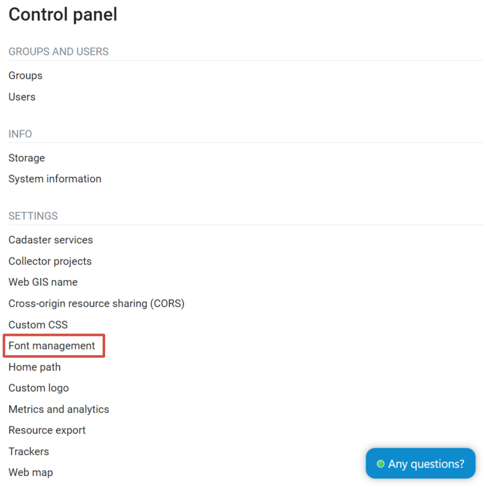
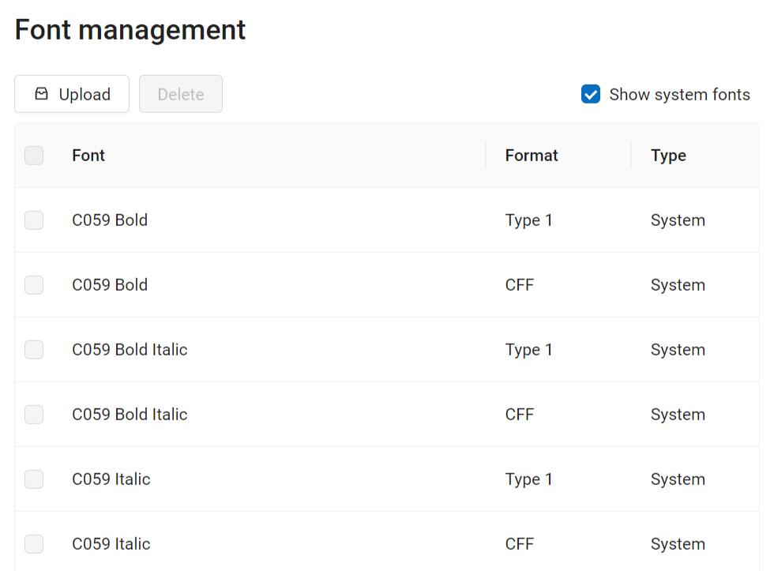
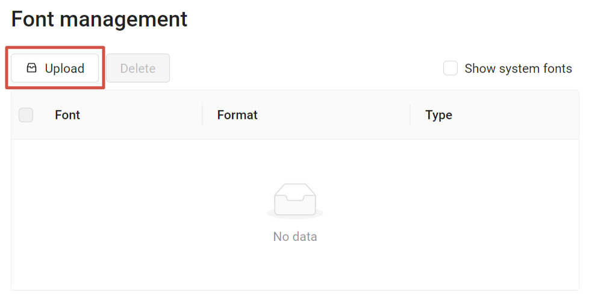
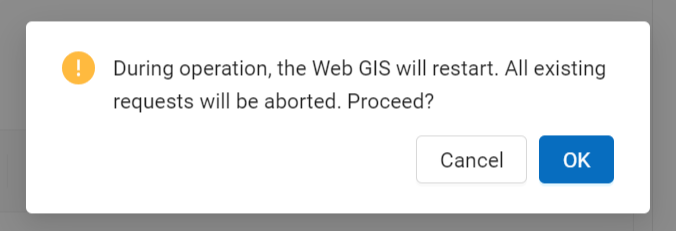
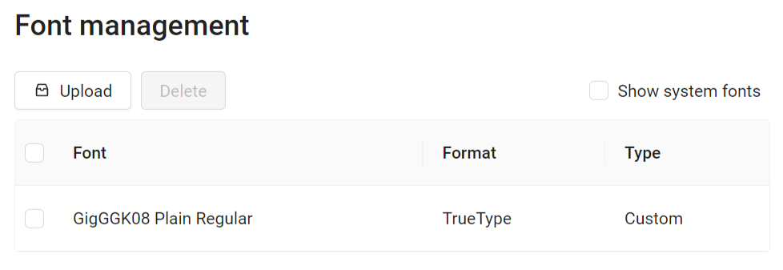
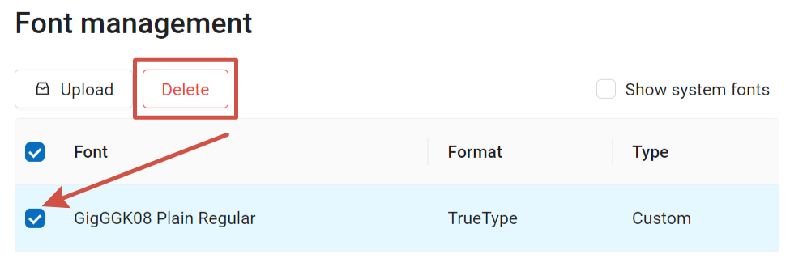

.. sectionauthor:: Юлия Григоренко <grigorenko.j@gmail.com>

.. _ngcom_fonts:

How to manage Fonts for Web Map
====================================

NestGIS Web allows to upload custom fonts in addition to system ones.

To manage fonts, go the Settings section of the Control panel.

   Font management in Control panel

Font management page has a list of custom fonts. If no additional fonts have been uploaded, the list is empty.

To view the pre-installed fonts, tick "Show system fonts".

   Viewing system fonts

.. _ngcom_fonts_add:

How to add a font
------------------

Users can add custom fonts.

Technical requirements:

*  *.ttf or *.otf format;
* File size up to 10MB;
* Filename only has basic latin characters, numbers, underscore (_) and dash (-).

To add a custom font, on the Font management page press **Upload** and select the font file from your device.

   Uploading custom font

To install the font the Web GIS needs to restart. Make sure there are no ongoing requests, restarting Web GIS aborts them.

   Web GIS restart alert

Press **Ok** to complete font uploading.

After the installation is complete, the new font will appear in the list, marked as "Custom".

   Custom font added successfully

.. _ngcom_fonts_del:

How to delete a custom font
-----------------------------------

Only custom fonts added by users can be deleted.

To delete a font, go to Font management page of the Control panel. Tick the font you'd like to delete.

Press **Delete**. While deleting a font, as while installing one, Web GIS needs to be restarted.

   Deleting custom font
