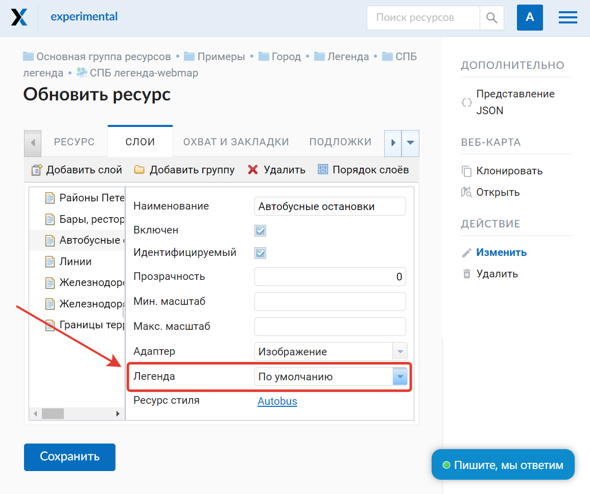
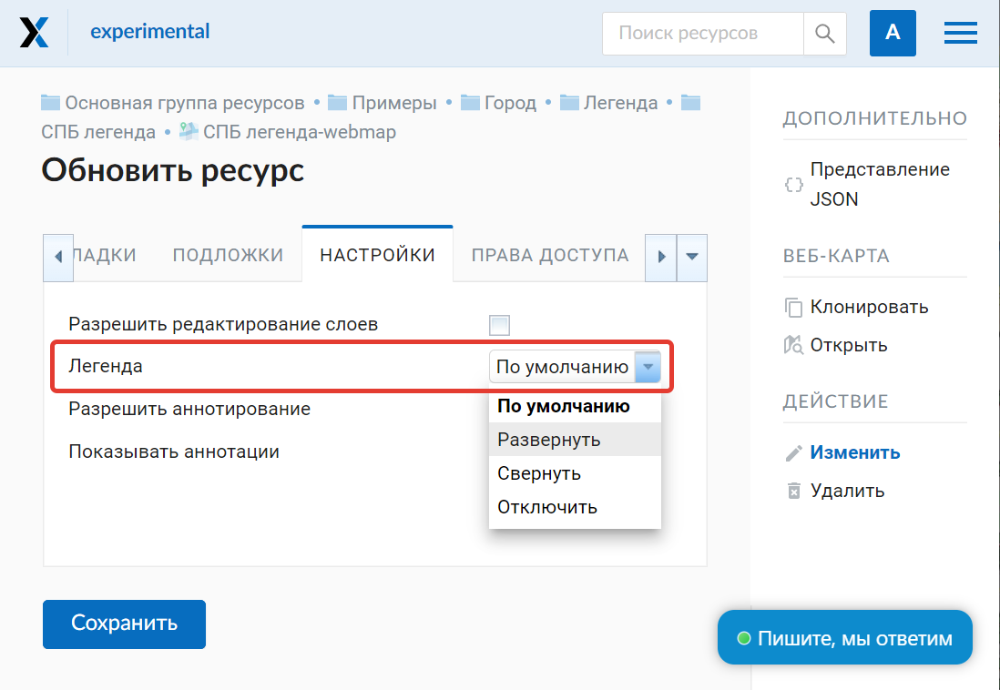
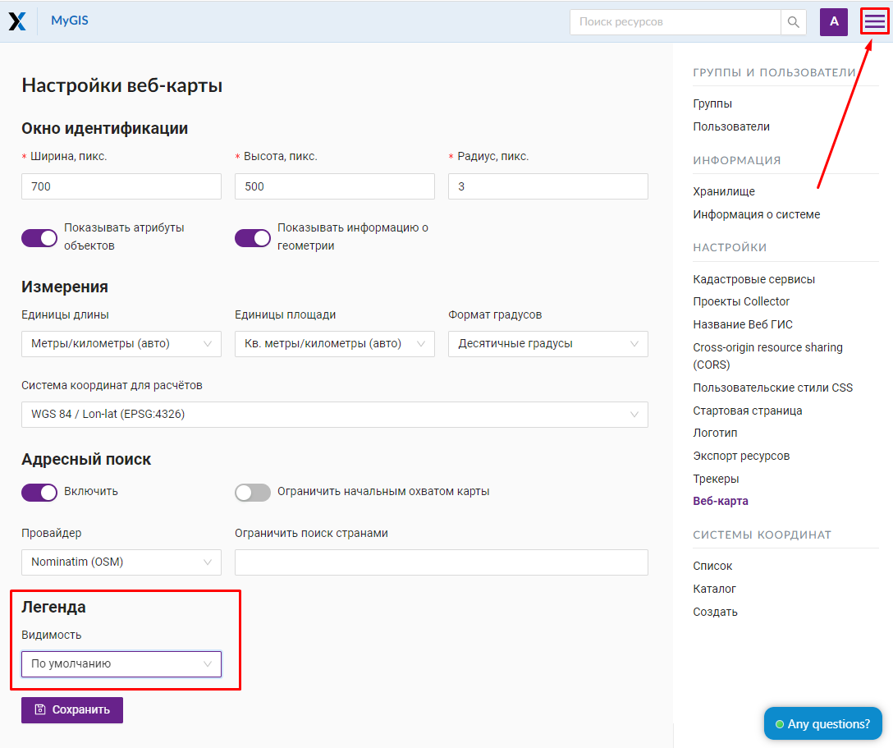
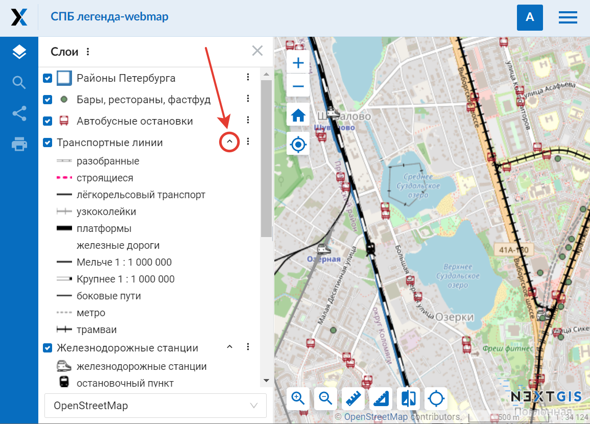
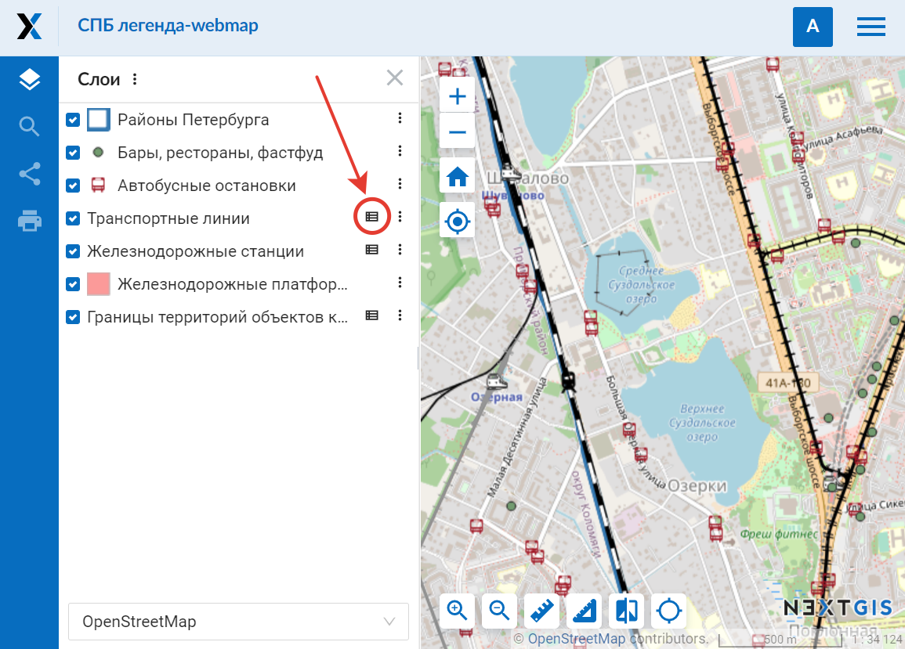
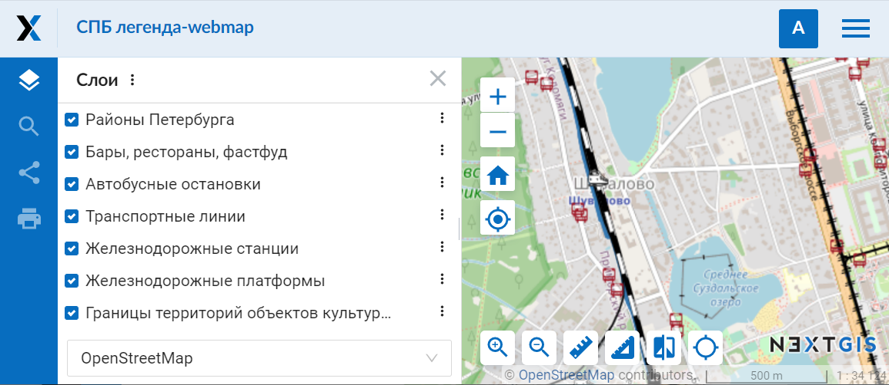
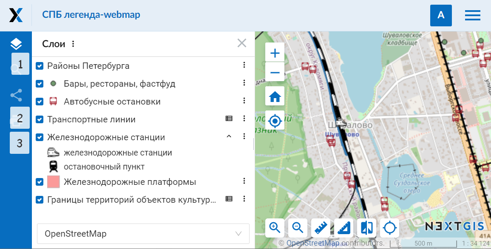

.. sectionauthor:: Юлия Григоренко <grigorenko.j@gmail.com>

.. _ngcom_webmap_legend:

Как настроить легенду
=====================

Используемые на карте условные обозначения могут нуждаться в дополнительной расшифровке. На бумажных картах и в атласах для этого используется легенда - отдельная страница атласа или врезка на карте, в которой расписано, какой знак что обозначает. 

В NextGIS Web для векторных слоёв можно добавить информацию об условных обозначениях карты двумя способами:

Включить условные обозначения в дерево слоев. Будут использованы маркеры, выбранные в стиле слоя.
Если этого не хватает, добавить расшифровку условных обозначений отдельно в `панели «описание» <https://docs.nextgis.ru/docs_ngcom/source/webmap_create.html#id4>`_ (i в кружочке).

В настройках NextGIS Web под «легендой» понимается именно отображение условных обозначений в дереве слоёв веб-карты, непосредственно под слоем.

Видимость легенды может задаваться на уровнях разных ресурсов. Таким образом вы можете эффективно решить разные задачи, от “включить легенду везде”, до “настроить легенду только на отдельной карте”. Настраивать видимость легенды можно: 

* на уровне конкретного слоя веб-карты
* на уровне всей веб-карты (все слои)
* на уровне всей Веб ГИС

На уровня слоя веб-карты видимость легенды задается в настройках веб-карты на вкладке «Слои».

   Настройка видимости легенды отдельных слоёв

Режим видимости легенды для веб-карты в целом задаётся во вкладке «Настройки»:

   
   Настройка видимости легенды для всей карты

Также можно задать значение «по умолчанию» для всей Веб ГИС: Панель управления – Веб-карта – Легенда. Выбранный здесь режим будет использоваться, если значение «по умолчанию» выставлено как для слоя, так и для веб-карты.

   
   Настройка видимости легенды для Веб ГИС в целом

Режимы видимости легенды следующие:

* Развернуть – легенда отображается в дереве слоёв, если стиль включает разные типы или цвета маркеров, то будет отображаться их полный список. Этот список можно свернуть, нажав на стрелочку рядом с меню слоя.

   
   Легенда на веб-карте показана в развёрнутом виде

* Свернуть – легенда отображается, но список условных обозначений отдельного слоя будет свёрнут при открытии карты. Чтобы развернуть его, нужно нажать на значок таблички рядом с меню слоя.

   
   Легенда на веб-карте свернута

* Отключить – легенда не отображается в дереве слоёв.

   
   Легенда отключена. Для всех слоёв отображается только название

* По умолчанию – используется более общая настройка. Для тех слоёв, для которых режим отображения легенды выбран «по умолчанию», будет использоваться настройка карты. Если и у веб-карты также стоит значение «по умолчанию» – работает общая настройка Веб ГИС.

   
   Разные режимы видимости легенды для отдельных слоёв одной карты: 1 – отключена, 2 – свёрнута, 3 – развёрнута

