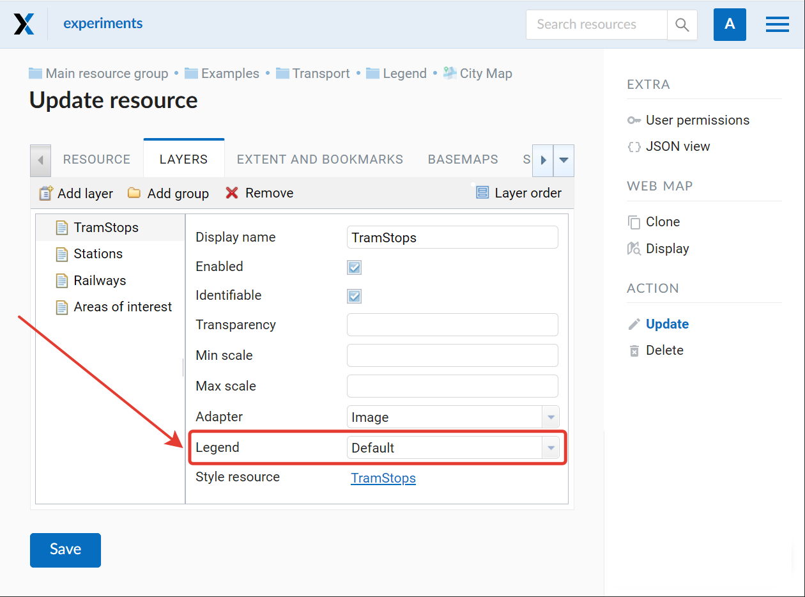
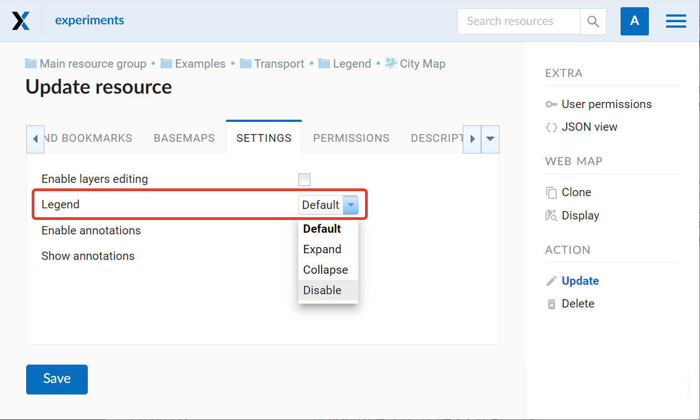
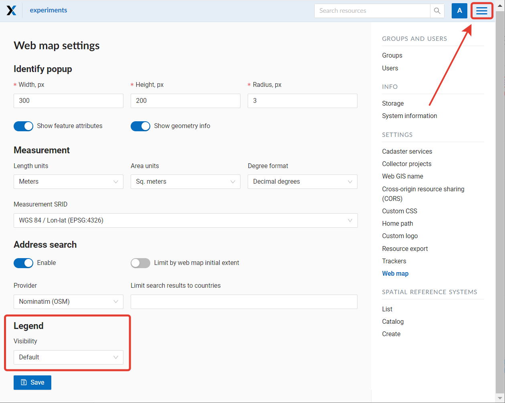
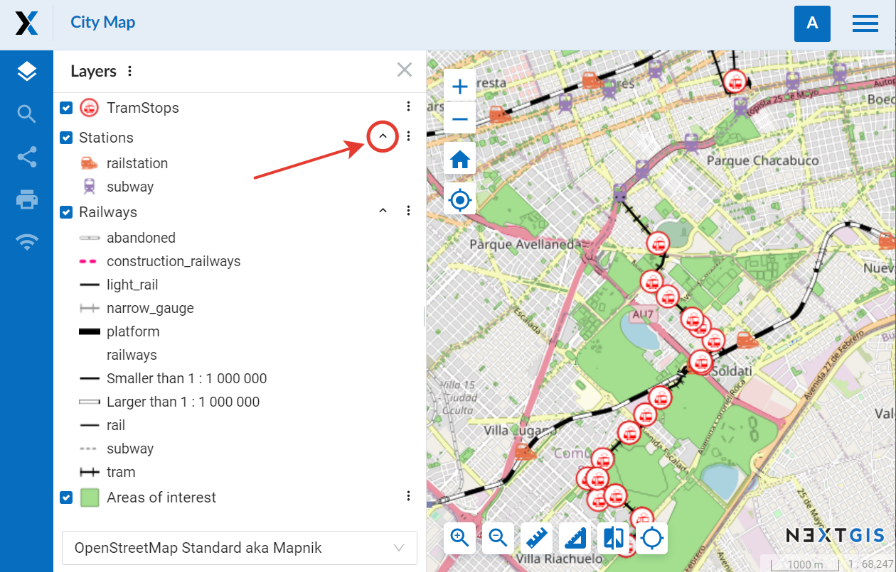
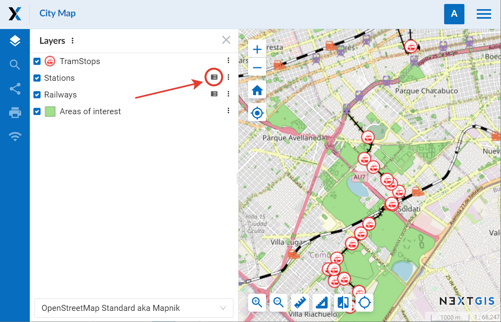
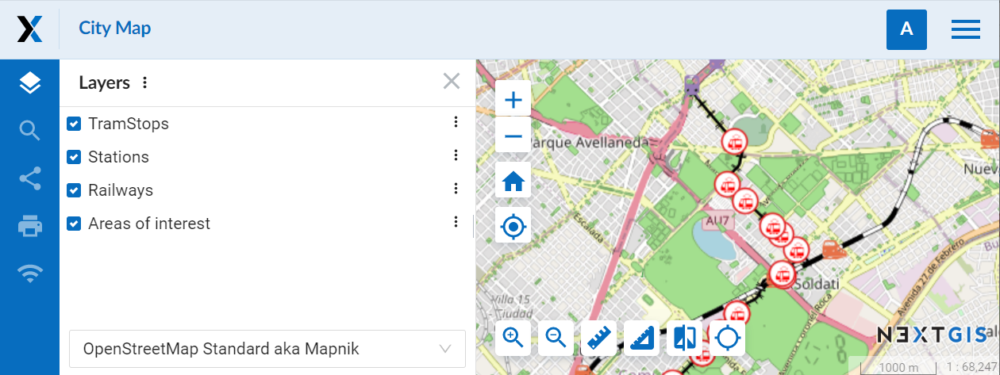
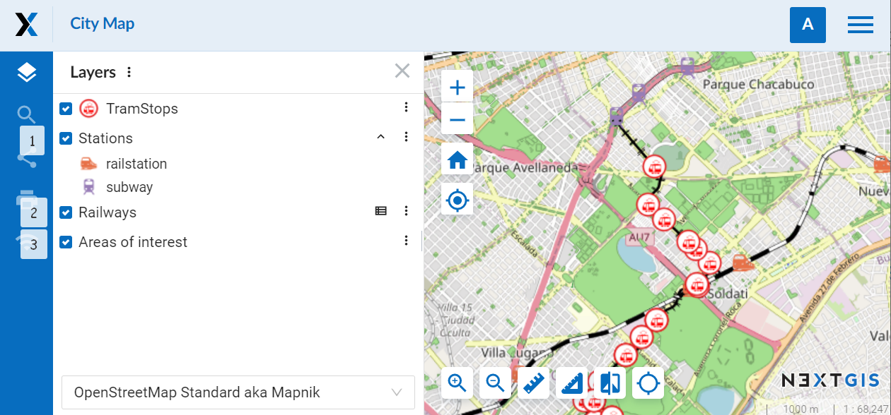

.. sectionauthor:: Юлия Григоренко <grigorenko.j@gmail.com>

.. _ngcom_webmap_legend:

How to set up legend visibility for Web Map
=============================================

Map symbols may need additional explanation. Paper maps and atlases use a separate page or an insert explaining what each symbol means. 

In NextGIS Web you have two options to display the information on symbols used in a vector layer:

Display the map symbols in the layer tree. The markers of the layer styles will be used.
In addition, you can add detailed description of the map symbols in the `Description panel <https://docs.nextgis.com/docs_ngcom/source/webmap_create.html#add-a-description-and-map-legend>`_  (i in a circle).

In NextGIS Web settings the term "legend" refers specifically to the map symbols displayed in the layer tree of the Web Map under the layer name.

Visibility settings of the legend can be modified at various levels, allowing customization for specific goals, from "display all legends" to "display the legend differently for specific layers of one Web Map". Legend visibility can be set: 

* for a layer of a Web Map
* for a Web Map (all layers)
* for the entire Web GIS

Legend visibility for a particular layer is set in the Layer tab of the Web Map settings.

   Setting legend visibility for particular layers

Legend visibility for a Web Map is set in its Settings tab.

   
   Setting legend visibility for the Web Map

You can also set default legend visibility for the Web GIS: Control panel – Web Map – Legend. This setting will be used if both Web Map and the layer have "Default" selected for legend visibility.

   
   Setting legend visibility for the entire Web GIS

Options for legend visibility are:

* Expand – the legend is displayed in the layer tree. If the style has multiple marker types or colors, a full list will be shown. * To collapse the list click on the ^ symbol next to the layer menu.

   
   Expanded legend on a Web Map

* Collapse – the legend is displayed, but the list of the map symbols for a specific layer is collapsed when the map is opened. To expand it, click on a table symbol next to the layer menu.

   
   Collapsed legend on a Web Map

* Disable – the legend is not displayed in the layer tree.

   
   Legend disabled. Only the names of the layers are displayed

* Default – the higher level setting is used. For the layers that have "default" selected for legend visibility, the setting of the Web Map will be used. If the Web Map also has "default" selected, the visibility setting selected for the Web GIS is applied.

   
   Different legend visibility settings for layers of the same Web Map: 1 – disabled, 2 – collapsed, 3 – expanded
