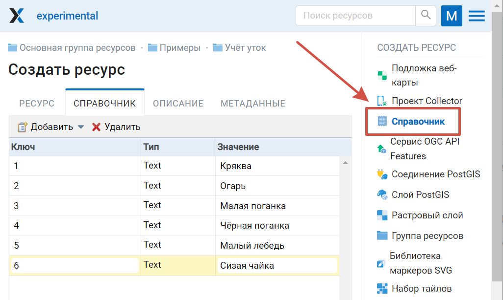
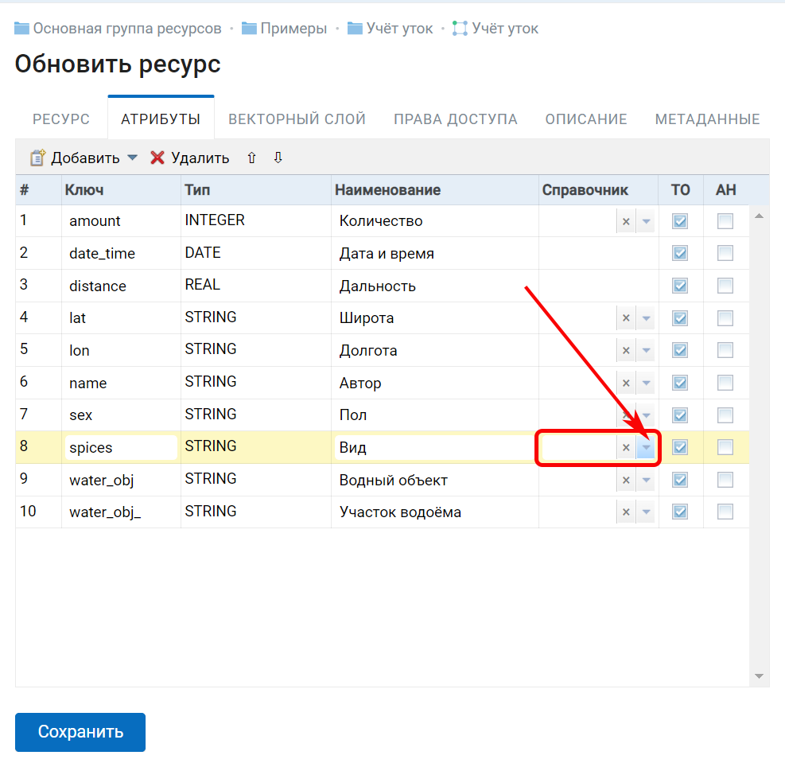
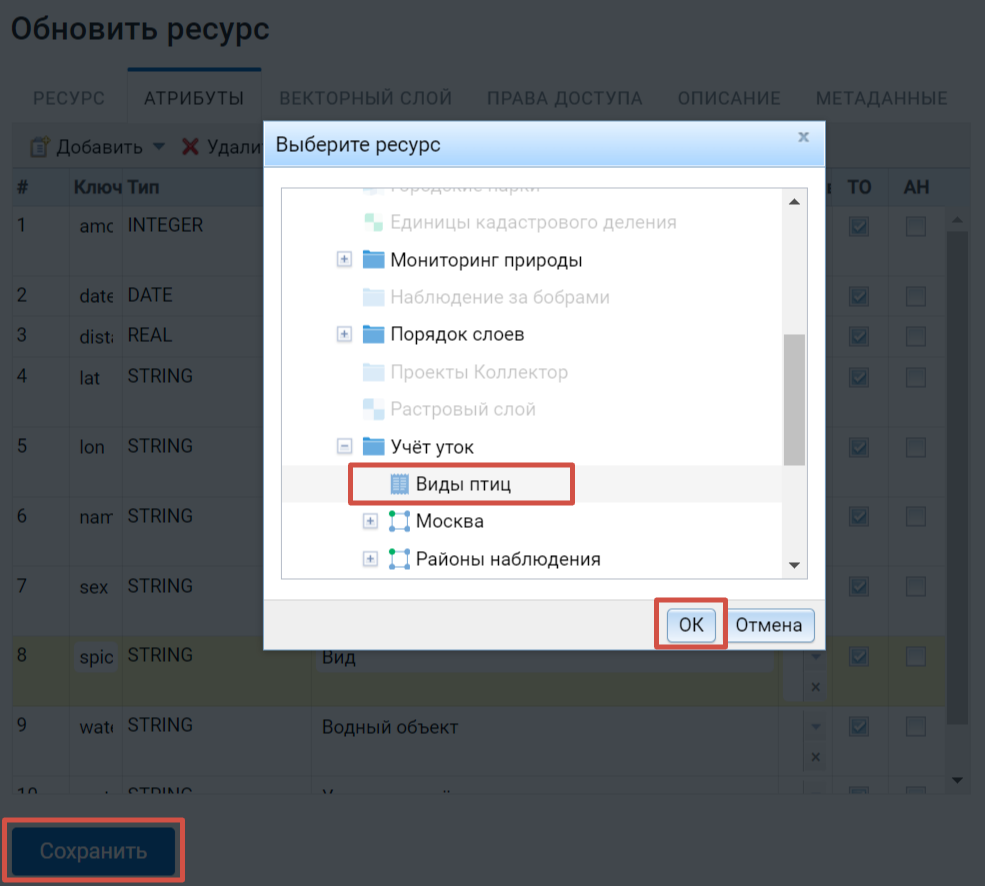
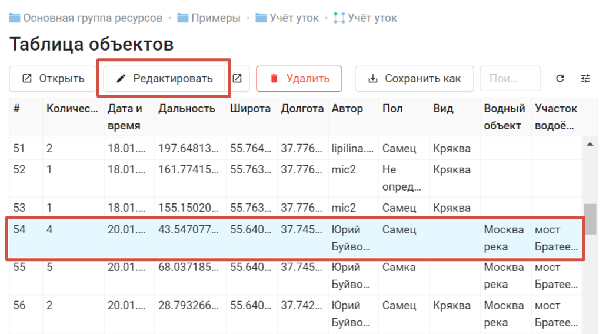
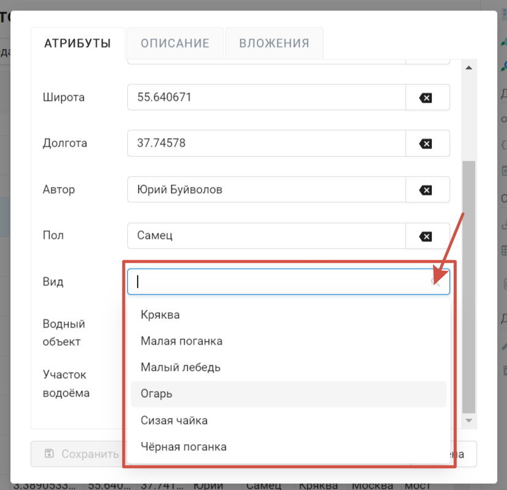
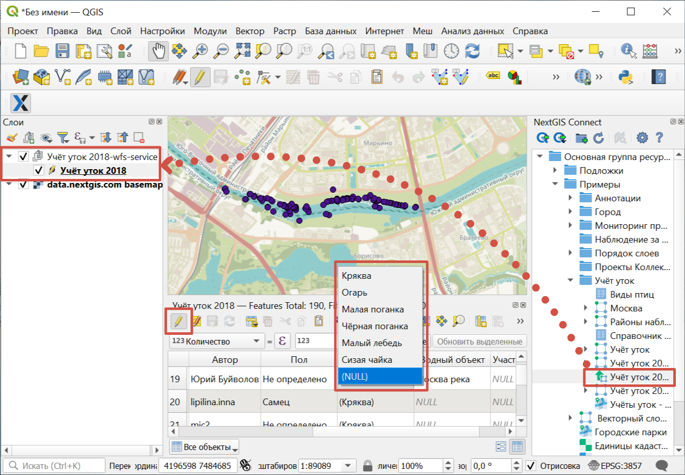

.. sectionauthor:: Юлия Григоренко <grigorenko.j@gmail.com>

.. _ngcom_lookup_table_for_layer:

Как подключить Справочник к векторному слою
================================================

К полю векторного слоя можно подключить справочник, это позволит при редактировании значений атрибутов выбирать значение из списка. 

1. Создайте справочник с нужным набором пар ключ-значение (`подробнее о создании справочника <https://docs.nextgis.ru/docs_ngweb/source/layers.html#ngw-create-lookup-table>`_).

   Создание справочника

2. Перейдите в редактирование векторного слоя. Во вкладке **Атрибуты** выберите нужную строку и нажмите на стрелку вниз в колонке *Справочник*.

   Поле справочника

3. В появившемся окне выберите созданный справочник. 

   Выбор справочника

Сохраните изменения.

Для того, чтобы **удалить** подключенный справочник, в поле, где он выбран, нажмите на кнопку с крестиком.

.. note:: 
	Пошаговая инструкция также представлена в `видео <https://youtu.be/4geb-lbE81g?si=4Dt5oOYCKomN7o0Y>`_.

.. _ngcom_lookup_table_for_layer_ngw:

Как пользоваться справочником в облаке при редактировании слоя 
--------------------------------------------------------------

Подключенный справочник можно использовать при редактировании объектов векторного слоя в облаке. Для того, чтобы выбрать значение атрибута из списка, откройте Таблицу объектов в отдельном окне или на веб-карте.

Выделите нужную строку и нажмите **Редактировать**.

   Выбор объекта для редактирования

В открывшемся окне редактирования значения справочника для поля, к которому он подключен, будут доступны в виде выпадающего меню. Выберите нужное значение и нажмите **Сохранить**.

   Выбор значения из справочника

.. _ngcom_lookup_table_for_layer_qgis:

Как пользоваться справочником в QGIS
------------------------------------

Справочники подхватываются NextGIS Connect и доступны при редактировании данных в QGIS.

1. Подключитесь к нужной веб ГИС в NextGIS Connect. 

2. Создайте сервис WFS для нужного слоя.

3. Откройте таблицу атрибутов слоя. Активируйте режим редактирования.

4. При нажатии на поле атрибута, к которому прикреплен справочник, справа будет появляться стрелочка, вызывающая выпадающее меню со значениями справочника.

   Выбор значения из справочника в QGIS
