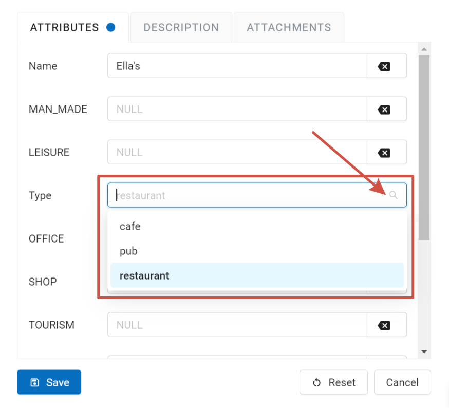

.. sectionauthor:: Юлия Григоренко <grigorenko.j@gmail.com>

.. _ngcom_lookup_table_for_layer:

How to connect a Lookup table to a vector layer
================================================

A Lookup table can be connected to an attribute field of a vector layer. While editing the layer you will be able to select the value for the attribute from a dropdown menu. 

1. Create a lookup table using key-value format (`how to do it <https://docs.nextgis.com/docs_ngweb/source/layers.html#ngw-create-lookup-table>`_).

   Creating lookup table

2. Open the Edit dialog for the vector layer. In the **Attributes** tab press the downwards arrow in the field of the *Lookup table* column corresponding to the attribute you want to connect it to.

   Lookup table field

3. In the opened dialog select the lookup table. 

   Selecting lookup table

Press **Save**.

To **delete** a connected lookup table, click on the cross next to it in the corresponding field.

.. note:: 
	See step by step tutorial in our video.

.. _ngcom_lookup_table_for_layer_ngw:

How to use a lookup table for layer editing in NextGIS Web 
--------------------------------------------------------------

A lookup table connected to a layer can be used for editing the vector layer in the web application. To select an attribute value from the list, open the Feature table on a separate tab or on a Web Map.

Select the feature and press **Edit**.

   Selecting feature to be edited

In the opened dialog the values included in the lookup table connected to the field will be available as a dropdown menu. Select the value and press **Save**.

   Selecting attribute value from a lookup table

.. _ngcom_lookup_table_for_layer_qgis:

How to use a lookup table in QGIS
------------------------------------

NextGIS Connect allows you to use lookup tables while editing layers in QGIS.

1. Connect to the Web GIS in NextGIS Connect. 

2. Create WFS service for the layer.

3. Open the attribute table of the layer. Enter the edit mode.

4. Click on the field of the attribute that has a lookup table connected to it. Then click again on the arrow at the end of the field to open the dropdown menu.

   Selecting attribute value from a lookup table in QGIS
