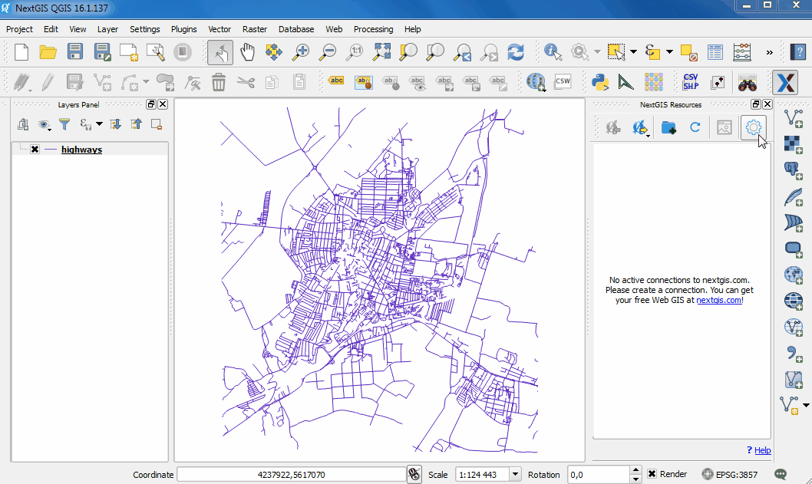
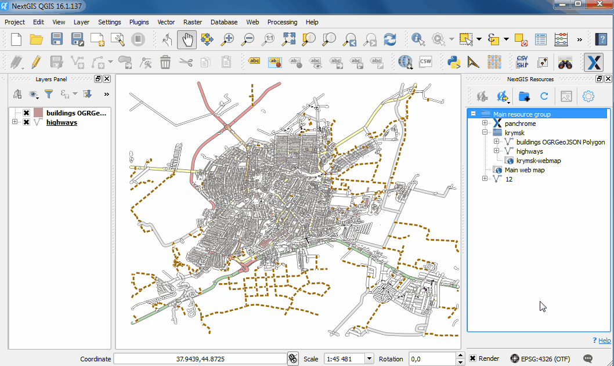
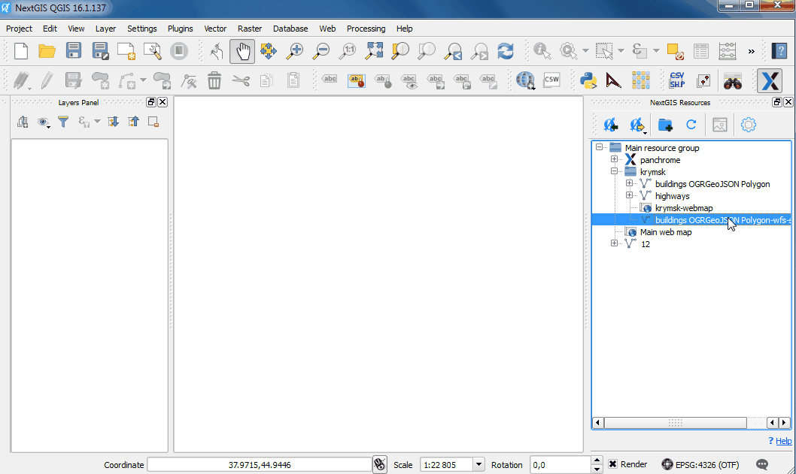
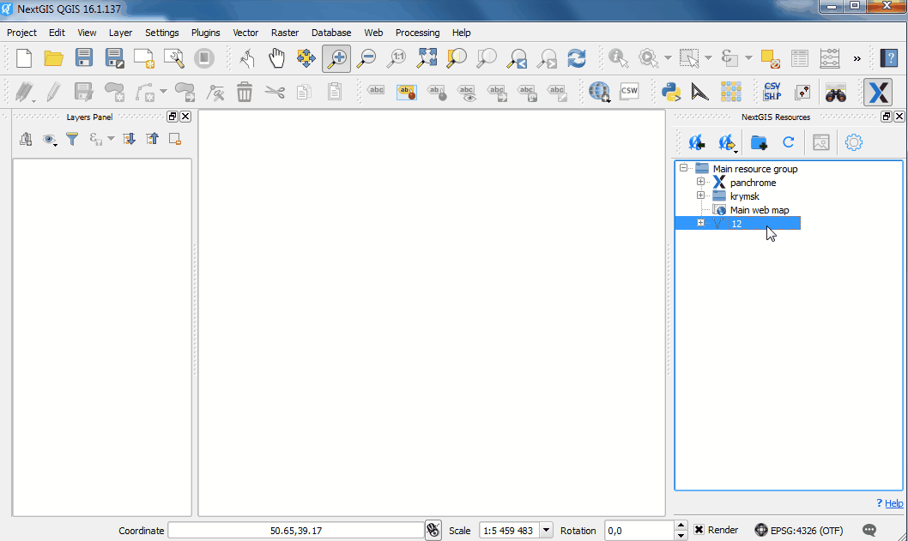

.. _ngcom_ngqgis_connect:

Как управлять данными с помощью настольного приложения NextGIS QGIS
====================================================================================================

Загружать, редактировать и совершать другие операции с геоданными в :ref:`Веб ГИС <ngcom_description>` можно не только через административный :ref:`веб-интерфейс <ngw_admin_interface>`, но и с помощью настольного приложения `NextGIS QGIS <http://nextgis.ru/nextgis-qgis/>`_.

Для удобного управления вашей Веб ГИС мы создали модуль расширения `NextGIS Connect <https://plugins.qgis.org/plugins/nextgis_connect/>`_. После успешной установки модуля в правой части экрана появится панель :guilabel:`Ресурсы NextGIS`.

NextGIS Connect позволяет обмениваться данными с несколькими различными Веб ГИС из настольного приложения. Для этого необходимо создать к ним соответствующие подключения.

.. _ngcom_ngqgis_connect_connection:

Подключение к Веб ГИС
----------------------------

Для начала работы настройте подключение к своей Веб ГИС:

* Откройте диалог :guilabel:`Настройки` на панели управления NextGIS Connect;
* Нажмите кнопку :guilabel:`Новое`;
* В открывшемся диалоговом окне заполните поля :guilabel:`URL` (например, http://examples.nextgis.com) и :guilabel:`Имя` (это имя будет отображаться в списке доступных подключений модуля). Чтобы получить возможность создавать и удалять ресурсы, снимите галочку в поле :guilabel:`Как гость` и заполните поля :guilabel:`Имя пользователя` и :guilabel:`Пароль`;

.. note:: 
   :guilabel:`Имя пользователя` и :guilabel:`Пароль` для входа в Веб ГИС высылаются на электронную почту после того, как пользователь запросил создание Веб ГИС (создание может занять время). Письмо высылается на email, указанный при регистрации на сайте `my.nextgis.com <https://my.nextgis.com/>`_. Имя пользователя и пароль также может назначать администратор Веб ГИС через панель управления.
   
* Нажмите кнопку :guilabel:`Ок`. Если подключение создалось успешно, то в окне модуля появится дерево ресурсов вашей Веб ГИС.

.. _ngcom_ngqgis_connect_data_upload:

Создание и загрузка данных
------------------------------------------------

Загрузка векторных данных
~~~~~~~~~~~~~~~~~~~~~~~~~~~~~~~~~~~~~~~~~

Модуль NextGIS Connect позволяет быстро загружать в Веб ГИС растровые и векторные данные, а также целиком проекты QGIS. Это позволит вам легко опубликовать в интернете свои карты и геоданные.

.. warning:: 
   Вы можете избежать :ref:`ограничений по форматам данных <ngcom_vector_layer>` при загрузке векторных данных в Веб ГИС через NextGIS Connect, применив опции "Переименовывать запрещенные поля" и "Исправлять некорректные геометрии" в диалоге :guilabel:`Настройки`.

* Создайте в QGIS "с нуля" или добавьте из файлов векторные слои :term:`ESRI Shape`, :term:`GeoJSON` или :term:`CSV`. Настройте стили их отображения;
* Выберите в дереве ресурсов Веб ГИС в окне модуля NextGIS Connect :ref:`Группу ресурсов <ngcom_resources_group>`, в которую вы хотите загрузить данные;
* Выберите в панели слоев QGIS векторный слой, который вы хотите загрузить в Веб ГИС;
* Нажмите кнопку :guilabel:`Импортировать выбранный слой` на панели инструментов модуля или выберите :menuselection:`NextGIS Connect --> Импортировать выбранный слой` в контекстном меню слоя;
* Если данные загрузились успешно, то в соответствующей Группе ресурсов появится новый :ref:`Векторный слой <ngcom_data_upload>`, внутри которого будет создан :ref:`Стиль QGIS <ngcom_styles>` с заданными настройками стиля.

Загрузка растровых данных
~~~~~~~~~~~~~~~~~~~~~~~~~~~~~~~~~~~~~~~~~~

* Добавьте в QGIS из файлов растровые слои :term:`GeoTIFF`;
* Выберите в дереве ресурсов Веб ГИС в окне модуля NextGIS Connect Группу ресурсов, в которую вы хотите загрузить данные;
* Выберите в панели слоев QGIS растровый слой, который вы хотите загрузить в Веб ГИС;
* Нажмите кнопку :guilabel:`Импортировать выбранный слой` на панели инструментов модуля или выберите :menuselection:`NextGIS Connect --> Импортировать выбранный слой` в контекстном меню слоя;
* Если данные загрузились успешно, то в соответствующей Группе ресурсов появится новый :ref:`Растровый слой <ngcom_data_upload>`, внутри которого будет создан :ref:`Растровый стиль <ngcom_styles>` с настройками стиля по умолчанию.

Загрузка проекта QGIS целиком
~~~~~~~~~~~~~~~~~~~~~~~~~~~~~~~~~~~~~~~~~~~~~

* Соберите в QGIS проект из растровых и векторных слоев. Настройте их стили отображения, иерархию, группировку, видимость. Настройте экстент карты;
* Выберите в дереве ресурсов Веб ГИС в окне модуля NextGIS Connect Группу ресурсов, в которую вы хотите загрузить проект;
* Нажмите кнопку :guilabel:`Импортировать текущий проект` на панели инструментов модуля или выберите :menuselection:`NextGIS Connect --> Импортировать текущий проект` в контекстном меню любого слоя;
* В открывшемся диалоговом окне укажите название новой Группы ресурсов, в которую будет загружен проект;
* Если проект загрузился успешно, то в соответствующей Группе ресурсов появится новая Группа ресурсов с заданным названием, внутри которой будут находиться: 1) все Растровые и Векторные слои, для которых доступна операция :guilabel:`Импортировать выбранный слой`, а также их Стили; 2) :ref:`Веб-карта <ngcom_webmap_create>` с заданным экстентом, на которую будут добавлены все импортированные слои с учетом их группировки, иерархии и видимости в панели слоёв QGIS.

.. note:: 
	Быстро перейти к Веб-карте можно, нажав кнопку :guilabel:`Открыть карту в браузере` на панели инструментов модуля или выполнив команду :guilabel:`Открыть карту в браузере` в контекстном меню Веб-карты.

.. figure:: _static/NGConnect_project_import.gif
   :name: NGConnect_project_import
   :align: center
   :width: 850px

.. _ngcom_ngqgis_connect_wfs_service:

Создание Сервисов WFS
--------------------------------------------------------------

Модуль NextGIS Connect позволяет быстро публиковать Векторные слои Веб ГИС по стандартному протоколу :term:`WFS`. 

Для этого в модуле доступна операция быстрого создания :ref:`Сервиса WFS <ngcom_wfs_service>`:

* В NextGIS QGIS, в модуле Модуль NextGIS Connect, выберите в NextGIS QGISдереве ресурсов Веб ГИС в окне модуля NextGIS Connect Векторный слой, который вы хотите опубликовать по протоколу WFS;
* Выберите пункт :guilabel:`Создать сервис WFS` в контекстном меню слоя;
* В открывшемся диалоговом окне укажите число объектов слоя, которое должен публиковать Сервис WFS, изменив значение поля :guilabel:`Количество объектов слоя, возвращаемых по умолчанию`;
* Если Сервис WFS создался успешно, то в соответствующей Группе ресурсов появится новый Сервис WFS, в который уже подключен ваш Векторный слой.

.. note:: 
	Отредактировать настройки созданного таким образом Сервиса WFS (включая его название, публикуемые слои и их настройки) можно через веб-интерфейс Веб ГИС.

.. _ngcom_ngqgis_connect_data_edit:

Редактирование данных
---------------------------------------------------------------

Модуль NextGIS Connect позволяет быстро редактировать геометрии и атрибуты объектов в Векторных слоях Веб ГИС. Это возможно благодаря использованию стандартного протокола :term:`WFS` (с поддержкой редактирования):

* :ref:`Опубликуйте по протоколу WFS <ngcom_ngqgis_connect_wfs_service>` Векторный слой, объекты которого вы хотите отредактировать;
* Выберите в дереве ресурсов Веб ГИС в окне модуля NextGIS Connect соответствующий WFS сервис;
* Нажмите кнопку :guilabel:`Добавить в QGIS` на панели инструментов модуля или выберите пункт :guilabel:`Добавить в QGIS` в контекстном меню сервиса;
* Если операция прошла успешно, то в панели слоев QGIS появится новая группа слоев WFS, опубликованных с помощью добавленного WFS сервиса;
* Отредактируйте геометрии и атрибуты объектов в добавленном слое WFS с помощью :ref:`стандартных инструментов QGIS <ngqgis_editing>`;
* Если редактирование объектов прошло успешно, то соответствующие изменения сразу же будут отображены в Веб ГИС в :ref:`Таблице объектов <ngw_feature_table>` и :ref:`веб-клиенте <ngw_webmaps_client>` Веб-карты.

.. _ngcom_ngqgis_connect_data_export:

Экспорт данных
--------------------------------------------------------

Модуль NextGIS Connect позволяет быстро экспортировать векторные данные из Веб ГИС в NextGIS QGIS для их последующей обработки, анализа, выгрузки и иных операций.

Для этого в модуле доступна операция быстрого создания векторных слоев GeoJSON в QGIS с использованием данных Векторных слоев Веб ГИС:

* Выберите в дереве ресурсов Веб ГИС в окне модуля NextGIS Connect Векторный слой, который вы хотите экспортировать в QGIS;
* Нажмите кнопку :guilabel:`Добавить в QGIS` на панели инструментов модуля или выберите пункт :guilabel:`Добавить в QGIS` в контекстном меню слоя;
* Если слой экспортировался успешно, то в панели слоев QGIS появится новый векторный слой GeoJSON, который можно использовать в текущих проектах или сохранить на устройство в нужном формате.

.. note:: 
	Поддерживается экспорт геометрий и атрибутов объектов. Стили слоев, описания, метаданные и изображения объектов вышеописанным способом не экспортируются.

.. _ngcom_ngqgis_connect_resource_group:

Создание Групп ресурсов
-------------------------------------------------------------------

Модуль NextGIS Connect позволяет быстро создавать новые Группы ресурсов в Веб ГИС. Для этого:

* Выберите в дереве ресурсов Веб ГИС в окне модуля NextGIS Connect Группу ресурсов, в которой вы хотите создать новую Группу;
* Нажмите кнопку :guilabel:`Создать новую группу ресурсов` на панели инструментов модуля или выберите пункт :guilabel:`Создать новую группу` в контекстном меню;
* В открывшемся диалоговом окне укажите имя новой Группы ресурсов;
* Если Группа ресурсов создалась успешно, то она появится в дереве ресурсов Веб ГИС.

.. _ngcom_ngqgis_connect_resource_delete:

Удаление ресурсов
--------------------------------------------------------

Модуль NextGIS Connect позволяет быстро создавать / удалять любые ресурсы из Веб ГИС. Для этого:

* Выберите в дереве ресурсов Веб ГИС в окне модуля NextGIS Connect ресурс, который вы хотите удалить;
* Выберите пункт :guilabel:`Удалить` в контекстном меню;
* Если ресурс удалился успешно, то он исчезнет из дерева ресурсов Веб ГИС.

Больше информации о модуле расширения NextGIS Connect - :ref:`здесь <ng_connect>`. 

