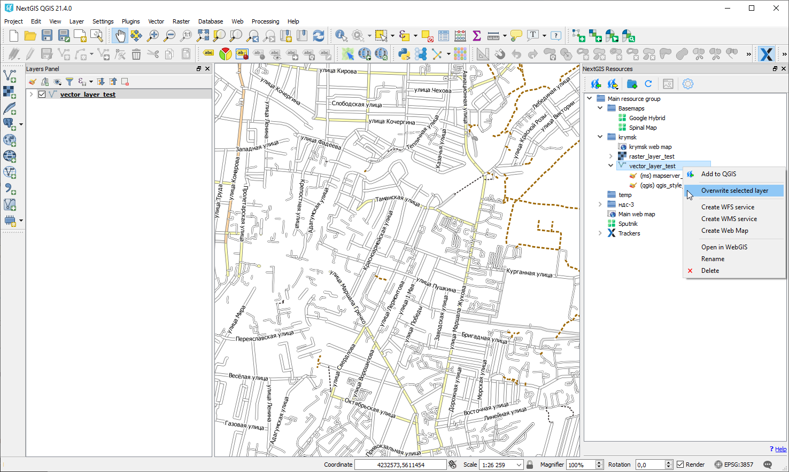

.. _ngcom_ngqgis_connect:

How to manage data with desktop app NextGIS QGIS
================================================

You can upload, edit and perform other operations with geodata in your :ref:`Web GIS <ngcom_description>` not only in :ref:`admin console <ngw_admin_interface>` but also with desktop app `NextGIS QGIS <https://nextgis.com/nextgis-qgis/>`_.

To make it super-easy we've created `NextGIS Connect <https://plugins.qgis.org/plugins/nextgis_connect/>`_ plugin. In `NextGIS QGIS <https://nextgis.com/nextgis-qgis/>`_ it is installed by default. If necessary, you can update the module through the menu **Modules** -> **Manage Modules** -> **NextGIS Connect**.
After successfull installation you'll see **NextGIS Connect** panel on the right side of the screen.

.. _ngcom_ngqgis_connect_connection:

Establishing Web GIS connection
-------------------------------

После успешной установки модуля в правой части экрана появится панель :guilabel:`NextGIS Connect`.

First you need to establish a connection to your Web GIS:

* Open *Settings* dialog from NextGIS Connect control panel;
* Press **New** button;
* In the opened dialog window fill in fields **URL** (for example, https://examples.nextgis.com) and **Name** (this name will be used in a list of available connections). In order to be able to create and delete resources uncheck a checkbox *As guest* and fill in fields **User name** and **Password**;

.. note:: 
   :guilabel:`User name` and :guilabel:`Password` to access your Web GIS are sent by email after you requested to create it (might take time). Email that you provided at `my.nextgis.com <https://my.nextgis.com/>`_ is used. User name and password can also be assigned later by Web GIS administrator through its Control panel.

* Press :guilabel:`Ок` button and close dialog wndow. If the connection is established successfully you'll see your Web GIS resources tree in the plugin window.

.. figure:: _static/NGConnect_connection.gif
   :name: NG_Connect_connection
   :align: center
   :width: 850px

.. _ngcom_ngqgis_connect_data_upload:

Creating and uploading data
---------------------------

NextGIS Connect plugin enables a fast upload of raster and vector data and whole QGIS projects to Web GIS. You'll be able to publish your maps and geodata online very quick and easy.

.. _vector_data:

Uploading vector data
~~~~~~~~~~~~~~~~~~~~~

.. warning:: 
   You can avoid :ref:`data format limitations <ngcom_vector_layer>` when uploading vector data to Web GIS through NextGIS Connect by switching on options "Rename forbidden fields" and "Fix incorrect geometries" in *Settings* dialog.

* Create in QGIS from scratch or upload from :term:`ESRI Shape`, :term:`GeoJSON` or :term:`CSV` files vector layers. Tailor their styles;
* Select in NextGIS Connect Resources panel :ref:`Resource group <ngcom_resources_group>` to which you want to upload your data;
* Select in QGIS Layers panel a vector layer which you want to upload to Web GIS;
* Press **Import selected layer** button on NextGIS Connect control panel or select **NextGIS Connect --> Import selected layer** in layer context menu;
* If data is uploaded successfully you'll see in the relevant Resource group a new :ref:`Vector layer <ngcom_data_upload>` with :ref:`QGIS style <ngcom_styles>` tailored by you.

.. _raster_data:

Uploading raster data
~~~~~~~~~~~~~~~~~~~~~

* Add raster layers to QGIS from :term:`GeoTIFF` files;
* Select in NextGIS Connect Resources panel Resource group to which you want to upload your data;
* Select in QGIS Layers panel a raster layer which you want to upload to Web GIS;
* Press **Import selected layer** button on NextGIS Connect control panel or select **NextGIS Connect --> Import selected layer** in layer context menu;
* If data is uploaded successfully you'll see in the relevant Resource group a new :ref:`Raster layer <ngcom_data_upload>` with default :ref:`Raster style <ngcom_styles>`.

.. _basemaps:

Uploading basemaps
~~~~~~~~~~~~~~~~~~

* Add basemaps to QGIS via TMS;
* Select in NextGIS Connect Resources panel Resource group to which you want to add your basemap;
* Select in QGIS Layers panel a basemap which you want to upload to Web GIS;
* Press **Import selected layer** button on NextGIS Connect control panel or select **NextGIS Connect --> Import selected layer** in layer context menu;
* If a basemap is uploaded successfully you'll see it the relevant Resource group.

You need to be on **Mini** or **Premium** to work with basemaps.

.. _qgis_project:

Creating and uploading a whole QGIS project
~~~~~~~~~~~~~~~~~~~~~~~~~~~~~~~~~~~~~~~~~~~

* Create a QGIS project with raster and vector layers. Tailor their styles, group them, set their hierarchy and visibility settings. Set the map extent;
* Select in NextGIS Connect panel :ref:`Resource group <ngcom_resources_group>` to which you want to upload the project;
* Press **Import current project** button on NextGIS Connect control panel or select **NextGIS Connect** --> **Import current project** in any layer context menu;
* In the opened dialog window fill in the name of the new Resource group to which the project will be imported;
* If the project is uploaded successfully you'll see in a selected Resource group a newly created group with: 1) all Raster and Vector layers to which **Import selected layer** operation is applicable, and their Styles; 2) :ref:`Web map <ngcom_webmap_create>` with a set extent, to which all the imported layers are added with groups, hierarchy and visibility settings similar to QGIS.

.. note:: 
	The fastest way to go to the newly created Web map is by pressing **Open map in browser** button on NextGIS Connect control panel or select **Open map in browser** in map's context layer.

.. figure:: _static/NGConnect_project_import.gif
   :name: NGConnect_project_import
   :align: center
   :width: 850px

.. _ngcom_ngqgis_connect_services:

Creating WFS and WFS services
---------------------------

NextGIS Connect module allows you to quickly publish Vector layers to Web GIS using standard protocols :term:`WFS` and :term:` WMS`.

.. _create_wfs_service:

Creating WFS services
~~~~~~~~~~~~~~~~~~~~~

NextGIS Connect plugin enables a fast publication of Vector layers from your Web GIS using standard :term:`WFS` protocol. 

It's possible due to the quick creation of :ref:`WFS service <ngcom_wfs_service>` option in NextGIS Connect:

* Select in NextGIS Connect Resources panel Vector layer which you want to publish using WFS protocol;
* Select **Create WFS service** in layer context menu;
* In the opened dialog window set the number of layer's features to be published via WFS service by changing the value of the field **The number of objects returned by default**;
* If WFS service is created successfully you'll see it in the relevant Resource group. The Vector layer is already connected to it.

.. note:: 
	You can edit settings of WFS service (including its name, published layers and their settings) in Web GIS admin console.

.. figure:: _static/NGConnect_wfs_service.gif
   :name: NGConnect_wfs_service
   :align: center
   :width: 850px

.. _create_wms_service:

Creating WMS services
~~~~~~~~~~~~~~~~~~~~~

To do this the module provides a quick creation operation :ref:`WMS service <ngcom_wms_service>`:

* In the desktop application (NextGIS QGIS) in the resource Web GIS tree of module NextGIS Connect select **Vector layer** that you want to publish via the WMS protocol;
* Select **Create WMS Service** in the context menu of the layer;
* In the dialog that opens select a layer style for publishing the WMS Service;
* If the WFS Service has been created successfully, then a new WMS Service will appear in the corresponding Resource Group, to which your Vector Layer is already connected.

.. _ngcom_ngqgis_connect_data_edit:

Editing data
------------

NextGIS Connect plugin enables an easy editing of geometries and attributes of Vector layers features. 

It's possible due to the use of standard :term:`WFS` protocol (with feature edit support):

* :ref:`Publish via WFS protocol <ngcom_ngqgis_connect_wfs_service>` Vector layer which features you're going to edit;
* Select in NextGIS Connect Resources panel the relevant WFS service;
* Press **Add to QGIS** button on NextGIS Connect control panel or select **Add to QGIS** in service context menu;
* If operation is successful you'll see in QGIS Layers panel a new group of WFS layers published via selected WFS service;
* Edit features' geometries and attributes in added WFS layers using standard QGIS tools;
* If editing went successful you'll be able to see the changes at once in Web GIS :ref:`Feature table <ngw_feature_table>` and Web map :ref:`web client <ngw_webmaps_client>`.

.. figure:: _static/NGConnect_data_edit.gif
   :name: NGConnect_data_edit
   :align: center
   :width: 850px

.. _ngcom_ngqgis_connect_data_overwrite:

Updating data
-------------

NextGIS Connect allows you to update the content of an existing Web GIS vector layer keeping its styles, attribute aliases and other settings.

.. warning:: 
   All target layer data including attachments (photos or documens) will be cleared. If you need to save them - update via WFS instead.

To update (overwrite) layer's data:

* Select a vector layer in QGIS Layers panel contents of which you need to send to a vector layer in Web GIS;
* Select a vector layer in NextGIS Connect panel contents of which you need to overwrite;
* Right click on the last layer and choose **Overwrite selected layer**.

Layer resource identifier will also be kept. Overwrite assumes that both layers structures are the same.

.. _ngcom_ngqgis_connect_style_overwrite:

Updating style
--------------

* Add layer to NextGIS QGIS via Connect
* Change the style of the layer (color, line width, etc.)
* Next select **Import/Update style**, highlighting the **style** of the desired resource in the right pane

After these operations, the NextGIS Connect module will remove the old style of the layer from the Web GIS and load the new one leaving all attachments intact.

.. _ngcom_ngqgis_connect_data_export:

Exporting data
--------------------------------------------------------

NextGIS Connect plugin enables a fast export of vector data from Web GIS to QGIS for further processing, analysis, saving in different formats and other data operations.

It's possible due to the option of fast creation of GeoJSON vector layers in QGIS using vector data from Web GIS:

* Select in NextGIS Connect Resources panel Vector layer which you want to export to QGIS;
* Press **Add to QGIS** button on NextGIS Connect control panel or select **Add to QGIS** in layer context menu;
* If the layer is exported successfully you'll see in QGIS Layers panel a new GeoJSON vector layer which you can use in your projects or save to your device in a required format.

.. note:: 
	Geometry and attributes data export is supported. Styles, descriptions, metadata and images of the objects can't be exported in the described way.

.. figure:: _static/NGConnect_data_export.gif
   :name: NGConnect_data_export
   :align: center
   :width: 850px

.. _ngcom_ngqgis_connect_resource_group:

Creating Resource groups
-------------------------------------------------------------------

NextGIS Connect plugin enables a fast creation of Resource groups in Web GIS. For that:

* Select in NextGIS Connect Resources panel Resource group where you want to create a new Group;
* Press **Create new group** button on NextGIS Connect control panel or select **Create new group** in group context menu;
* In the opened dialog window fill in the name of the new Resource group;
* If Resource group is created successfully you'll see it in the Web GIS resources tree in the plugin window.

.. _ngcom_ngqgis_connect_resource_delete:

Deleting resources
--------------------------------------------------------

NextGIS Connect plugin enables a fast deletion of any resources from Web GIS. For that:

* Select in NextGIS Connect Resources panel a resource you want to delete;
* Select **Delete** in resource context menu;
* If resource is deleted successfully it will disappear from Web GIS resources tree in the plugin window.

:ref:`More info <ng_connect>` about NextGIS Connect.
