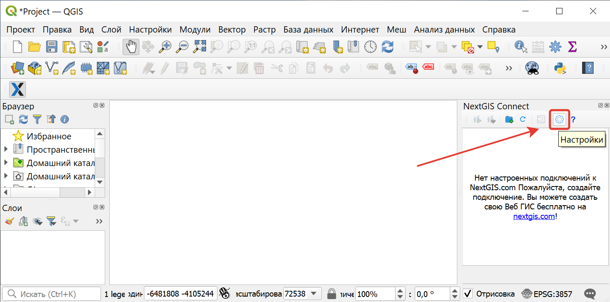
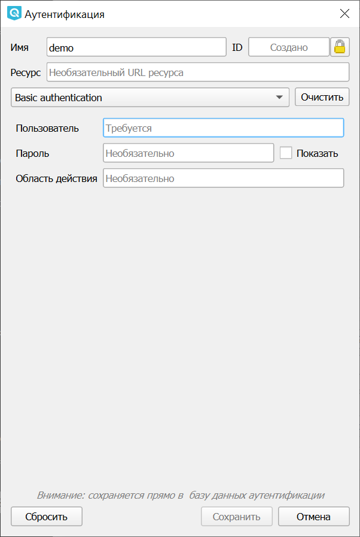

.. _ngcom_ngqgis_connect:

Как управлять данными с помощью настольного приложения QGIS
===================================================================

Загружать, редактировать и совершать другие операции с геоданными в :ref:`Веб ГИС <ngcom_description>` можно не только через административный :ref:`веб-интерфейс <ngw_admin_interface>`, но и с помощью настольного приложения QGIS. 

.. note::
   Также вы можете использовать `NextGIS QGIS <http://nextgis.ru/nextgis-qgis/>`_.

Для удобного управления вашей Веб ГИС мы создали модуль расширения `NextGIS Connect <https://plugins.qgis.org/plugins/nextgis_connect/>`_. Обновить модуль можно через меню **Модули** -> **Управление модулями** -> **NextGIS Connect**.

NextGIS Connect позволяет обмениваться данными с множеством Веб ГИС из настольного приложения. Для этого необходимо создать к ним соответствующие подключения.

.. _ngcom_ngqgis_connect_connection:

Подключение к Веб ГИС
---------------------

После успешной установки модуля в правой части экрана появится панель :guilabel:`NextGIS Connect`.

Для начала работы **создайте подключение** к своей Веб ГИС:

* Откройте диалог **Настройки** (шестренка) на панели управления NextGIS Connect;

   
   Вызов настроек из панели NextGIS Connect

* Нажмите кнопку **Новое**;

* В открывшемся диалоговом окне заполните поля **URL** (веб-адрес вашей Веб ГИС, например, - https://examples.nextgis.com) и **Название** (будет отображаться в списке доступных подключений). 

.. figure:: _static/create_connection_ru.png
   :name: NGconnection_create_pic
   :align: center
   :width: 20cm
   
   Создание нового подключения

.. note:: 
   Создавать и удалять ресурсы Веб ГИС может ее владелец и пользователи, добавленные в `команду <https://docs.nextgis.ru/docs_ngcom/source/create.html#ngcom-team-management>`_.

* Чтобы получить возможность создавать и удалять ресурсы, в разделе *Аутентификация* в выпадающем меню выберите конфигурацию аутентификации (в списке отражается название соединения и имя пользователя, а также тип аутентификации) или создайте новую.

Для того, чтобы добавить новую конфигурацию, нажмите кнопку с зеленым плюсом. Откроется диалоговое окно «Аутентификация».

   
   Добавление конфигурации аутентификации

1. Введите произвольное название конфигурации в поле *Имя*;
2. Выберите Basic-аутентификацию в выпадающем меню ниже;
3. Заполните поля *Пользователь* и *Пароль* данными вашего NextGIS ID;
4. Нажмите **Сохранить**.

Убедитесь, что выбрана нужная конфигурация. Если хотите проверить правильность введенных данных, нажмите "Проверка подключения". 

* Затем нажмите **Сохранить** в окне "Создание подключения". 

   
* Нажмите кнопку :guilabel:`Ок` и закройте диалоговое окно `Настройки`. В окне модуля появится дерево ресурсов вашей Веб ГИС.

   
.. figure:: _static/NGConnection_result_ru.png
   :name: NGconnection_result_pic
   :align: center
   :width: 20cm
   
   Дерево ресурсов подключенной Веб ГИС в окне NextGIS Connect

Модуль NextGIS Connect позволяет легко опубликовать в интернете свои карты и геоданные. С помощью модуля вы можете:

* Быстро `загружать в Веб ГИС <https://docs.nextgis.ru/docs_ngconnect/source/ngc_data_transfer.html>`_ растровые и векторные данные, а также целиком проекты QGIS. 
* Создавать `веб-карты <https://docs.nextgis.ru/docs_ngconnect/source/resources.html#web-map>`_.
* Публиковать данные по стандартным `протоколам WFS, WMS, OGC API - Features <https://docs.nextgis.ru/docs_ngconnect/source/resources.html#wfs-wms-ogc-api-features>`_.
* `Редактировать <https://docs.nextgis.ru/docs_ngconnect/source/edit.html>`_ данные в Веб ГИС при помощи приложения QGIS.
* `Экспортировать <https://docs.nextgis.ru/docs_ngconnect/source/export.html>`_ данные и стили слоёв в файл.

