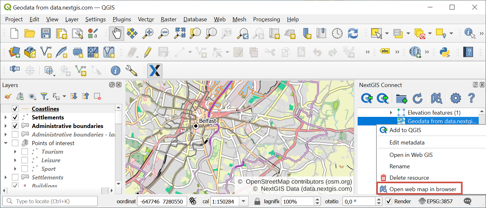

.. _ngcom_ngqgis_connect:

How to manage data with desktop app QGIS
================================================

You can upload, edit and perform other operations with geodata in your :ref:`Web GIS <ngcom_description>` not only in :ref:`admin console <ngw_admin_interface>` but also with desktop app QGIS.

To make it super-easy we've created `NextGIS Connect <https://plugins.qgis.org/plugins/nextgis_connect/>`_ plugin. You can update the module through the menu **Modules** -> **Manage Modules** -> **NextGIS Connect**.
After successfull installation you'll see **NextGIS Connect** panel on the right side of the screen.

.. _ngcom_ngqgis_connect_connection:

Establishing Web GIS connection
--------------------------------

After successful installation of the module, a panel will appear on the right side of the screen :guilabel:`NextGIS Connect`.

First you need to **establish a connection** to your Web GIS:

* Open *Settings* dialog from NextGIS Connect control panel (gear button);

.. figure:: _static/NGconnection_main_en.png
   :name: NGconnection_main_pic
   :align: center
   :width: 20cm

   Selecting NextGIS Connect Settings

* Press **New** button;

* In the opened dialog window fill in fields **URL** (for example, https://examples.nextgis.com) and **Name** (this name will be used in the list of available connections). 

   Creating new connection

.. note::
   Only the owner of the Web GIS and users added to the `team <https://docs.nextgis.com/docs_ngcom/source/create.html#team-management>`_ can create and delete resources in the Web GIS.

* In order to be able to create and delete resources, in the *Authentication* section select from a dropdown menu an authentication configuration (the list contains connection name and username as well as authentication type) or create a new configuration.

To add a new configuration, press the button with a green plus. The "Authentication" dialog will pop up.

   Adding authentication configuration

1. Enter a name for the new configuration in the corresponding field;
2. Select the Basic authentication in the dropdown menu below;
3. Enter *Username* and *Password* of your NextGIS ID;
4. Press **Save**.

Make sure that the correct configuration is selected. To check if the credentials are correct, press **Test Connection**.

* Next press **Save** in the connection creating dialog.

* Press :guilabel:`Ок` button and close the Settings window.  If the connection is established successfully you'll see your Web GIS resources tree in the plugin window.

   Web GIS resource tree in the plugin window

.. _ngcom_ngqgis_connect_data_upload:

Creating and uploading data
---------------------------

NextGIS Connect plugin enables a fast upload of raster and vector data and whole QGIS projects to Web GIS. You'll be able to publish your maps and geodata online very quick and easy.

.. _vector_data:

Uploading vector data
~~~~~~~~~~~~~~~~~~~~~

.. warning:: 
   You can avoid :ref:`data format limitations <ngcom_vector_layer>` when uploading vector data to Web GIS through NextGIS Connect by switching on options "Rename forbidden fields" and "Fix incorrect geometries" in *Settings* dialog.

* In QGIS create from scratch or upload from :term:`ESRI Shape`, :term:`GeoJSON` or :term:`CSV` files vector layers. Tailor their styles;
* In NextGIS Connect panel select :ref:`Resource group <ngcom_resources_group>` to which you want to upload your data;
* In QGIS Layers panel select the vector layer which you want to upload to Web GIS;
* Press **Add to Web GIS** button on NextGIS Connect control panel and click **Upload selected** or choose **NextGIS Connect --> Upload selected** in layer context menu;
* If data is uploaded successfully you'll see in the relevant Resource group a new :ref:`Vector layer <ngcom_data_upload>` with :ref:`QGIS style <ngcom_styles>` tailored by you.

If a layer has **multiple styles**, they will all be uploaded. Their names will be kept. If the style name is "default", the layer's name will be used instead.

.. _raster_data:

Uploading raster data
~~~~~~~~~~~~~~~~~~~~~

* Add raster layers to QGIS from :term:`GeoTIFF` files;
* In NextGIS Connect panel select Resource group to which you want to upload your data;
* In QGIS Layers panel select a raster layer which you want to upload to Web GIS;
* Press **Add to Web GIS** button on NextGIS Connect control panel and click **Upload selected** or choose **NextGIS Connect --> Upload selected** in layer context menu;
* If data is uploaded successfully you'll see in the relevant Resource group a new :ref:`Raster layer <ngcom_data_upload>` with default :ref:`Raster style <ngcom_styles>`.

.. _basemaps:

Uploading basemaps
~~~~~~~~~~~~~~~~~~

* Add basemaps to QGIS via TMS;
* In NextGIS Connect panel select Resource group to which you want to add your basemap;
* In QGIS Layers panel select a basemap which you want to upload to Web GIS;
* Press **Add to Web GIS** button on NextGIS Connect control panel and click **Upload selected** or choose **NextGIS Connect --> Upload selected** in the basemap context menu;
* If a basemap is uploaded successfully you'll see it the relevant Resource group.

You need to be on `Mini or Premium <https://nextgis.com/pricing-base/>`_ to work with basemaps.

.. _qgis_project:

Creating and uploading a whole QGIS project
~~~~~~~~~~~~~~~~~~~~~~~~~~~~~~~~~~~~~~~~~~~

* Create a QGIS project with raster and vector layers. Tailor their styles, group them, set their hierarchy and visibility settings. Set the map extent;
* In NextGIS Connect panel select :ref:`Resource group <ngcom_resources_group>` to which you want to upload the project;
* Press **Add to Web GIS** button on NextGIS Connect control panel and select **Upload all**;

   
   Adding project in the NextGIS Connect panel. Target resource group is highligthed in blue

* In the opened dialog window enter the name of the new Resource group to which the project will be imported;

   
   Entering the name of the imported project

* If the project is uploaded successfully you'll see in a selected Resource group a newly created group with: 1) all Raster and Vector layers to which **Add to Web GIS** operation is applicable, and their Styles; 2) automatically created :ref:`Web map <ngcom_webmap_create>` with a set extent, to which all the imported layers are added with groups, hierarchy and visibility settings similar to QGIS.

To view the newly created Web map press **Open map in browser** button on NextGIS Connect control panel or select **Open map in browser** in the context menu.

   
   Opening the newly created Web Map via context menu of the imported project

If you select a resource group containing layers with **multiple styles**, all the styles will be added. The style used as current will be the one with the same name as the layer or the first in alphabetical order. No dialog will be displayed.

.. _ngcom_ngqgis_connect_services:

Creating WFS, WFS and OGC API - Features services
---------------------------

NextGIS Connect module allows you to quickly publish Vector layers to Web GIS using standard protocols :term:`WFS`, :term:` WMS` and OGC API - Features.

.. _create_wfs_service:

Creating WFS services
~~~~~~~~~~~~~~~~~~~~~

NextGIS Connect plugin enables a fast publication of Vector layers from your Web GIS using standard :term:`WFS` protocol. 

It's possible due to the quick creation of :ref:`WFS service <ngcom_wfs_service>` option in NextGIS Connect:

* Select in NextGIS Connect Resources panel Vector layer which you want to publish using WFS protocol;

   
   Selecting vector layer

* Select **Create WFS service** in layer context menu;

   
   Selecting "Create WFS service" in the Vector layer context menu
   
* In the opened dialog window set the number of layer's features to be published via WFS service by changing the value of the field **The number of objects returned by default**;

.. figure:: _static/NGConnect_wfs_number_en.png
   :name: NGConnect_wfs_number_pic
   :align: center
   :width: 20cm
   
   Number of objects returned by default
   
* If WFS service is created successfully you'll see it in the relevant Resource group. The Vector layer is already connected to it.

   
   Newly created WFS service

.. note:: 
	You can edit the settings of WFS service (including its name, published layers and their settings) in the Web GIS admin console.

.. _create_ogc_api_feat_service:

Creating OGC API - Features services
~~~~~~~~~~~~~~~~~~~~~

NextGIS Connect plugin enables a fast publication of Vector layers from your Web GIS using standard OGC API - Features protocol. 

It's possible due to the quick creation of OGC API - Features option in NextGIS Connect:

* Select in NextGIS Connect Resources panel Vector layer which you want to publish using OGCF protocol;

   
   Selecting vector layer

* Select **Create OGC API - Features service** in layer context menu;

   
   Selecting "Create OGC API - Features service" in the Vector layer context menu
   
* In the opened dialog window set the number of layer's features to be published via OGCF service by changing the value of the field **The number of objects returned by default**;

   
   Number of objects returned by default
   
* If OGCF service is created successfully you'll see it in the relevant Resource group. The Vector layer is already connected to it.

   
   Newly created OGC API - Features service

.. _create_wms_service:

Creating WMS services
~~~~~~~~~~~~~~~~~~~~~

To do this the module provides a quick creation operation :ref:`WMS service <ngcom_wms_service>`. The process is similar to creation of WFS service (see above)

* In the desktop application (QGIS) in the resource Web GIS tree of module NextGIS Connect select **Vector layer** that you want to publish via the WMS protocol;

   
   Selecting vector layer

* Select **Create WMS Service** in the context menu of the layer;

   
   Selecting "Create WMS service" in the Vector layer context menu

* In the dialog that opens select a layer style for publishing the WMS Service;

   
   Selecting layer style

* If the WMS Service has been created successfully, then a new WMS Service will appear in the corresponding Resource Group, to which your Vector Layer is already connected.

   
   Newly created WMS service

.. _ngcom_ngqgis_connect_data_edit:

Editing data
---------------------

NextGIS Connect plugin allows to quickly edit geometries and attribute values of vector layers in Web GIS. This functionality is only available for vector data formats used in QGIS.

.. warning::
	Only one user at a time can edit the layer directly.

#. Import the layer from Web GIS to QGIS by selecting it in NextGIS Connect and pressing **Add to QGIS**.
#. Enter the edit mode from the layer’s context menu or from the toolbar.
#. Make the changes.
#. Exit edit mode. Confirm changes in the pop-up window.
#. The layer will be automatically synchronized.

If changes have been made to the layer in Web GIS since the last synchronization, further synchronization will not be possible. Press the sync symbol by the layer, "Layer status" window will open. In the dropdown menu select **Reset layer**. Keep in mind that if you reset the layer, all local changes that had not been synchronized will be lost.

   Layer synchronization symbol

   Layer status dialog. To reset the layer, press the downward arrow by the "Synchronization" button and select "Reset layer"

You can also edit a vector layer using the standard :term:`WFS` protocol (with feature edit support):

* :ref:`Publish via WFS protocol <ngcom_ngqgis_connect_wfs_service>` Vector layer which features you're going to edit;
* Select in NextGIS Connect Resources panel the relevant WFS service;
* Press **Add to QGIS** button on NextGIS Connect control panel or select **Add to QGIS** in service context menu;

.. figure:: _static/NGConnect_edit_add_en.png
   :name: NGConnect_edit_add_pic
   :align: center
   :width: 20cm

   Adding layer to QGIS using WFS service

* If operation is successful you'll see in QGIS Layers panel a new group of WFS layers published via selected WFS service;
* Enter Edit mode and modify features' geometries and attributes in the added WFS layer using standard QGIS tools; 

   Features editing

* Press the "Edit" button to finish editing and press "Save" in the opened window. 

   Saving changes

* If editing went successful you'll be able to see the changes at once in the Web GIS :ref:`Feature table <ngw_feature_table>` and Web Map :ref:`web client <ngw_webmaps_client>`.

.. _ngcom_ngqgis_connect_data_overwrite:

Updating data
-------------

NextGIS Connect allows you to update the content of an existing Web GIS vector layer keeping its styles, attribute aliases and other settings.

.. warning:: 
   All target layer data including attachments (photos or documens) will be cleared. If you need to save them - update via WFS instead.

To update (overwrite) layer's data:

* Select the vector layer in QGIS Layers panel the contents of which you need to send to a vector layer in Web GIS;
* Select the vector layer in NextGIS Connect panel the contents of which you need to overwrite;
* Right click on the last layer and choose **Overwrite selected layer**.

Layer resource identifier will also be kept. Overwrite assumes that both layers have the same structure.

   
   Overwriting layer with the new version via context menu

.. _ngcom_ngqgis_connect_style_overwrite:

Updating styles
---------------

You can add another style to a layer or replace its existing style with a new one.

To replace a style:

* Add layer to QGIS via Connect.
* Change the style of the layer (color, line width, etc.).
* Select the layer in QGIS layer panel and the **style** in NextGIS Connect panel.
* In NextGIS Connect toolbar press **Add to Web GIS** and select **Update layer style**.

   Updating a style

   Updating a style from context menu

After these operations, the NextGIS Connect module will remove the old style of the layer from the Web GIS and load the new one leaving all data and attachments intact.

You can also add a style while keeping the old one in place. After the style is tailored in QGIS, do the following:

* In NextGIS Connect panel select the **layer**.
* In QGIS layer panel in the layer context menu select ``NextGIS Connect > Add new style to layer``.

   Adding style to a layer

.. _ngcom_ngqgis_connect_data_export:

Exporting data
--------------------------------------------------------

NextGIS Connect plugin enables a fast export of vector data from Web GIS to QGIS for further processing, analysis, saving in different formats and other data operations.

It's possible due to the option of fast creation of GeoJSON vector layers in QGIS using vector data from Web GIS:

* Select in NextGIS Connect Resources panel Vector layer which you want to export to QGIS;
* Press **Add to QGIS** button on NextGIS Connect control panel or select **Add to QGIS** in layer context menu;

   
   Exporting vector layer from Web GIS

* If the layer has multiple QGIS styles, there are several options depending on what you select in the Connect window:

1. If you select a **layer with multiple styles** in the Connect window, all the styles will be added, but you need to chose current style in a dialog window.

   
   Selecting QGIS style for export

2. If you select a **style** in the Connect window, all the styles of the layer weill be added, with the selected style chosen as current style.

3. If you select a **resource group** containing layers with multiple styles, all the styles will be added. The style used as current will be the one with the same name as the layer or the first in alphabetical order. No dialog will be displayed.

4. If you add WFS/OGCF, the style with the same name as the layer or the first in alphabetical order will be chosen.

You can change current style in the layer properties.

If the layer is exported successfully you'll see in QGIS Layers panel a new GeoJSON vector layer which you can use in your projects or save to your device in a required format. 

* To save the layer select it in the Layers panel, then open the "Layer" menu in the main menu panel and press **Save as** or use the context menu of the "Layers" panel to select :menuselection:`Export --> Save features as`.

* In the opened window select the desired file type and enter the name for the file.

   
   Saving the exported layer to the device

   
   
.. _ngcom_ngqgis_connect_resource_group:

Creating Resource groups
-------------------------------------------------------------------

NextGIS Connect plugin enables a fast creation of Resource groups in Web GIS. For that:

* Select in NextGIS Connect Resources panel Resource group where you want to create a new Group;
* Press **Create new group** button on NextGIS Connect control panel or select **Create new group** in group context menu;
* In the opened dialog window fill in the name of the new Resource group;
* If Resource group is created successfully you'll see it in the Web GIS resources tree in the plugin window.

.. _ngcom_ngqgis_connect_resource_delete:

Deleting resources
--------------------------------------------------------

NextGIS Connect plugin enables a fast deletion of any resources from Web GIS. For that:

* Select in NextGIS Connect Resources panel a resource you want to delete;
* Select **Delete** in resource context menu;
* If resource is deleted successfully it will disappear from Web GIS resources tree in the plugin window.

:ref:`More info <ng_connect>` about NextGIS Connect.
