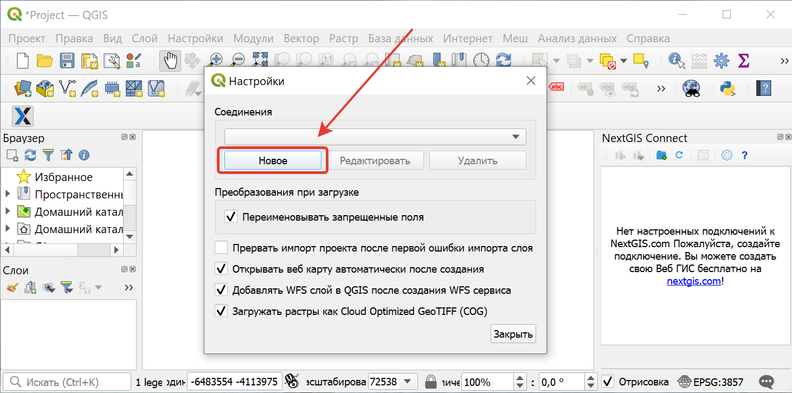
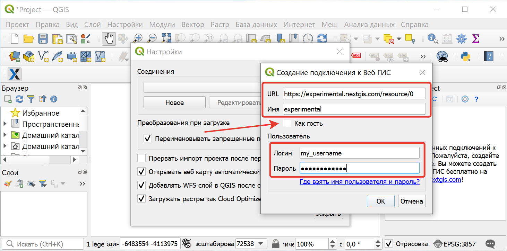
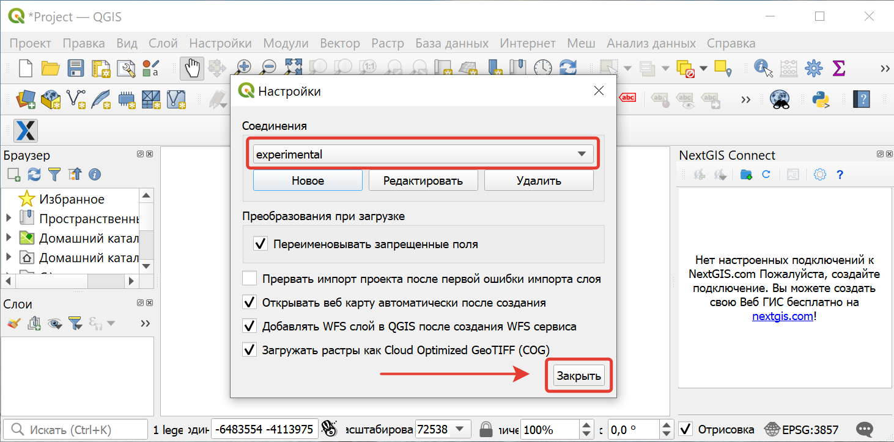
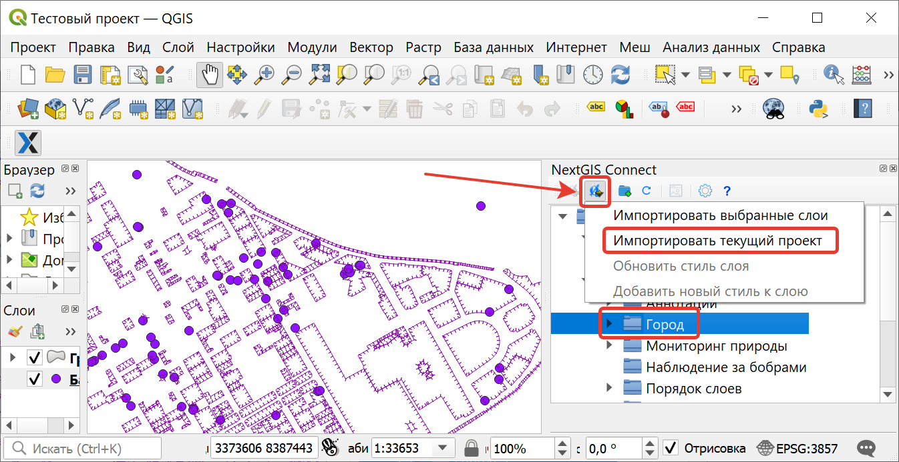
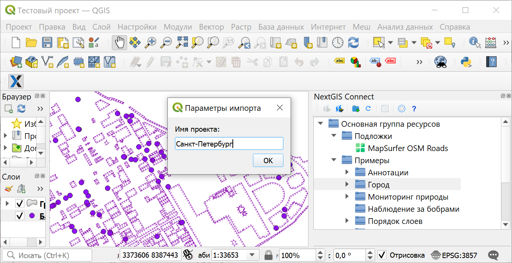
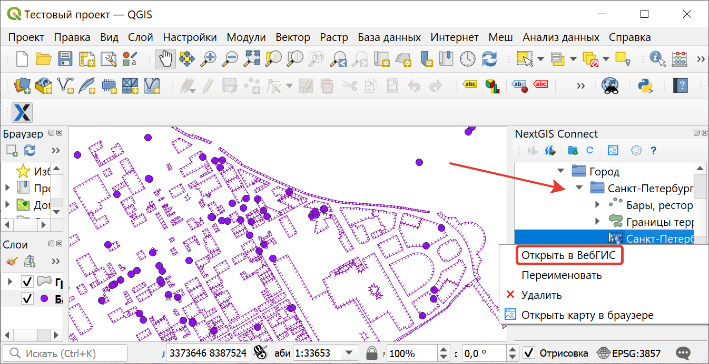
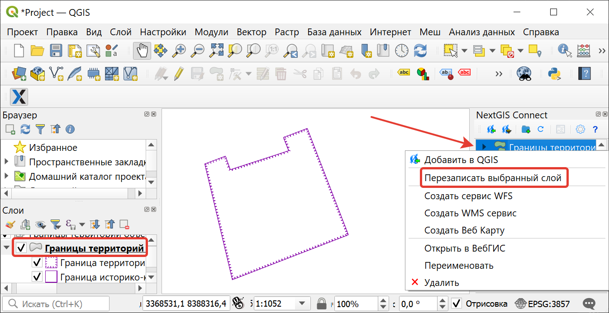

.. _ngcom_ngqgis_connect:

Как управлять данными с помощью настольного приложения QGIS
===================================================================

Загружать, редактировать и совершать другие операции с геоданными в :ref:`Веб ГИС <ngcom_description>` можно не только через административный :ref:`веб-интерфейс <ngw_admin_interface>`, но и с помощью настольного приложения QGIS. 

.. note::
   Также вы можете использовать `NextGIS QGIS <http://nextgis.ru/nextgis-qgis/>`_.

Для удобного управления вашей Веб ГИС мы создали модуль расширения `NextGIS Connect <https://plugins.qgis.org/plugins/nextgis_connect/>`_. Обновить модуль можно через меню **Модули** -> **Управление модулями** -> **NextGIS Connect**.

NextGIS Connect позволяет обмениваться данными с множеством Веб ГИС из настольного приложения. Для этого необходимо создать к ним соответствующие подключения.

.. _ngcom_ngqgis_connect_connection:

Подключение к Веб ГИС
---------------------

После успешной установки модуля в правой части экрана появится панель :guilabel:`NextGIS Connect`.

Для начала работы **создайте подключение** к своей Веб ГИС:

* Откройте диалог **Настройки** (шестренка) на панели управления NextGIS Connect;

.. figure:: _static/NGConnection_main_ru.png
   :name: NGconnection_main_pic
   :align: center
   :width: 20cm
   
   Вызов настроек из панели NextGIS Connect

* Нажмите кнопку **Новое**;

   
   Окно настроек NextGIS Connect

* В открывшемся диалоговом окне заполните поля **URL** (веб-адрес вашей Веб ГИС, например, - https://examples.nextgis.com) и **Имя** (будет отображаться в списке доступных подключений). Чтобы получить возможность создавать и удалять ресурсы, снимите галочку в поле *Как гость* и заполните поля **Логин** и **Пароль**, используя данные вашего NextGIS ID;

   
   Создание нового подключения

.. note:: 
   Создавать и удалять ресурсы Веб ГИС может ее владелец и пользователи, добавленные в `команду <https://docs.nextgis.ru/docs_ngcom/source/create.html#ngcom-team-management>`_.
   
* Нажмите кнопку :guilabel:`Ок` и закройте диалоговое окно `Настройки`. В окне модуля появится дерево ресурсов вашей Веб ГИС.

   
   Завершение создания подключения
   

   
   Дерево ресурсов подключенной Веб ГИС в окне NextGIS Connect

.. _ngcom_ngqgis_connect_data_upload:

Создание и загрузка данных
------------------------------------------------

Модуль NextGIS Connect позволяет быстро загружать в Веб ГИС растровые и векторные данные, а также целиком проекты QGIS. Это позволит вам легко опубликовать в интернете свои карты и геоданные.

.. _vector_data:

Загрузка векторных данных
~~~~~~~~~~~~~~~~~~~~~~~~~

.. warning:: 
   Вы можете избежать :ref:`ограничений по форматам данных <ngcom_vector_layer>` при загрузке векторных данных в Веб ГИС через NextGIS Connect, применив опции "Переименовывать запрещенные поля" и "Исправлять некорректные геометрии" в диалоге :guilabel:`Настройки`.

* Создайте в QGIS "с нуля" или добавьте из файлов векторные слои :term:`ESRI Shape`, :term:`GeoJSON` или :term:`CSV`. Настройте стили их отображения;
* Выберите в дереве ресурсов Веб ГИС в окне модуля NextGIS Connect :ref:`Группу ресурсов <ngcom_resources_group>`, в которую вы хотите загрузить данные (или создайте её с помощью кнопки "Создать новую группу ресурсов");
* Выберите в панели слоев QGIS векторный слой, который вы хотите загрузить в Веб ГИС;
* Нажмите кнопку **Импортировать выбранный слой** на панели инструментов модуля или выберите **NextGIS Connect --> Импортировать выбранный слой** в контекстном меню слоя;
* Если данные загрузились успешно, то в соответствующей Группе ресурсов появится новый :ref:`Векторный слой <ngcom_data_upload>`, внутри которого будет создан :ref:`Стиль QGIS <ngcom_styles>` с заданными настройками стиля.

При загрузке слоя **с несколькими стилями** в веб-ГИС, они загружаются со своими именами. Если название стиля - default (или "по умолчанию"), используется название слоя. 

.. _raster_data:

Загрузка растровых данных
~~~~~~~~~~~~~~~~~~~~~~~~~

* Добавьте в QGIS из файлов растровые слои :term:`GeoTIFF`;
* Выберите в дереве ресурсов Веб ГИС в окне модуля NextGIS Connect Группу ресурсов, в которую вы хотите загрузить данные;
* Выберите в панели слоев QGIS растровый слой, который вы хотите загрузить в Веб ГИС;
* Нажмите кнопку **Импортировать выбранный слой** на панели инструментов модуля или выберите **NextGIS Connect --> Импортировать выбранный слой** в контекстном меню слоя;
* Если данные загрузились успешно, то в соответствующей Группе ресурсов появится новый :ref:`Растровый слой <ngcom_data_upload>`, внутри которого будет создан :ref:`Растровый стиль <ngcom_styles>` с настройками стиля по умолчанию.

.. _basemaps:

Загрузка базовых карт (подложек)
~~~~~~~~~~~~~~~~~~~~~~~~~~~~~~~~

* Добавьте в QGIS базовую карту (подложку);
* Выберите в дереве ресурсов Веб ГИС в окне модуля NextGIS Connect Группу ресурсов, в которую вы хотите добавить подложку;
* Выберите в панели слоев QGIS подложку, которую вы хотите загрузить в Веб ГИС;
* Нажмите кнопку **Импортировать выбранный слой** на панели инструментов модуля или выберите **NextGIS Connect --> Импортировать выбранный слой** в контекстном меню слоя;
* Если подложка загрузилась успешно, то она появится в соответствующей Группе ресурсов.

Для работы с подложками ваша Веб ГИС должна быть на плане **Мини** или **Премиум**, в противном случае вы не сможете импортировать их в Веб ГИС.

.. _qgis_project:

Загрузка проекта QGIS целиком
~~~~~~~~~~~~~~~~~~~~~~~~~~~~~

* Соберите в QGIS проект из растровых и векторных слоев. Настройте их стили отображения, иерархию, группировку, видимость. Настройте охват карты;
* Выберите в дереве ресурсов Веб ГИС в окне модуля NextGIS Connect Группу ресурсов, в которую вы хотите загрузить проект;
* Нажмите кнопку **Импортировать текущий проект** на панели инструментов модуля или выберите **NextGIS Connect --> Импортировать текущий проект** в контекстном меню любого слоя;

   
   Импорт текущего проекта через контекстное меню
   
* В открывшемся диалоговом окне укажите название новой Группы ресурсов, в которую будет загружен проект;

   
   Указание имени импортируемого проекта

* Если проект загрузился успешно, то в соответствующей Группе ресурсов появится новая Группа ресурсов с заданным названием, внутри которой будут находиться: 
1) все Растровые и Векторные слои, для которых доступна операция *Импортировать выбранный слой*, а также их Стили;
2) автоматически созданная :ref:`Веб-карта <ngcom_webmap_create>` с заданным охватом, на которую будут добавлены все импортированные слои с учетом их группировки, иерархии и видимости в панели слоёв QGIS.

.. note:: 
	Быстро перейти к Веб-карте можно, нажав кнопку **Открыть карту в браузере** на панели инструментов модуля или выбрав соответствующую команду в контекстном меню Веб-карты.

   
   Открытие импортированного проекта в Веб ГИС через контекстное меню

При добавлении группы ресурсов, которая содержит слои **с несколькими стилями**, будут добавлены все стили и выбран в качестве текущего либо одноименный слою, либо первый по алфавиту. Диалог с выбором показан не будет.

.. _ngcom_ngqgis_connect_services:

Создание Сервисов: WFS, WMS, OGC API - Features
---------------------------

Модуль NextGIS Connect позволяет быстро публиковать Векторные слои в Веб ГИС по стандартным протоколам :term:`WFS`, :term:`WMS` и OGC API - Features. 

.. _create_wfs_service:

Создание сервиса WFS
~~~~~~~~~~~~~~~~~~~~~

Для этого в модуле доступна операция быстрого создания :ref:`Сервиса WFS <ngcom_wfs_service>`:

* В настольном приложении (QGIS) в дереве ресурсов Веб ГИС модуля NextGIS Connect выберите **Векторный слой**, который вы хотите опубликовать по протоколу WFS;

   
   Выбор слоя

* Выберите пункт **Создать сервис WFS** в контекстном меню слоя;

   
   Контекстное меню слоя
   
* В открывшемся диалоговом окне укажите число объектов слоя, которое должен публиковать Сервис WFS;

   
   Число публикуемых объектов слоя

* Если Сервис WFS создался успешно, то в соответствующей Группе ресурсов появится новый Сервис WFS, в который уже подключен ваш Векторный слой.

   
   Созданный сервис WFS в дереве ресурсов
   
.. note:: 
	Отредактировать настройки созданного таким образом Сервиса WFS (включая его название, публикуемые слои и их настройки) можно через веб-интерфейс Веб ГИС.

.. _create_ogc_api_feat_service:

Создание сервиса OGC API - Features
~~~~~~~~~~~~~~~~~~~~~

Для этого в модуле доступна операция быстрого создания Сервиса OGC API - Features:

* В настольном приложении (QGIS) в дереве ресурсов Веб ГИС модуля NextGIS Connect выберите **Векторный слой**, который вы хотите опубликовать по протоколу OGC API - Features;

   
   Выбор слоя

* Выберите пункт **Создать сервис OGC API - Features** в контекстном меню слоя;

   
   Контекстное меню слоя
   
* В открывшемся диалоговом окне укажите число объектов слоя, которое должен публиковать Сервис OGC API - Features;

   
   Число публикуемых объектов слоя

* Если Сервис OGC API - Features создался успешно, то в соответствующей Группе ресурсов появится новый Сервис OGC API - Features, в который уже подключен ваш Векторный слой.

   
   Созданный сервис OGC API - Features в дереве ресурсов

.. _create_wms_service:

Создание сервиса WMS
~~~~~~~~~~~~~~~~~~~~~

Для этого в модуле доступна операция быстрого создания :ref:`Сервиса WMS <ngcom_wms_service>`:

* В настольном приложении (QGIS) в дереве ресурсов Веб ГИС модуля NextGIS Connect выберите **Векторный слой**, который вы хотите опубликовать по протоколу WMS;

   
   Выбор слоя
   
* Выберите пункт **Создать WMS сервис** в контекстном меню слоя;

   
   Контекстное меню слоя
   
* В открывшемся диалоговом выберите стиль слоя для публикация Сервиса WMS;

   
   Выбор стиля для публикации Сервиса WMS
   
* Если Сервис WFS создался успешно, то в соответствующей Группе ресурсов появится новый Сервис WMS, в который уже подключен ваш Векторный слой.

   
   Созданный Сервис WFS в дереве ресурсов

.. _ngcom_ngqgis_connect_data_edit:

Редактирование данных
---------------------

Модуль NextGIS Connect позволяет быстро редактировать геометрии и атрибуты объектов в Векторных слоях Веб ГИС. Это возможно благодаря использованию стандартного протокола :term:`WFS` (с поддержкой редактирования):

* :ref:`Опубликуйте по протоколу WFS <ngcom_ngqgis_connect_wfs_service>` Векторный слой, объекты которого вы хотите отредактировать (как это сделать, см выше);
* Выберите в дереве ресурсов Веб ГИС в окне модуля NextGIS Connect соответствующий WFS сервис;
* Нажмите кнопку **Добавить в QGIS** на панели инструментов модуля или выберите пункт **Добавить в QGIS** в контекстном меню сервиса;

   
   Добавление слоя в QGIS через панель NextGIS Connect
   
* Если операция прошла успешно, то на панели слоев QGIS появится новая группа слоев WFS, опубликованных с помощью добавленного WFS сервиса;
* Включите режим редактирования (иконка карандаша) и отредактируйте геометрии и атрибуты объектов в добавленном слое WFS с помощью :ref:`стандартных инструментов QGIS <ngqgis_editing>`;

   
   Редактирование объектов

* Нажмите ещё раз кнопку "Режим редактирования" и подтвердите сохранение изменений.

   
   Сохранение изменений векторного слоя
   
* Если редактирование объектов прошло успешно, то соответствующие изменения сразу же будут отображены в Веб ГИС в :ref:`Таблице объектов <ngw_feature_table>` и :ref:`веб-клиенте <ngw_webmaps_client>` Веб-карты.

.. _ngcom_ngqgis_connect_data_overwrite:

Обновление данных
-----------------

С помощью NextGIS Connect можно обновить содержимое уже существующего векторного слоя Веб ГИС, сохранив его стили, псевдонимы атрибутов и другие настройки.

.. warning:: 
   Все данные целевого слоя, включая вложения (фото, документы), будут очищены. Если вам нужно их сохранить - используйте WFS

Для обновления (замены) данных слоя:

* Выберите на панели слоёв QGIS векторный слой, объекты которого вы хотите отправить в векторный слой Веб ГИС;
* Выберите в дереве ресурсов Веб ГИС в окне модуля NextGIS Connect векторный слой, объекты которого вы хотите заменить;
* Щелкните правой кнопкой выши по выбранному векторному слою в окне NextGIS Connect и выберите **Перезаписать выбранный слой**.

Идентификатор ресурса слоя при этом останется неизменным. Операция подозревает что слой источник и целевой слой имеют одинаковую структуру атрибутов.

   

   
   Перезапись выбранного слоя через контекстное меню

.. _ngcom_ngqgis_connect_style_overwrite:

Обновление стиля
-----------------

* Добавьте слой в QGIS через Connect
* Измените стиль вашего слоя (цвет, толщина линий и так далее)
* Далее выберите **Добавить в Веб ГИС/Обновить стиль слоя**, выделив в правой панели **стиль** нужного ресурса (Или в панели слоев QGIS на редактируемом слое - Правый клик > NextGIS Connect > Обновить стиль слоя)

После данных операций модуль NextGIS Connect удалит старый стиль вашего слоя из веб ГИС и загрузит новый, оставив при этом нетронутыми данные и вложения.

.. _ngcom_ngqgis_connect_data_export:

Экспорт данных
--------------

Модуль NextGIS Connect позволяет быстро экспортировать векторные данные из Веб ГИС в QGIS для их последующей обработки, анализа, выгрузки и иных операций.

Для этого в модуле доступна операция быстрого создания векторных слоев GeoJSON в QGIS с использованием данных Векторных слоев Веб ГИС:

* Выберите в дереве ресурсов Веб ГИС в окне модуля NextGIS Connect Векторный слой, который вы хотите экспортировать в QGIS;
* Нажмите кнопку **Добавить в QGIS** на панели инструментов модуля или выберите пункт **Добавить в QGIS** в контекстном меню слоя;

   
   Экспорт векторного слоя из Веб ГИС

* В случае, если слой имеет несколько стилей QGIS, сценарий зависит от того, что выделено для загрузки в окне Connect:

1. При выборе в дереве Connect **слоя с несколькими стилями**, они подгрузятся все, но будет предложено выбрать текущий. Это единственный вариант, при котором появляется диалоговое окно.

   
   Выбор текущего QGIS-стиля

2. При выборе в дереве Connect **стиля** слоя, добавятся все стили, по умолчанию будет выбранный.

3. При добавлении **группы ресурсов**, которая содержит слои с несколькими стилями, будут добавлены все стили и выбран либо одноименный слою, либо первый по алфавиту. Диалог с выбором показан не будет.

4. При добавлении WFS/OGCF диалога выбора не будет. Стиль будет выбран либо одноименный слою, либо первый по алфавиту.

Выбрать другой стиль для загруженного слоя можно будет в свойствах слоя.

Если слой экспортировался успешно, то в панели слоев QGIS появится новый векторный слой GeoJSON, который можно использовать в текущих проектах или сохранить на устройство в нужном формате.

* Чтобы сохранить слой на устройстве, выберите в главном меню :menuselection:`Слой --> Сохранить как` или в панели слоев вызовите контекстное меню и нажмите :menuselection:`Экспорт --> Сохранить объекты как`.

   
   Сохранение векторного слоя в файл

.. _ngcom_ngqgis_connect_resource_group:

Создание Групп ресурсов
-------------------------------------------------------------------

Модуль NextGIS Connect позволяет быстро создавать новые Группы ресурсов в Веб ГИС. Для этого:

* Выберите в дереве ресурсов Веб ГИС в окне модуля NextGIS Connect Группу ресурсов, в которой вы хотите создать новую Группу;
* Нажмите кнопку **Создать новую группу ресурсов** на панели инструментов модуля или выберите пункт **Создать новую группу** в контекстном меню;
* В открывшемся диалоговом окне укажите имя новой Группы ресурсов;
* Если Группа ресурсов создалась успешно, то она появится в дереве ресурсов Веб ГИС.

.. _ngcom_ngqgis_connect_resource_delete:

Удаление ресурсов
--------------------------------------------------------

Модуль NextGIS Connect позволяет быстро создавать / удалять любые ресурсы из Веб ГИС. Для этого:

* Выберите в дереве ресурсов Веб ГИС в окне модуля NextGIS Connect ресурс, который вы хотите удалить;
* Выберите пункт **Удалить** в контекстном меню;
* Если ресурс удалился успешно, то он исчезнет из дерева ресурсов Веб ГИС.

Больше информации о модуле расширения NextGIS Connect - `здесь <https://docs.nextgis.ru/docs_ngconnect/source/toc.html>`_. 
