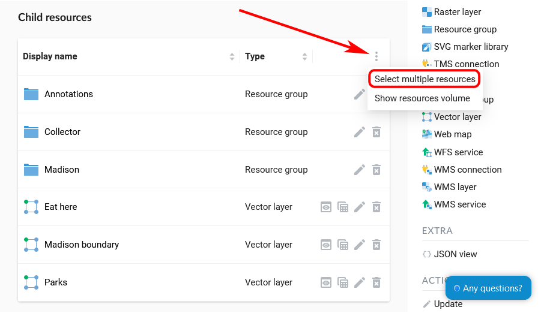
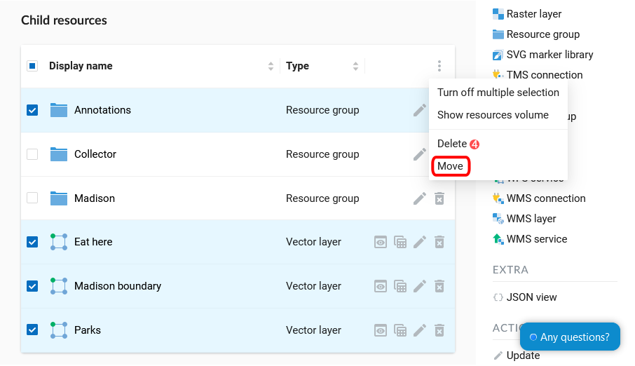
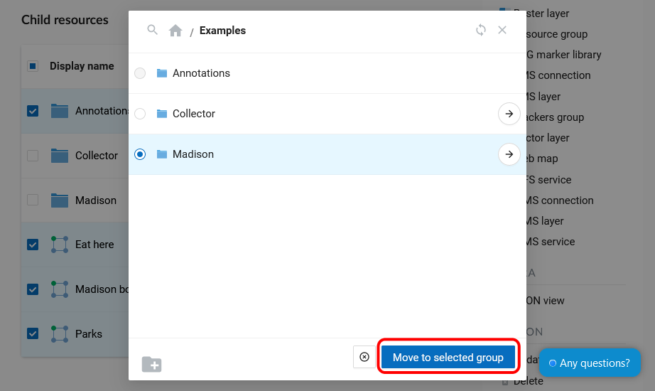
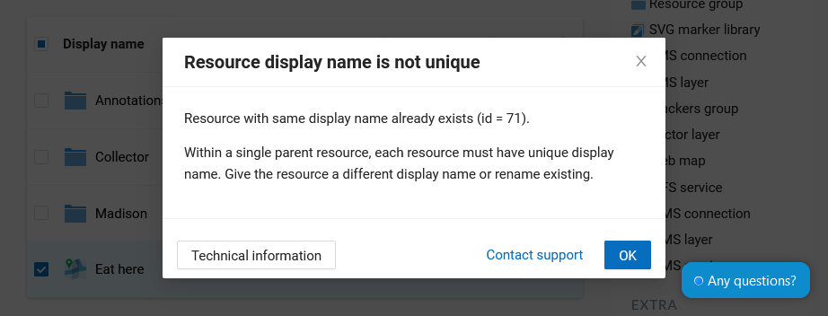

.. _ngcom_parent_change:

How to transfer resources within Web GIS
=========================================

:ref:`Web GIS <ngcom_description>` resourses (data layers, connections, services, groups) can be transferred from one :ref:`Resource group <ngcom_resources_group>` to another after their creation. There are two ways to do so.

.. _ngcom_parent_change_update:

Using resource update
----------------------

This is a good way if you only need to move one resource.

#. Open the Properties page of a resource you want to transfer;
#. Select :menuselection:`Action --> Update` on the right side of Web GIS :ref:`admin console <ngw_admin_interface>`;
#. In the opened dialog window in the field :guilabel:`Parent` in :guilabel:`Resource` tab select Resource group you want to transfer your resource to;
#. Press :guilabel:`Save` button. If a resource is transferred successfully its name will appear in the new Resource group and disappear from the previous Resource group.

In the same way you can transfer :ref:`Styles <ngcom_styles>` between parent resources (:ref:`Vector layers <ngcom_vector_layer>`, :ref:`Raster layers <ngcom_raster_layer>`, :ref:`PostGIS layers <ngcom_postgis_layer>`).

.. _ngcom_parent_change_multi:

Using multiple selection
------------------------

This way allows you to move several resources at once.

Open the group containing the resources you'd like to move. In the Child Resources list click the three dots in the upper right corner and in the menu press "Select multiple resources". 

   
   Enabling multiple selection

Boxes will appear to the right of the resource names in the list. Tick them to mark resources for transfer. If you tick the box by the "Display name" title, all resources in the list will be selected. 
After selecting the resources, open the menu again and press "Move".

   
   Selecting resources to be moved

A pop-up window of group selection will open.
In this window you can use a search bar. Click the magnifying glass in the top left corner and start entering the name of the group you want to find.
To go up in the resource tree, click the path indicated in the top panel of the window. To open a folder from the list, click the arrow icon on the right.
If you want to return to the group containing the original Web Map, click the icon **|<** in the top right corner.

To select the group as the destination for the copy, click the circle to the left of its name,  a blue dot marker will appear. Then press "Move to selected group". To move resources to the main group, click on the house icon in the top panel of the pop-up window and then press "Move to this group".

   
   Selecting the target group

If in the selecting folder there are already resources with the same name as those you want to transfer, they will not be moved and the following message will appear:

   
   Alert in case if a name is not unique

Close the alert window, change the name of one of the resources and try to move it again. 

If a resource is transferred successfully its name will appear in the new Resource group and disappear from the previous Resource group.
