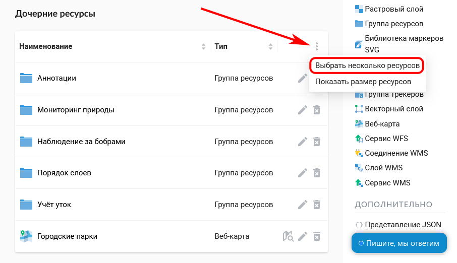

.. _ngcom_parent_change:

Как перемещать ресурсы внутри Веб ГИС
======================================

Ресурсы :ref:`Веб ГИС <ngcom_description>` (слои, соединения, сервисы, группы) можно перемещать из одной :ref:`Группы ресурсов <ngcom_resources_group>` в другую и после их создания. Это можно сделать двумя способами.

.. _ngcom_parent_change_update:

Через изменение ресурса
-----------------------

Этот способ подойдет, если нужно перенести всего один ресурс.

#. Откройте окно свойств ресурса, который вы хотите переместить;
#. Выберите :menuselection:`Действие --> Изменить` на правой панели :ref:`веб-интерфейса <ngw_admin_interface>` Веб ГИС;
#. В открывшемся окне через меню :guilabel:`Родитель` на вкладке :guilabel:`Ресурс` выберите Группу ресурсов, в которую вы хотите переместить свой ресурс;
#. Нажмите кнопку :guilabel:`Сохранить`. Если ресурс успешно перемещен, то информация о нем появится в новой Группе ресурсов и пропадет в старой Группе ресурсов.

Аналогичным образом между родительскими ресурсами (:ref:`Векторными слоями <ngcom_vector_layer>`, :ref:`Растровыми слоями <ngcom_raster_layer>`, :ref:`Слоями PostGIS <ngcom_postgis_layer>`) можно перемещать :ref:`Стили <ngcom_styles>`.

.. _ngcom_parent_change_multi:

Через множественный выбор
-------------------------

Этот способ удобен, если нужно перенести несколько ресурсов.

Откройте группу, в которой находятся ресурсы, которые вы хотите переместить. В списке дочерних рисурсов вызовите меню (три точки в правом верхнем углу) и нажмите "Выбрать несколько ресурсов". 

   
   Включение множественного выбора

Слева от названий ресурсов в списке появятся квадратики, в которые можно поставить галку, чтобы пометить нужные ресурсы. Если поставить галку рядом со заголовком "Наименование", будут выделены все ресурсы в списке. 
После того, как ресурсы отмечены, снова вызовите меню и выберите "Переместить".

   
   Выбор ресурсов для перемещения

Появится всплывающее окно выбора группы.
В нём можно воспользоваться поиском, нажав на лупу в левом верхнем углу и начав вводить название нужной группы.
Для перемещения по дереву групп вверх используйте путь к папке в верхней части окна. Чтобы перейти в папку из списка, нажмите стрелку справа от ее названия.
Если вы хотите снова открыть группу, в которой находится исходная карта, нажмите значок **|<** в верхней части окна.

Чтобы отметить выбранную группу, поставьте маркер в кружке слева от её названия. Затем нажмите кнопку “Переместить в выбранную группу”. Если нужно перенести ресурсы в основную группу, нажмите на значок домика в верхней части всплывающего окна и затем на кнопку "Переместить в эту группу".

.. figure:: _static/move_to_selected_group_ru.png
   :name: move_to_selected_group_pic
   :align: center
   :width: 20cm
   
   Выбор группы, в которую будут перемещены ресурсы

Если в выбранной папке уже есть ресурсы, название которых совпадает с перемещаемыми, они не будут перенесены, и на экране появится предупреждение:

.. figure:: _static/move_name_not_unique_ru.png
   :name: move_name_not_unique_pic
   :align: center
   :width: 20cm
   
   Предупреждение о неуникальности имени

Закрыв его, измените имя одного из ресурсов и повторите шаги по перемещению. 

Если ресурс успешно перемещен, то информация о нем появится в новой Группе ресурсов и пропадет в старой Группе ресурсов.
