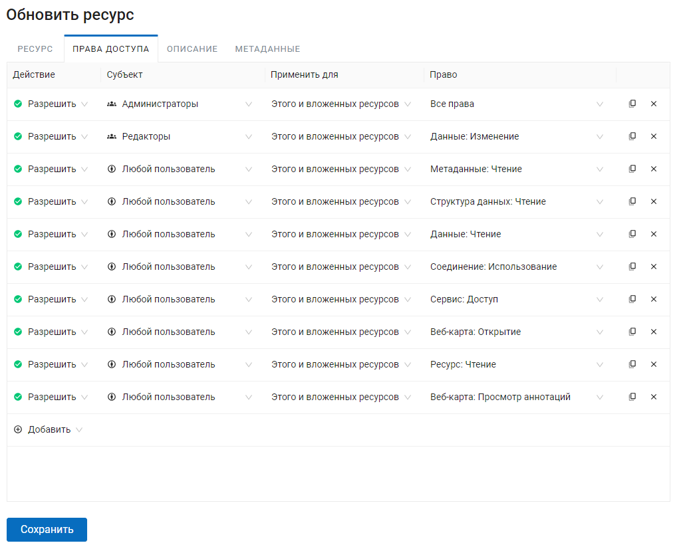
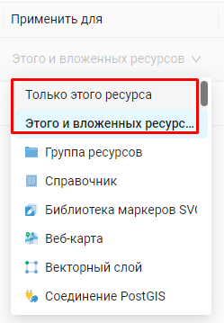

.. sectionauthor:: Роман Гайнуллов <roman.gainullov@nextgis.ru>

.. _ngcom_permissions_intro:

Как настроить права доступа
===============================

Этот раздел поможет вам настроить права доступа в вашей Веб ГИС. Для этого здесь рассмотрены базовые принципы работы системы прав доступа и основные пользовательские сценарии их настройки.

Общие понятия
-------------

   Вкладка "Права доступа"

Два основных правила, на которых строится всё:

1. **Ресурсный подход**

Корневая группа ресурсов (0) > Директория 1 > Директория 2 > Слой.

Право на корень > Право на директорию 1 > Право на директорию 2 > право на слой.

.. warning::
	! Без права на чтение корня не прочитать никакие вложенные файлы.

.. list-table::

   * - **Ресурс**
     - Корень (0)
     - Папка 1
     - Папка 2
     - Слой
   * - **Право**
     - Чтение
     - Чтение
     - Чтение
     - Чтение

Вложенность может управляться на уровне типа ресурса.

Есть два состояния (помимо конкретных типов ресурсов):

* Для этого ресурса - применить только для текущего ресурса.
* Для этого и вложенных ресурсов - применить и для всех тех, что внутри по иерархии до последнего.

   Меню выбора вариантов применения права доступа

2. По умолчанию пользователи бесправны.

.. warning::
	! Запрещено всё, кроме того, что не разрешено администратором явно.

Чтобы пользователь получил доступ к каким-либо-данным, этот доступ нужно ему предоставить.

Типы пользователей (субъектов)
~~~~~~~~~~~~~~~~~~~~~~~~~~~~~~~~~~~~

* Администратор - пользователь Веб ГИС, обладающий административными правами
* Владелец - пользователь Веб ГИС, создавший ресурс, на которое устанавливается право
* Гость - пользователь Веб ГИС, который обращается к ресурсу, не являясь при этом авторизованным
* Прошедший проверку - пользователь Веб ГИС, авторизованный в системе под любым существующим аккаунтом (то есть не гость)
* Любой пользователь - все, включая гостей и авторизовавшихся под любым аккаунтом пользователей

Типы прав - что можно или нельзя делать с ресурсами
~~~~~~~~~~~~~~~~~~~~~~~~~~~~~~~~~~~~~~~~~~~~~~~~~~~~~~~~

.. list-table::

   * - Ресурс: Все права
     - Любые действия с ресурсами, за исключением групп ресурсов
   * - Ресурс: Чтение
     - Чтение ресурсов
   * - Ресурс: Создание
     - Создание ресурсов
   * - Ресурс: Изменение
     - Модификация ресурсов
   * - Ресурс: Удаление
     - Удаление ресурсов
   * - Ресурс: Управление вложенными
     - Изменение настроек вложенных (дочерних) ресурсов
   * - Ресурс: Настройка прав доступа
     - Изменение настройки прав доступа ресурсов
   * - Метаданные: Все права 
     - Любые действия над метаданными
   * - Метаданные: Чтение
     - Модификация метаданных
   * - Метаданные: Изменение 
     - Чтение метаданных
   * - Структура данных: Все права 
     - Любые действия со структурой данных
   * - Структура данных: Чтение
     - Чтение структуры данных
   * - Структура данных: Изменение 
     - Изменение структуру данных
   * - Данные: Все права 
     - Любые действия над данными
   * - Данные: Чтение
     - Чтение данных
   * - Данные: Изменение 
     - Модификация данных
   * - Соединение: Все права
     - Любые действия с соединениями
   * - Соединение: Чтение
     - Чтение параметров соединения
   * - Соединение: Настройки
     - Модификация соединений
   * - Соединение: Использование
     - Использование соединения (будут ли доступны пользователю слои или данные из соединения)
   * - Сервис: Все права
     - Любые действия с сервисом
   * - Сервис: Доступ
     - Подключение к сервису
   * - Сервис: Настройка
     - Изменение настроек сервиса
   * - Веб-карта: Все права
     - Любые действия над веб-картой
   * - Веб-карта: Открытие
     - Просмотр веб-карты
   * - Веб-карта: Просмотр аннотаций
     - Просмотр аннотация на веб-карте
   * - Веб-карта: Рисование аннотаций
     - Рисование аннотация на веб-карте
   * - Веб-карта: Управление аннотациями
     - Изменение аннотаций на веб-карте
   * - Collector: Все права
     - 
   * - Collector: Чтение
     - 

