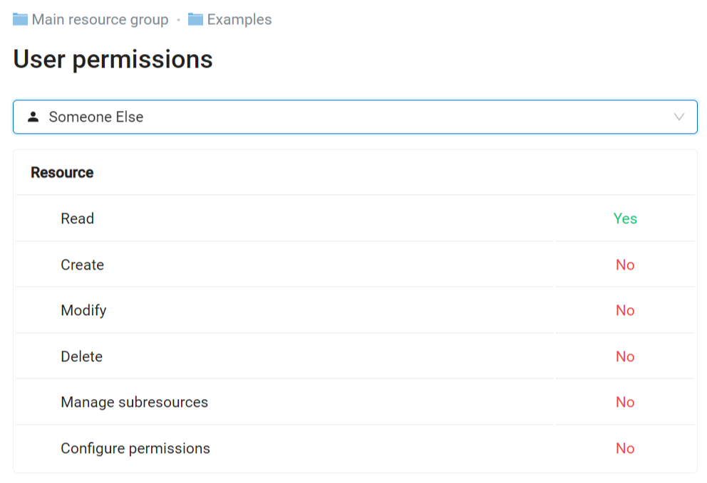
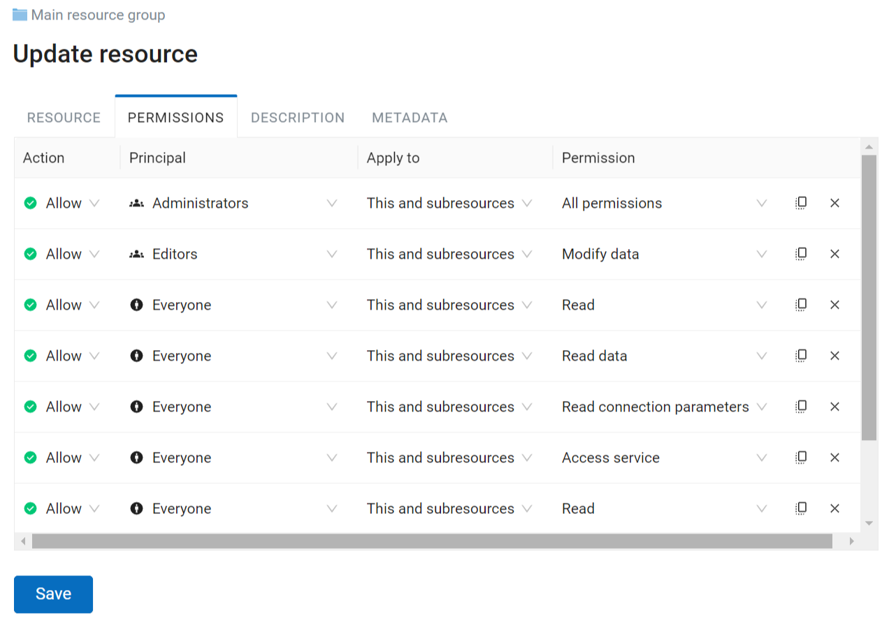

.. sectionauthor:: Роман Гайнуллов <roman.gainullov@nextgis.ru>, Юлия Григоренко <grigorenko.j@gmail.com>

.. _ngcom_permissions_intro:

Managing access rights
===============================

This section will help you set up access to your Web GIS for various users. Below you'll find an overview of the permissions system and some common cases of setting up access.

.. note::
    This functionality is only available for users having `Premium <http://nextgis.com/pricing/#premium/>`_ subscription.

.. _ngcom_permissions_terms:

Terms
-------------

There are two base rules:

1. **Resource approach**

Main (root) resource group (0) > Group 1 > Group 2 > Layer.

Permission for the root group > Permission for Group 1 > Permission for Group 2 > Permission for the layer.

.. important::
	! Without permission to read the main resource group user cannot view any files it contains.

.. list-table::

   * - **Resource**
     - Root (0)
     - Folder 1
     - Folder 2
     - Layer
   * - **Permission**
     - Read
     - Read
     - Read
     - Read

You can select a specific resource type that will be affected by the permission.

Other than that, there are two main options to apply a permission:

* This resource only - it will only affect the resource itself.
* This and subresources - it will affect all resources within, subgroups and their contents.

.. figure:: _static/permission_apply_en.png
   :name: permission_apply_pic
   :align: center
   :width: 6cm

   Selecting permission application

2. **By default users have NO permissions.**

.. important::
	! Everything is forbidden unless explicitly allowed by the administrator.

The only way a user gets access to data is by having access granted by a permission.

.. _ngcom_permissions_usertypes:

Types of principals (users)
~~~~~~~~~~~~~~~~~~~~~~~~~~~~~~~~~~~~

* Administrator - Web GIS user with administrative rights
* Owner - Web GIS user who has created the particular resource for which the permission is given
* Guest - user that has not logged in
* Authenticated - Web GIS user who's logged in with any existing account (a.k.a. not a guest)
* Everyone - this includes both guests and users logged in with existing account

.. _ngcom_permissions_permtipes:

Types of rules - what can be allowed or denied
~~~~~~~~~~~~~~~~~~~~~~~~~~~~~~~~~~~~~~~~~~~~~~~~~~~~~~~~

.. list-table::

   * - Resource: All permissions
     - Any actions with resources, except resource groups
   * - Resource: Read
     - Read resources
   * - Resource: Create
     - Create resources
   * - Resource: Modify
     - Edit resources
   * - Resource: Delete
     - Delete resources
   * - Resource: Manage subresources
     - Configure included (child) resource
   * - Resource: Configure permissions
     - Edit access permissions for the resources
   * - Data: All permissions 
     - Any actions with the data
   * - Data: Read data
     - Read data
   * - Data: Modify data
     - Edit data
   * - External connections: All permissions
     - Any actions with the connections
   * - External connections: Read connection parameters
     - Read connection settings
   * - External connections: Configure connection
     - Edit connections
   * - External connections: Use connection
     - Use connections (gives to the user access to the layers and data of the connection)
   * - Web GIS services: All permissions
     - Any actions with the service
   * - Web GIS services: Access service
     - Connect to the service
   * - Web GIS services: Configure service
     - Edit service settings
   * - Web Map: All permissions
     - Any actions with the Web Maps
   * - Web Map: View annotations
     - View Web Map annotations
   * - Web Map: Draw annotations
     - Add annotations to Web Maps
   * - Web Map: Manage annotations
     - Edit Web Map annotations
   * - Collector: All permissions
     - Any actions with the Collector project 
   * - Collector: Read
     - Any actions with the Collector project 

.. _ngcom_permissions_view:

Viewing user permissions
---------------------------

To view which permissions particular users or groups of users have for a resource press **User permissions** in the "Extra" panel on the right side of the resource page.

   Opening user permissions page for the "Example" resource group viewed in browser

This page only displays permissions that concern the resource itself. For example, if a folder has a "Read data" permission for its subresources, it will not be displayed, because the folder itself has no data. To check for this type of permission open one of the subresources and see user permissions for it.

By default the page contains permissions for the user that is currently logged in. To view permissions for other users, press the arrow at the end of the field and select a user or a group in the dropdown menu.

   Selecting user to view permissions

   Viewing permissions for user Someone Else who only has a right to read the resource

By default the Administrator and users added to the group Administrators have permission to view permissions for any user. Viewing user permissions is a global permission that is set up in the `Control panel <https://docs.nextgis.com/docs_ngweb/source/admin_tasks.html#ngw-group-rights>`_.

If a user does not have a global permission to view users and groups, but has a permission to view the resource, the option to display permissions is available, but only for that one user. Guests can only view user permissions for guest.

   User selection unavailable

.. _ngcom_permissions_tab:

Permissions tab in Settings
---------------------------

Permissions tab is available in Update resource page. Every row is a separate rule that inculdes:

- **Action**: Allow or Deny; As everything that is not allowed by a rule is forbidden by default, we advise not to use "Deny".
- **Principal**: username, name of a user group or a `type of users <https://docs.nextgis.com/docs_ngcom/source/permissions.html#ngcom-permissions-usertypes>`_ to whom the rule applies;
- **Apply to**: This resource only or This and subresources;
- **Permission**: determines actions that can be performed with a certain type of resource, see the full list in the `table <https://docs.nextgis.com/docs_ngcom/source/permissions.html#ngcom-permissions-permtypes>`_.

   Permissions tab

.. _ngcom_permissions_new:

How to add a new rule
~~~~~~~~~~~~~~~~~~~~~~~~~~~~~

To add a new rule, press **Add** in the empty row at the end of the list and select **Allow**.

   Adding new permission rule

Then in each column select from a dropdown menu the value you need and press **Save**.

   Selecting principal for the new rule

To delete a rule, press X at the end of the row.

.. _ngcom_permissions_cases:

Common cases of assigning permissions
------------------------------

This section contains examples of settings for some common cases of permission setups.

* `Allow Guests to view the entire Web GIS <https://docs.nextgis.com/docs_ngcom/source/permissions.html#ngcom-permissions-guest-webgis>`_
* `Allow Guests to view just one Web Map <https://docs.nextgis.com/docs_ngcom/source/permissions.html#ngcom-permissions-guest-webmap>`_
* `Allow logged in users to use WMS service <https://docs.nextgis.com/docs_ngcom/source/permissions.html#ngcom-permissions-auth-wms>`_
* `Allow to view PostGIS layer on a Web Map <https://docs.nextgis.com/docs_ngcom/source/permissions.html#postgis>`_
* `Allow group of users to display trackers on Web Map <https://docs.nextgis.com/docs_ngcom/source/permissions.html#ngcom-permissions-track>`_

.. _ngcom_permissions_guest_webgis:

Allow Guests to view the entire Web GIS
~~~~~~~~~~~~~~~~~~~~~~~~~~~~~~~~~~~~~~~~~~~~

Go to the Main resource group, select the Update action and set up the following permissions:

* Action: **Allow**
* Principal: **Guest**
* Apply to **This and subresources**
* Permission **Read** for **Resource** and **Data**.

.. _ngcom_permissions_guest_webmap:

Allow Guests to view just one Web Map
~~~~~~~~~~~~~~~~~~~~~~~~~~~~~~~~~~~~~~~~~~~~

* Action: **Allow**
* Principal: **Guest**

1. For the Main resource group **Resource: Read**;

2. For the resource group containing data for the Web Map: **Resource: Read, Data: Read data**;

3. For the resource group containing the Web Map, if it is not the same group that contains the data, also assign permission **Resource: Read**;

4. For the Web Map set up permission **Resource: Read**.

.. important::
	We recommend keeping Web Map in a **separate group** from its layers, it will make setting up access rights more easy. If the Web Map is in the same group as the data, for the group only assign Resource: Read, then assing reading permission for every layer that has to be included. 

.. _ngcom_permissions_auth_wms:

Allow logged in users to use WMS service
~~~~~~~~~~~~~~~~~~~~~~~~~~~~~~~~~~~~~~~~~~~~

* Action: **Allow**
* Principal: **Authenticated**

1. For the Main resource group: **Resource: Read**, apply to **This resource only**.

2. For the group containing the data and the WMS service: **Resource: Read, Data: Read data** and **Web GIS services: Access service**, apply to **This and subresources**.

   Permissions for the group containing both the data and the WMS service

.. _ngcom_permissions_postgis:

Allow to view PostGIS layer on a Web Map
~~~~~~~~~~~~~~~~~~~~~~~~~~~~~~~~~~~~~~~~~~~~

* Action: **Allow**
* Principal: **Guest** (if the map needs to be available unauthorized users), **Authenticated** (if it needs to be available only to users who have logged in) etc.
* Apply to **This resource only**

1. For the Main resource group **Resource: Read**;

2. For the resource group containing data for the Web Map and the PostGIS layer: **Resource: Read, Data: Read data** and **External connections: Use connection**;

3. For the resource group containing the Web Map, if it is not the same group that contains the data, also assign permission **Resource: Read**;

4. For the Web Map set up permission **Resource: Read**.

.. important::
	We recommend keeping Web Map in a **separate group** from its layers, it will make setting up access rights more easy. If the Web Map is in the same group as the data, for the group only assign Resource: Read, then assing reading permission for every layer that has to be included. 

If there are other Web Maps in the group that you wish to keep hidden from guests, make sure that the **Resource: Read** permission for the group is not propagated to the subresources and set to **This resource only**. 

.. _ngcom_permissions_track:

Allow group of users to display trackers on Web Map
~~~~~~~~~~~~~~~~~~~~~~~~~~~~~~~~~~~~~~~~~~~~~~~~~~~~~~~~~~~~~~

* Action: **Allow**
* Principal: **User group** (e.g. "Research group")

1. Permission **Resource: Read**. Apply to: **This resource only**.

Set it for: 

* Main resource group
* Group that contains tracker group
* Trackers group
* Tracker
* Group that contains Web Map
* Web Map

2. Permissions: **Resource: Read** for **This resource only** and **Data: Read data** for **This and subresources**

Set it for:

* Resource group containing data for the Web Map

