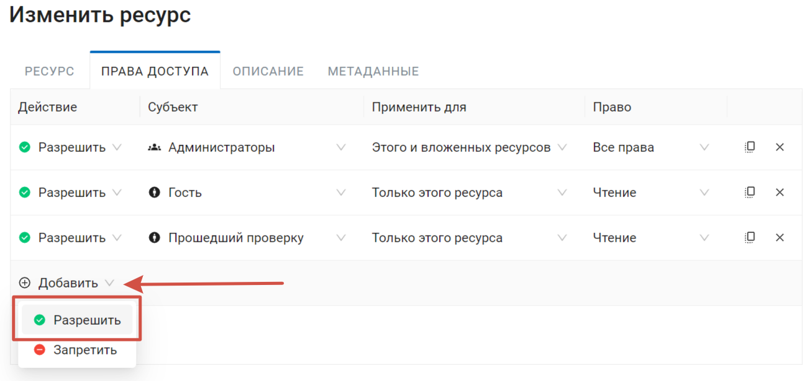

.. sectionauthor:: Роман Гайнуллов <roman.gainullov@nextgis.ru>, Юлия Григоренко <grigorenko.j@gmail.com>

.. _ngcom_permissions_intro:

Как настроить права доступа
===============================

Этот раздел поможет вам настроить права доступа в вашей Веб ГИС. Для этого здесь рассмотрены базовые принципы работы системы прав доступа и основные пользовательские сценарии их настройки.

.. note::
    Описываемая в данном разделе функциональность доступна в Веб ГИС, находящейся на тарифном плане `Премиум <http://nextgis.ru/pricing/#premium/>`_.

.. _ngcom_permissions_terms:

Общие понятия
-------------

Два основных правила, на которых строится всё:

1. **Ресурсный подход**

Корневая группа ресурсов (0) > Директория 1 > Директория 2 > Слой.

Право на корень > Право на директорию 1 > Право на директорию 2 > право на слой.

.. important::
	! Без права на чтение корня не прочитать никакие вложенные файлы.

.. list-table::

   * - **Ресурс**
     - Корень (0)
     - Папка 1
     - Папка 2
     - Слой
   * - **Право**
     - Чтение
     - Чтение
     - Чтение
     - Чтение

Вложенность может управляться на уровне типа ресурса.

Есть два состояния (помимо конкретных типов ресурсов):

* Для этого ресурса - применить только для текущего ресурса.
* Для этого и вложенных ресурсов - применить и для всех тех, что внутри по иерархии до последнего.

.. figure:: _static/permission_apply_ru.png
   :name: permission_apply_pic
   :align: center

   Меню выбора вариантов применения права доступа

2. **По умолчанию пользователи бесправны**

.. important::
	! Запрещено всё, кроме того, что не разрешено администратором явно.

Чтобы пользователь получил доступ к каким-либо-данным, этот доступ нужно ему предоставить.

.. _ngcom_permissions_usertypes:

Типы пользователей (субъектов)
~~~~~~~~~~~~~~~~~~~~~~~~~~~~~~~~~~~~

* Администратор - пользователь Веб ГИС, обладающий административными правами
* Владелец - пользователь Веб ГИС, создавший ресурс, на которое устанавливается право
* Гость - пользователь Веб ГИС, который обращается к ресурсу, не являясь при этом авторизованным
* Прошедший проверку - пользователь Веб ГИС, авторизованный в системе под любым существующим аккаунтом (то есть не гость)
* Любой пользователь - все, включая гостей и авторизовавшихся под любым аккаунтом пользователей

.. _ngcom_permissions_permtipes:

Типы прав - что можно или нельзя делать с ресурсами
~~~~~~~~~~~~~~~~~~~~~~~~~~~~~~~~~~~~~~~~~~~~~~~~~~~~~~~~

.. list-table::

   * - Ресурс: Все права
     - Любые действия с ресурсами, за исключением групп ресурсов
   * - Ресурс: Чтение
     - Чтение ресурсов
   * - Ресурс: Создание
     - Создание ресурсов
   * - Ресурс: Изменение
     - Модификация ресурсов
   * - Ресурс: Удаление
     - Удаление ресурсов
   * - Ресурс: Управление вложенными
     - Изменение настроек вложенных (дочерних) ресурсов
   * - Ресурс: Настройка прав доступа
     - Изменение настройки прав доступа ресурсов
   * - Данные: Все права 
     - Любые действия над данными
   * - Данные: Чтение данных
     - Чтение данных
   * - Данные: Изменение данных
     - Модификация данных
   * - Внешние соединения: Все права
     - Любые действия с соединениями
   * - Внешние соединения: Чтение параметров соединения
     - Чтение параметров соединения
   * - Внешние соединения: Настройки
     - Модификация соединений
   * - Внешние соединения: использование соединения
     - Использование соединения (будут ли доступны пользователю слои или данные из соединения)
   * - Сервисы Веб ГИС: Все права
     - Любые действия с сервисом
   * - Сервисы Веб ГИС: Доступ к сервису
     - Подключение к сервису
   * - Сервисы Веб ГИС: Настройка сервиса
     - Изменение настроек сервиса
   * - Веб-карта: Все права
     - Любые действия над веб-картой
   * - Веб-карта: Просмотр аннотаций
     - Просмотр аннотация на веб-карте
   * - Веб-карта: Рисование аннотаций
     - Рисование аннотация на веб-карте
   * - Веб-карта: Управление аннотациями
     - Изменение аннотаций на веб-карте
   * - Collector: Все права
     - 
   * - Collector: Чтение
     - 

.. _ngcom_permissions_tab:

Панель Права доступа
---------------------

Панель прав доступа доступна в режиме создания или измения ресурса. Каждая строка представляет собой отдельное правило, которое включает в себя:

- **Действие**: Разрешить или запретить. Поскольку по умолчанию запрещено всё, что не разрешено в явном виде, не рекомендуем использовать действие "запретить".
- **Субъект**: имя конкретного пользователя, группы пользователей или `тип пользователя <https://docs.nextgis.ru/docs_ngcom/source/permissions.html#ngcom-permissions-usertypes>`_, к которому будет применяться правило;
- **Применить для**: этого ресурса или этого и вложенных ресурсов;
- **Право**: включает тип ресурса и действие, которое с ним можно совершать, полный список возможных прав см. в `таблице <https://docs.nextgis.ru/docs_ngcom/source/permissions.html#ngcom-permissions-permtypes>`_.

   Вкладка "Права доступа"

.. _ngcom_permissions_new:

Как создать новое правило
~~~~~~~~~~~~~~~~~~~~~~~~~~~~~

Для того, чтобы создать новое правило, нажмите **Добавить** в свободной строке в конце списка и выберите **Разрешить**.

   Добавление нового правила права доступа

Далее в каждом столбце выберите из выпадающего списка нужное значение и нажмите **Сохранить**.

   Выбор субъекта для создаваемого права

Чтобы удалить правило, нажмите на крестик в конце строки.

.. _ngcom_permissions_cases:

Сценарии настроек прав доступа
------------------------------

В этом разделе рассматриваются в качестве примеров некоторые распространенные сценарии настроект прав доступа.

* `Просмотр всей Веб ГИС (на примере Гостя) <https://docs.nextgis.ru/docs_ngcom/source/permissions.html#ngcom-permissions-guest-webgis>`_
* `Просмотр только одной из веб-карт (на примере Гостя) <https://docs.nextgis.ru/docs_ngcom/source/permissions.html#ngcom-permissions-guest-webmap>`_
* `Доступ к WMS сервису (для авторизованных пользователей) <https://docs.nextgis.ru/docs_ngcom/source/permissions.html#ngcom-permissions-auth-wms>`_
* `Просмотр PostGIS слоя на веб-карте <https://docs.nextgis.ru/docs_ngcom/source/permissions.html#postgis>`_
* `Отображение трекеров на веб-карте для группы пользователей <https://docs.nextgis.ru/docs_ngcom/source/permissions.html#ngcom-permissions-track>`_

.. _ngcom_permissions_guest_webgis:

Просмотр всей Веб ГИС (на примере Гостя)
~~~~~~~~~~~~~~~~~~~~~~~~~~~~~~~~~~~~~~~~~~~~

Для этого нужно зайти в Основную группу ресурсов, открыть страницу редактирования и задать для группы следующие права:

* Действие: **Разрешить**
* Субъект: **Гость**
* Применить для **Этого и вложенных ресурсов**
* Право **Чтение** для: **ресурса** и **данных**.

.. _ngcom_permissions_guest_webmap:

Просмотр только одной из веб-карт (на примере Гостя)
~~~~~~~~~~~~~~~~~~~~~~~~~~~~~~~~~~~~~~~~~~~~

* Действие: **Разрешить**
* Субъект: **Гость**

1. Для Основной группы **Ресурс: Чтение**;

2. Для группы ресурсов, где лежат данные для веб-карты **Ресурс: Чтение, Данные: Чтение данных** ;

3. Для группы ресурсов, где лежит веб-карта, если это не та же самая группа, где расположены данные, также нужно задать разрешение **Ресурс: Чтение**;

4. Для веб-карты **Ресурс: Чтение**.

.. important::
	Рекомендуется размещать веб-карту и слои к ней **в разных папках**, это упростит настройку прав доступа. Если веб-карта расположена в той же папке, что и данные, то для всей папки нужно дать только право ресурс: Чтение, а затем право чтения нужно будет дать отдельно для всех необходимых слоев. 

Если в группе находятся другие веб-карты, доступ к которым вы давать не хотите, убедитесь, что право **Ресурс: Чтение** папки выставлено *только для нее самой*, но не для вложенных ресурсов. 

.. figure:: _static/guest_webmap_forbid_open_ru.png
   :name: guest_webmap_forbid_open_pic
   :align: center
   :width: 20cm

   В папке находятся три веб-карты, одна из них доступна для гостя, вторая видна, но не доступна для открытия, третья не видна в списке ресурсов

.. _ngcom_permissions_auth_wms:

Доступ к WMS сервису (для авторизованных пользователей)
~~~~~~~~~~~~~~~~~~~~~~~~~~~~~~~~~~~~~~~~~~~~

* Действие: **Разрешить**
* Субъект: **Прошедший проверку**

1. Для Основной группы **Ресурс: Чтение** применить **только для этого ресурса**.

2. Для группы ресурсов, где лежат данные и сервис WMS на основе этих данных **Ресурс: Чтение, Данные: Чтение данных** и **Сервисы Веб ГИС: Доступ к сервису**, применить **для этого и вложенных ресурсов**.

.. figure:: _static/allow_authorized_WMS_ru_2.png
   :name: allow_authorized_WMS_pic
   :align: center
   :width: 20cm

   Настройки прав доступа для папки, в которой расположены данные и сервис WMS

.. _ngcom_permissions_postgis:

Просмотр PostGIS слоя на веб-карте
~~~~~~~~~~~~~~~~~~~~~~~~~~~~~~~~~~~~~~~~~~~~

* Действие: **Разрешить**
* Субъект: **Гость** (если карта должна быть доступна неавторизованным пользователям), **Прошедший проверку** (если карта должна быть доступна только авторизованным пользователям) и т.п.
* Применить для **Этого ресурса**

1. Для Основной группы **Ресурс: Чтение**;

2. Для группы ресурсов, где лежат данные для веб-карты и слой PostGIS **Ресурс: Чтение, Данные: Чтение данных** и **Внешние соединения: Использование соединения**;

3. Для группы ресурсов, где лежит веб-карта, если это не та же самая группа, где расположены данные, также нужно задать разрешение **Ресурс: Чтение**;

.. figure:: _static/allow_auth_webmap_group_ru_2.png
   :name: allow_auth_webmap_group_pic
   :align: center
   :width: 20cm

4. Для веб-карты **Ресурс: Чтение**.

.. important::
	Рекомендуется размещать веб-карту и слои к ней **в разных папках**, это упростит настройку прав доступа. Если веб-карта расположена в той же папке, что и данные, то для всей папки нужно дать только право ресурс: Чтение, а затем право чтения нужно будет дать отдельно для всех необходимых слоев. 

Если в группе находятся другие веб-карты, доступ к которым вы давать не хотите, убедитесь, что право **Ресурс: Чтение** папки выставлено *только для нее самой*, но не для вложенных ресурсов. 

.. _ngcom_permissions_track:

Отображение трекеров на веб-карте для группы пользователей
~~~~~~~~~~~~~~~~~~~~~~~~~~~~~~~~~~~~~~~~~~~~~~~~~~~~~~~~~~~~~~

* Действие: **Разрешить**
* Субъект: **Группа пользователей** (напр. "Научный отдел")

1. Право: **Ресурс: Чтение**. Применить: **Только для этого ресурса**

Установить для: 

* Основной группы ресурсов
* Группы, в которой расположена группа трекеров
* Группы трекеров
* Трекера
* Группы, в которой расположена веб-карта
* Веб-карты

2. Права: **Ресурс: Чтение** только для этого ресурса, **Данные: Чтение данных** для этого и вложенных ресурсов

Установить для:

* Группы ресурсов, где лежат данные для веб-карты

