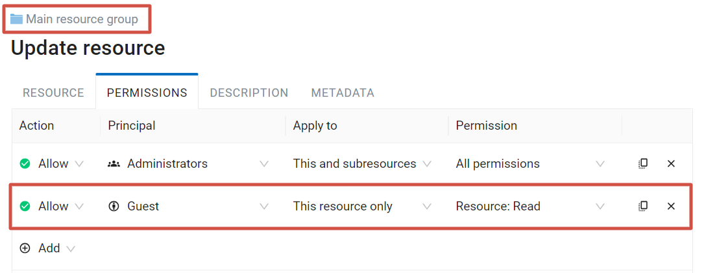
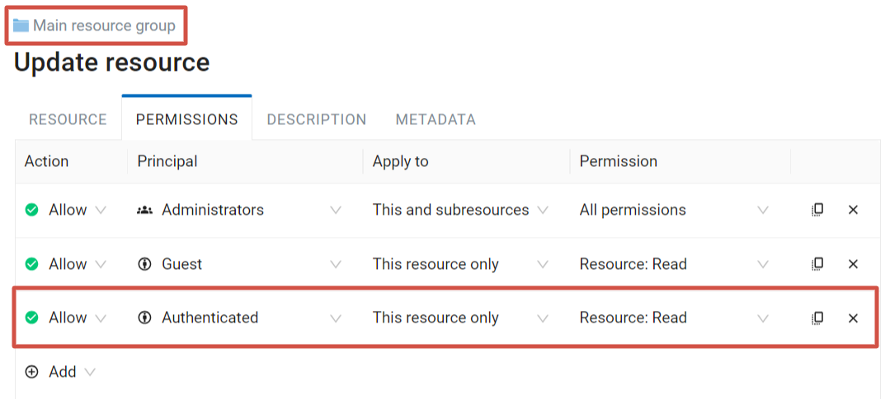

.. sectionauthor:: Роман Гайнуллов <roman.gainullov@nextgis.ru>, Юлия Григоренко <grigorenko.j@gmail.com>

.. _ngcom_permissions_intro:

Managing access rights
================================

This section will help you set up access to your Web GIS for various users. Below you'll find an overview of the permissions system and some common cases of setting up access.

.. note::
    This functionality is only available for users having `Premium <http://nextgis.com/pricing/#premium/>`_ subscription.

Terms
-------------

   Permissions tab

There are two base rules:

1. **Resource approach**

Main (root) resource group (0) > Group 1 > Group 2 > Layer.

Permission for the root group > Permission for Group 1 > Permission for Group 2 > Permission for the layer.

.. important::
	! Without permission to read the main resource group user cannot view any files it contains.

.. list-table::

   * - **Resource**
     - Root (0)
     - Folder 1
     - Folder 2
     - Layer
   * - **Permission**
     - Read
     - Read
     - Read
     - Read

You can select a specific resource type that will be affected by the permission.

Other than that, there are two main options to apply a permission:

* This resource only - it will only affect the resource itself.
* This and subresources - it will affect all resources within, subgroups and their contents.

   Menu to select what permission applies to

2. By default users have NO permissions.

.. important::
	! Everything is forbidden unless explicitly allowed by the administrator.

The only way a user gets access to data is by having access granted by a permission.

Types of principals (users)
~~~~~~~~~~~~~~~~~~~~~~~~~~~~~~~~~~~~

* Administrator - Web GIS user with administrative rights
* Owner - Web GIS user who has created the particular resource for which the permission is given
* Guest - user that has not logged in
* Authenticated - Web GIS user who's logged in with any existing account (a.k.a. not a guest)
* Everyone - this includes both guests and users logged in with existing account

Types of rules - what can be allowed or denied
~~~~~~~~~~~~~~~~~~~~~~~~~~~~~~~~~~~~~~~~~~~~~~~~~~~~~~~~

.. list-table::

   * - Resource: All permissions
     - Any actions with resources, except resource groups
   * - Resource: Read
     - Read resources
   * - Resource: Create
     - Create resources
   * - Resource: Modify
     - Edit resources
   * - Resource: Delete
     - Delete resources
   * - Resource: Manage subresources
     - Configure included (child) resource
   * - Resource: Configure permissions
     - Edit access permissions for the resources
   * - Metadata: All permissions 
     - Any actions on metadata
   * - Metadata: Read
     - Edit metadata
   * - Metadata: Modify 
     - Read metadata
   * - Data structure: All permissions 
     - Any actions with the data structure
   * - Data structure: Read
     - Read data structure
   * - Data structure: Modify 
     - Edit data structure
   * - Data: All permissions 
     - Any actions with the data
   * - Data: Read
     - Read data
   * - Data: Modify 
     - Edit data
   * - Connection: All permissions
     - Any actions with the connections
   * - Connection: Read
     - Read connection settings
   * - Connection: Configure
     - Edit connections
   * - Connection: Use
     - Use connections (gives to the user access to the layers and data of the connection)
   * - Service: All permissions
     - Any actions with the service
   * - Service: Access
     - Connect to the service
   * - Service: Configure
     - Edit service settings
   * - Web Map: All permissions
     - Any actions with the Web Maps
   * - Web Map: Open
     - View Web Map
   * - Web Map: View annotations
     - View Web Map annotations
   * - Web Map: Draw annotations
     - Add annotations to Web Maps
   * - Web Map: Manage annotations
     - Edit Web Map annotations
   * - Collector: All permissions
     - Any actions with the Collector project 
   * - Collector: Read
     - Read Collector data

.. _ngcom_permissions_cases:

Common cases
------------------------------

.. _ngcom_permissions_guest_webgis:

Allow Guests to view the entire Web GIS
~~~~~~~~~~~~~~~~~~~~~~~~~~~~~~~~~~~~~~~~~~~~

Go to the Main resource group, select the Update action and set up the following permissions:

* Action: **Allow**
* Principal: **Guest**
* Apply to **This and subresources**
* Permission to **Read** for the **resource, metadata, data structure** and **data**.

.. _ngcom_permissions_guest_webmap:

Allow Guests to view just one Web Map
~~~~~~~~~~~~~~~~~~~~~~~~~~~~~~~~~~~~~~~~~~~~

* Action: **Allow**
* Principal: **Guest**

1. For the Main resource group **Resource: Read**;

2. For the resource group containing data for the Web Map: **Resource: Read, Data: Read** and **Data structure: Read**;

3. For the resource group containing the Web Map, if it is not the same group that contains the data, also assign permission **Resource: Read**;

4. For the Web Map: **Resource: Read** and **Web Map: Display**.

.. important::
	We recommend keeping Web Map in a **separate group** from its layers, it will make setting up access rights more easy. If the Web Map is in the same group as the data, for the group only assign Resource: Read, then assing reading permission for every layer that has to be included. 

If there are other Web Maps in the group that you wish to keep hidden from guests, make sure that the **Resource: Read** permission for the group is not propagated to the subresources and set to **This resource only**. 

.. figure:: _static/guest_webmap_forbid_open_en.png
   :name: guest_webmap_forbid_open_pic
   :align: center
   :width: 16cm

   There are three Web Maps in the group. One is available to guests. The other is visible in the resource list, but cannot be opened. The third one is not visible in the list

.. _ngcom_permissions_auth_wms:

Allow logged in users to use WMS service
~~~~~~~~~~~~~~~~~~~~~~~~~~~~~~~~~~~~~~~~~~~~

* Action: **Allow**
* Principal: **Authenticated**

1. For the Main resource group: **Resource: Read**, apply to **This resource only**.

2. For the group containing the data and the WMS service: **Resource: Read, Data: Read**, **Data structure: Read** and **Service: Access**, apply to **This and subresources**.

.. figure:: _static/allow_authorized_WMS_en.png
   :name: allow_authorized_WMS_pic
   :align: center
   :width: 20cm

   Permissions for the group containing both the data and the WMS service

.. _ngcom_permissions_postgis:

Allow to view PostGIS layer on a Web Map
~~~~~~~~~~~~~~~~~~~~~~~~~~~~~~~~~~~~~~~~~~~~

* Action: **Allow**
* Principal: **Guest** (if the map needs to be available unauthorized users), **Authenticated** (if it needs to be available only to users who have logged in) etc.
* Apply to **This resource**

1. For the Main resource group **Resource: Read**;

2. For the resource group containing data for the Web Map and the PostGIS layer: **Resource: Read, Data: Read, Data structure: Read** and **Connection: Use**;

3. For the resource group containing the Web Map, if it is not the same group that contains the data, also assign permission **Resource: Read**;

4. For the Web Map: **Resource: Read** and **Web Map: Display**.

.. important::
	We recommend keeping Web Map in a **separate group** from its layers, it will make setting up access rights more easy. If the Web Map is in the same group as the data, for the group only assign Resource: Read, then assing reading permission for every layer that has to be included. 

If there are other Web Maps in the group that you wish to keep hidden from guests, make sure that the **Resource: Read** permission for the group is not propagated to the subresources and set to **This resource only**.

