.. sectionauthor:: Роман Гайнуллов <roman.gainullov@nextgis.ru>, Юлия Григоренко <grigorenko.j@gmail.com>

.. _ngcom_permissions_cases:

Сценарии настроек прав доступа
=================================

.. _ngcom_permissions_guest_webgis:

Просмотр всей Веб ГИС (на примере Гостя)
-----------------------------------------

Для этого нужно зайти в Основную группу ресурсов, открыть страницу редактирования и задать для группы следующие права:

* Действие: **Разрешить**
* Субъект: **Гость**
* Применить для **Этого и вложенных ресурсов**
* Право **Чтение** для: **ресурса, метаданных, структуры данных** и самих **данных**.

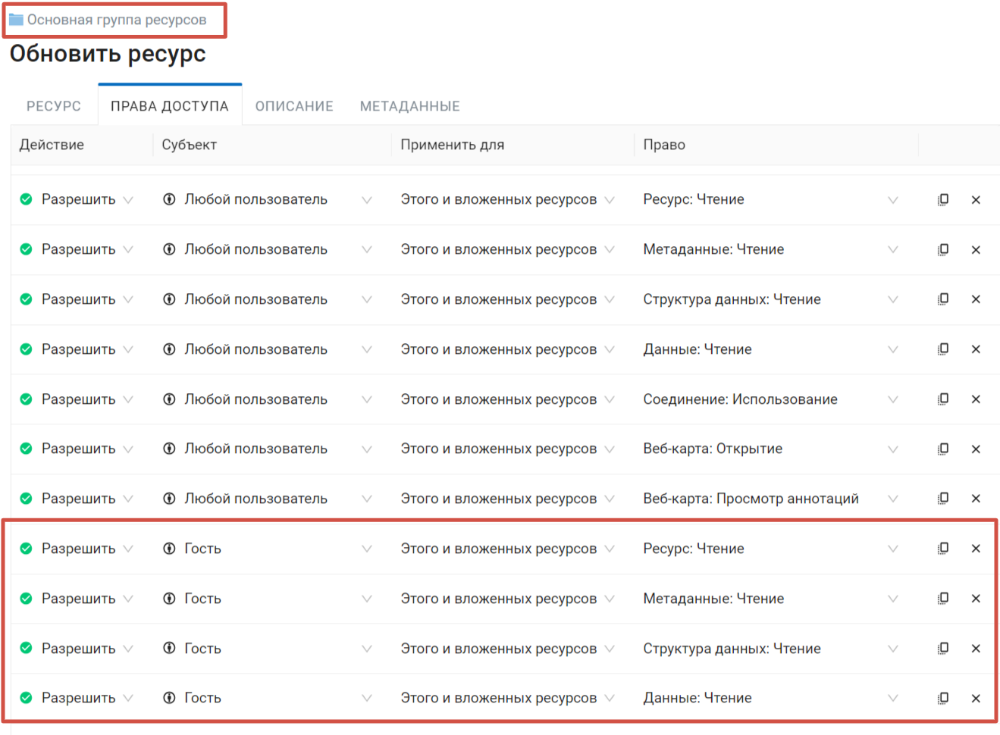

.. _ngcom_permissions_guest_webmap:

Просмотр только одной из веб-карт (на примере Гостя)
----------------------------------------

* Действие: **Разрешить**
* Субъект: **Гость**

1. Для Основной группы **Ресурс: Чтение**;

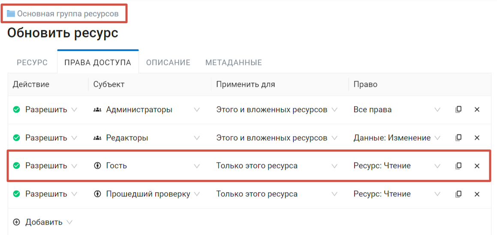

2. Для группы ресурсов, где лежат данные для веб-карты **Ресурс: Чтение, Данные: Чтение** и **Структура данных: Чтение**;

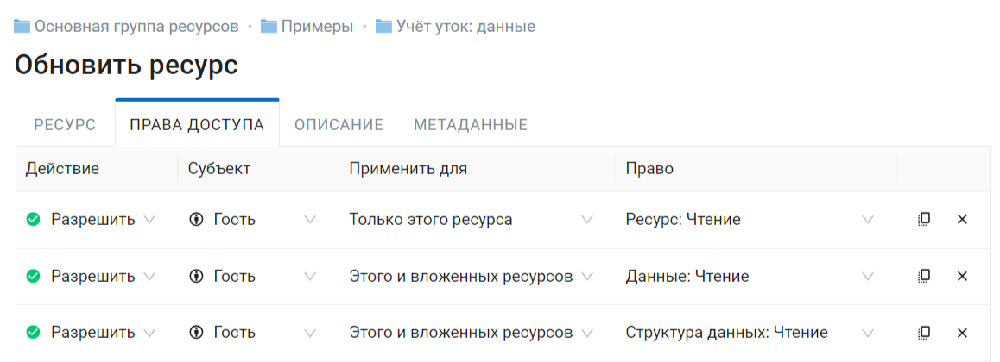

3. Для группы ресурсов, где лежит веб-карта, если это не та же самая группа, где расположены данные, также нужно задать разрешение **Ресурс: Чтение**;

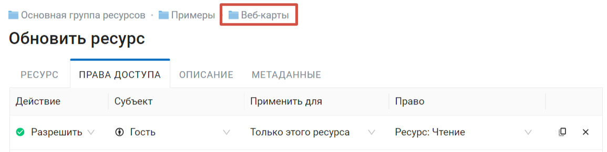

4. Для веб-карты **Ресурс: Чтение** и **Веб-карта: Открытие**

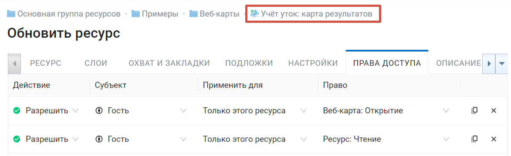

.. important::
	Рекомендуется размещать веб-карту и слои к ней **в разных папках**, это упростит настройку прав доступа. Если веб-карта расположена в той же папке, что и данные, то для всей папки нужно дать только право ресурс: Чтение, а затем право чтения нужно будет дать отдельно для всех необходимых слоев. 

Если в группе находятся другие веб-карты, доступ к которым вы давать не хотите, убедитесь, что право **Ресурс: Чтение** папки выставлено *только для нее самой*, но не для вложенных ресурсов. 

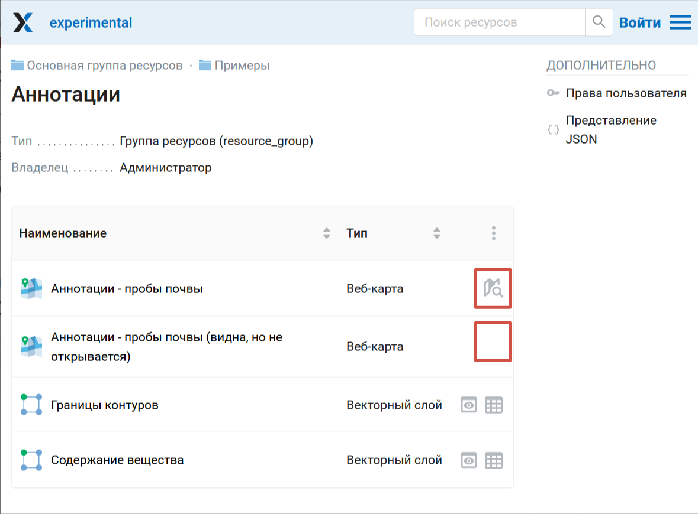

   В папке находятся три веб-карты, одна из них доступна для гостя, вторая видна, но не доступна для открытия, третья не видна в списке ресурсов

.. _ngcom_permissions_auth_wms:

Доступ к WMS сервису (для авторизованных пользователей)
------------------------------------------------------------------------------------------------------

* Действие: **Разрешить**
* Субъект: **Прошедший проверку**

1. Для Основной группы **Ресурс: Чтение** применить **только для этого ресурса**.

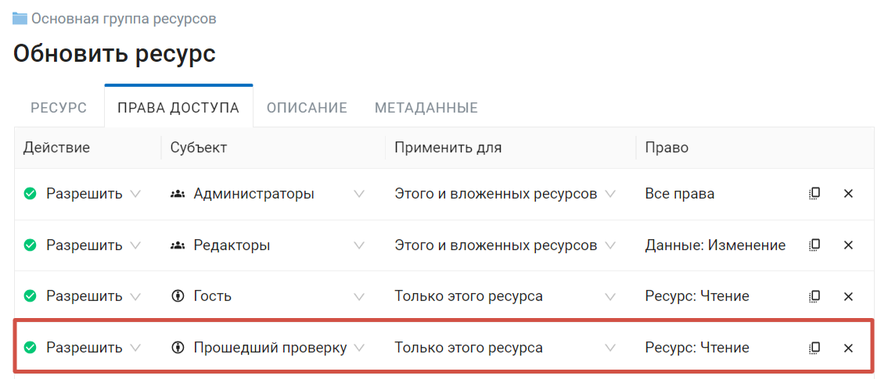

2. Для группы ресурсов, где лежат данные и сервис WMS на основе этих данных **Ресурс: Чтение, Данные: Чтение, Структура данных: Чтение** и **Сервис: Доступ**, применить **для этого и вложенных ресурсов**.

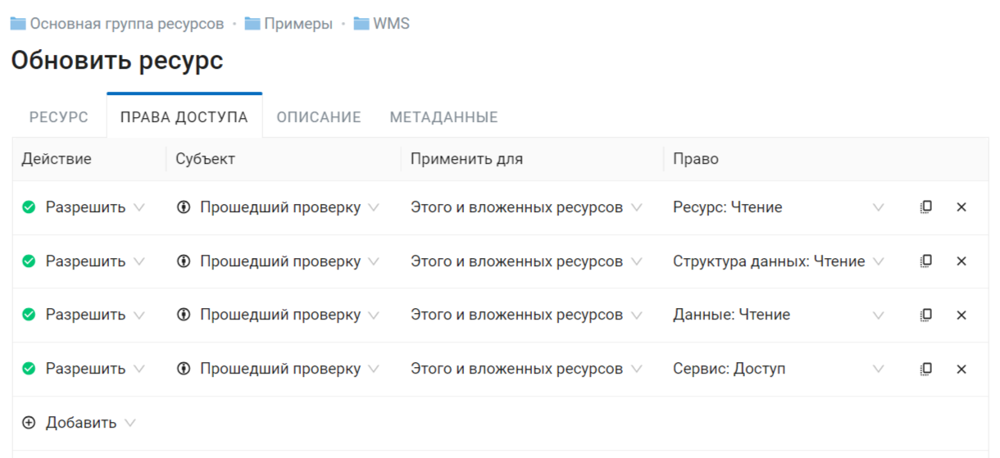

   Настройки прав доступа для папки, в которой расположены данные и сервис WMS

.. _ngcom_permissions_postgis:

Просмотр PostGIS слоя на веб-карте
-------------------------------------

* Действие: **Разрешить**
* Субъект: **Гость** (если карта должна быть доступна неавторизованным пользователям), **Прошедший проверку** (если карта должна быть доступна только авторизованным пользователям) и т.п.
* Применить для **Этого ресурса**

1. Для Основной группы **Ресурс: Чтение**;

2. Для группы ресурсов, где лежат данные для веб-карты и слой PostGIS **Ресурс: Чтение, Данные: Чтение, Структура данных: Чтение** и **Соединение: Использование**;

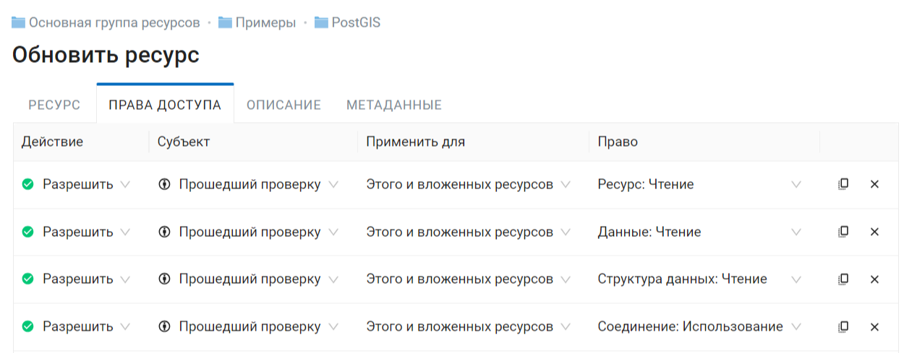

3. Для группы ресурсов, где лежит веб-карта, если это не та же самая группа, где расположены данные, также нужно задать разрешение **Ресурс: Чтение**;

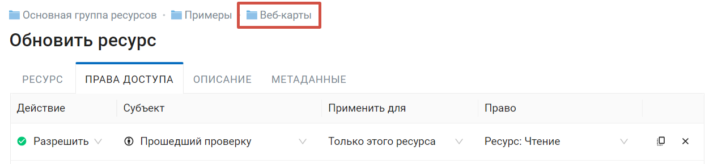

4. Для веб-карты **Ресурс: Чтение** и **Веб-карта: Открытие**.

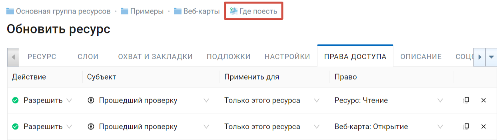

.. important::
	Рекомендуется размещать веб-карту и слои к ней **в разных папках**, это упростит настройку прав доступа. Если веб-карта расположена в той же папке, что и данные, то для всей папки нужно дать только право ресурс: Чтение, а затем право чтения нужно будет дать отдельно для всех необходимых слоев. 

Если в группе находятся другие веб-карты, доступ к которым вы давать не хотите, убедитесь, что право **Ресурс: Чтение** папки выставлено *только для нее самой*, но не для вложенных ресурсов. 
