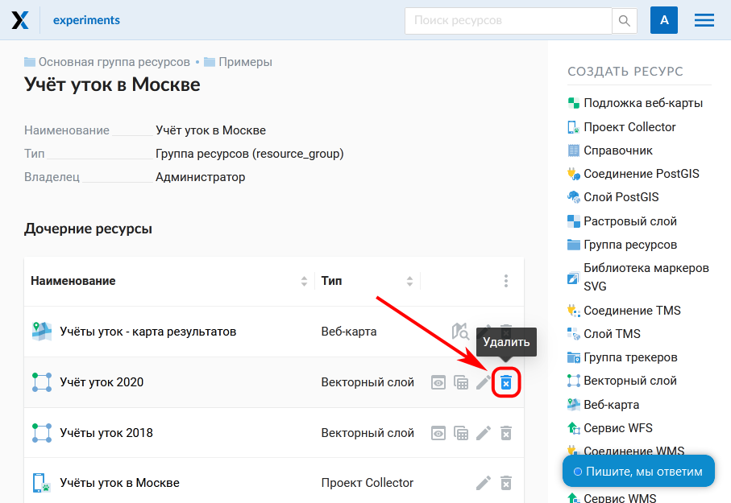
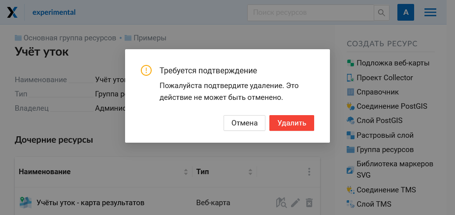
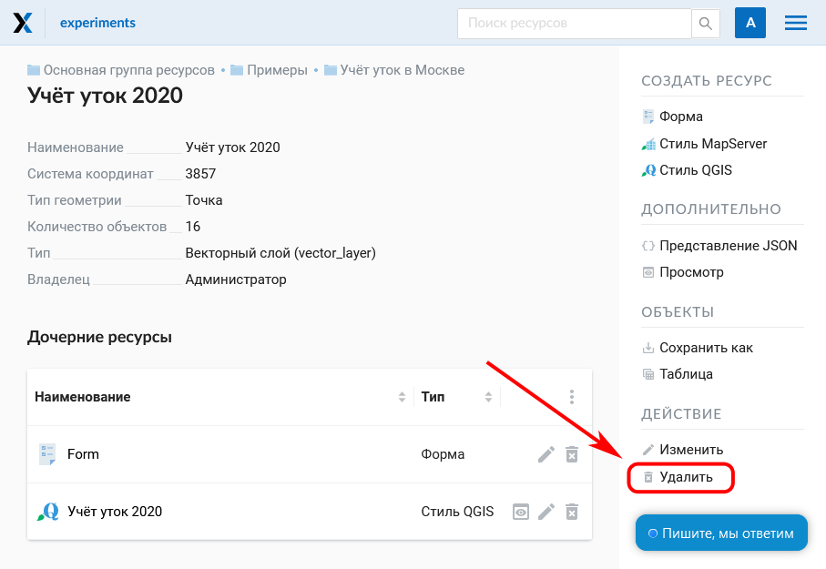
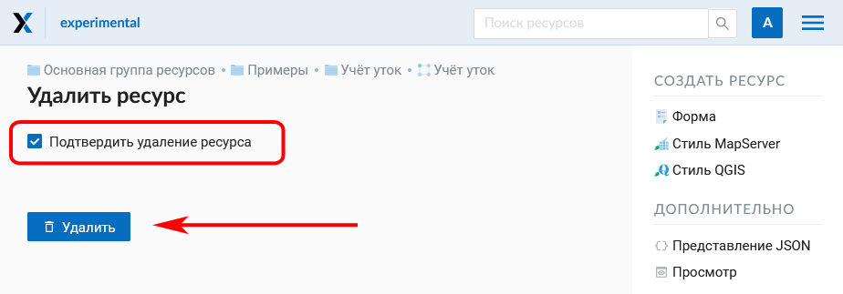
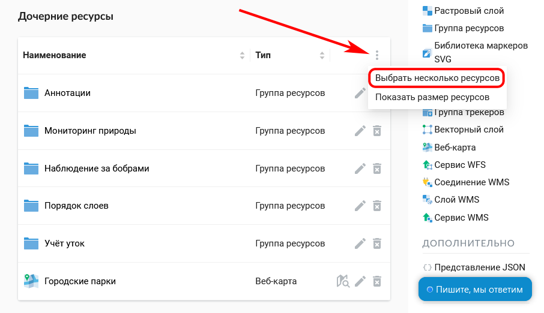
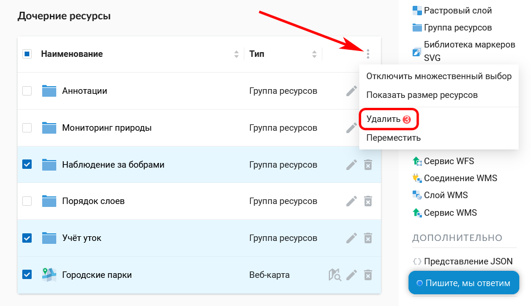

.. _ngcom_resource_delete:

Как удалять данные
======================================

:ref:`Веб ГИС <ngcom_description>` позволяет удалять загруженные и подключенные в нее данные путем удаления соответствующих ресурсов (:ref:`Векторных слоев <ngcom_vector_layer>`, :ref:`Растровых слоев <ngcom_raster_layer>`, :ref:`Слоев PostGIS <ngcom_postgis_layer>`, :ref:`Слоев WMS <ngcom_postgis_layer>`, а также :ref:`Соединений PostGIS <ngcom_postgis_connect>` и :ref:`Соединений WMS <ngcom_wms_connect>`, :ref:`Сервисов <ngcom_data_services>`, :ref:`Стилей <ngcom_styles>`, :ref:`Групп ресурсов <ngcom_resources_group>`). 

.. _ngcom_resource_delete_one:

Как удалить один ресурс
~~~~~~~~~~~~~~~~~~~~~~~~~~

1. Находясь в родительском ресурсе, в списке дочерних напротив целевого слоя выберите иконку "крест" (см. :numref:`ngw_delete_resource_from_group_pic`).

   Выбор действия "Удалить" в списке ресурсов

2. Подтвердите операцию во всплывающем окне.

   Подтверждение удаления

Второй способ:

1. Откройте окно свойств ресурса, который вы хотите удалить;
2. Выберите :menuselection:`Действие --> Удалить` на правой панели :ref:`веб-интерфейса <ngw_admin_interface>` Веб ГИС;

   Выбор действия "Удалить" на странице ресурса

3. В открывшемся окне на вкладке :guilabel:`Удалить ресурс` поставьте галочку в строке :guilabel:`Подтвердить удаление ресурса`;
3. Нажмите кнопку :guilabel:`Удалить`. 

   Удаление ресурса

Если ресурс успешно удален, то информация о нем исчезнет из соответствующей :ref:`Группы ресурсов <ngcom_resources_group>`.

.. _ngcom_resource_delete_multi:

Как удалить несколько ресурсов сразу
~~~~~~~~~~~~~~~~~~~~~~~~~~~~~~~~~~~

1. Находясь в родительском ресурсе, в списке дочерних рисурсов вызовите меню (три точки в правом верхнем углу) и нажмите "Выбрать несколько ресурсов".

   
   Включение множественного выбора

2. Поставьте галочки напротив ресурсов, которые необходимо удалить.
3. Снова вызовите меню списка ресурсов и выберите действие "Удалить". 

   
   Удаление нескольких ресурсов

4. Подтвердите удаление во всплывающем окне.

.. note:: 
	Вы также можете удалять ресурсы из Веб ГИС :ref:`с помощью настольного приложения QGIS <ngcom_ngqgis_connect_resource_delete>`.
