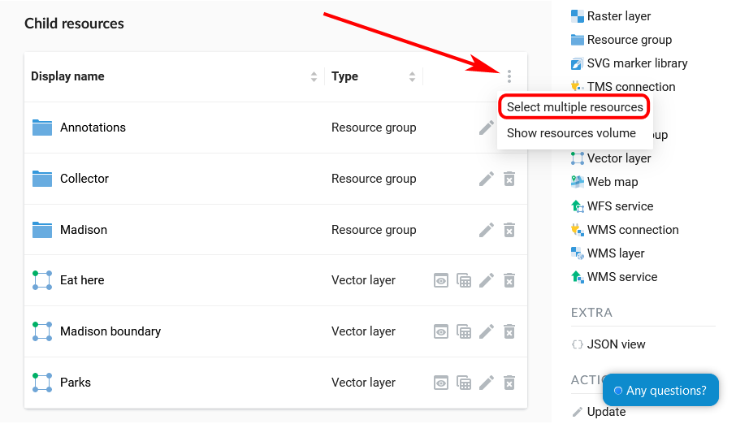

.. _ngcom_resource_delete:

How to delete data
======================================

:ref:`Web GIS <ngcom_description>` allows to delete uploaded and connected geodata by deleting the corresponding resources (:ref:`Vector layers <ngcom_vector_layer>`, :ref:`Raster layers <ngcom_raster_layer>`, :ref:`PostGIS layers <ngcom_postgis_layer>`, :ref:`WMS layers <ngcom_postgis_layer>`, :ref:`PostGIS and WMS connections <ngcom_data_connect>`, :ref:`WMS and WFS services <ngcom_data_services>`, :ref:`Styles <ngcom_styles>`, :ref:`Resource groups <ngcom_resources_group>`).  

.. _ngcom_resource_delete_one:

How to delete one resource
~~~~~~~~~~~~~~~~~~~~~~~~~~

1. Open the group containing the resource you’d like to delete. In the Child Resources list click the trash can icon to the right of the resource's name (see :numref:`ngw_delete_resource_from_group_pic`).

.. figure:: _static/ngw_delete_resource_from_group_en.png
   :name: ngw_delete_resource_from_group_pic
   :align: center
   :width: 20cm

   Selecting "Delete" in the child resource list

4. Confirm the operation in the pop-up window.

.. figure:: _static/ngw_delete_from_group_confirmation_en.png
   :name: ngw_delete_from_group_confirmation_pic
   :align: center
   :width: 20cm

   Resource deleting confirmation

Alternative way

1. Open the Properties page of a resource you want to delete;
2. Select :menuselection:`Action --> Delete` on the right side of Web GIS :ref:`admin console <ngw_admin_interface>`;

.. figure:: _static/ngw_window_update_delete_resource_eng_2.png
   :name: ngw_window_update_delete_resource
   :align: center
   :width: 20cm

   Selection of “Delete” action in the action pane

3. In the opened dialog window in :guilabel:`Delete resource` tab check the box :guilabel:`Confirm deletion of the resource`;
Press :guilabel:`Delete` button.  

.. figure:: _static/ngw_delete_from_page_confirmation_en.png
   :name: ngw_deletion_resource
   :align: center
   :width: 20cm

   “Delete resource” window

If a resource is deleted successfully its name will disappear from the relevant :ref:`Resource group <ngcom_resources_group>`.

.. _ngcom_resource_delete_multi:

How to delete several resources at once
~~~~~~~~~~~~~~~~~~~~~~~~~~~~~~~~~~~

1. Open the group containing the resources you’d like to delete. In the Child Resources list click the three dots in the upper right corner and in the menu press “Select multiple resources”.

   
   Enabling multiple selection

2. Tick the resources you want to delete.
3. In the list menu select "Delete". 

   
   Deleting multiple resources

4. Confirm in the pop-up window.

.. note:: 
	You can also delete resources from Web GIS :ref:`with desktop app QGIS <ngcom_ngqgis_connect_resource_delete>`.
