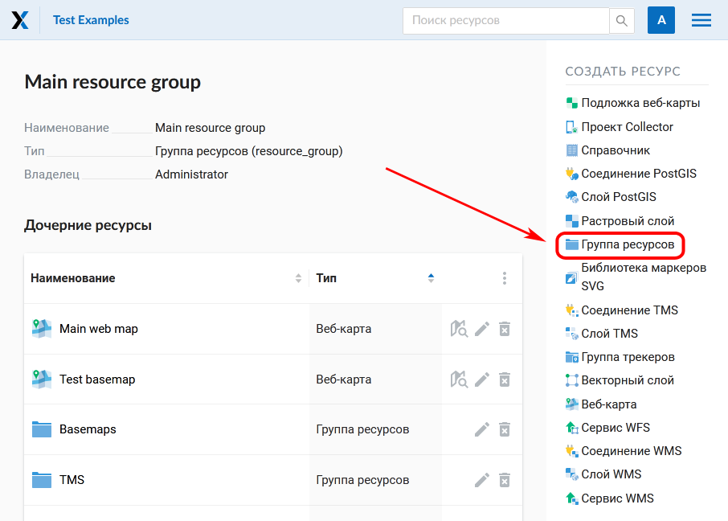
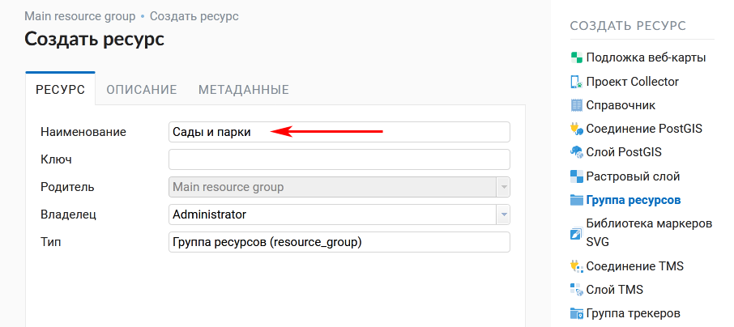

.. _ngcom_resources_group:

Как упорядочить хранение данных
==========================================

В :ref:`Веб ГИС <ngcom_description>` можно создавать Группы ресурсов для более удобной организации хранения геоданных. Например, можно создавать отдельные группы для хранения данных по разным проектам или объединять в группы слои данных по типам. Для создания группы:

#. Откройте главную страницу Веб ГИС (на ней по умолчанию открыта Основная группа ресурсов);
#. Выберите :menuselection:`Создать ресурс --> Группа ресурсов` на правой панели :ref:`веб-интерфейса <ngw_admin_interface>` Веб ГИС;

   
   Выбор пункта "Группа ресурсов"

#. В открывшемся окне заполните поле :guilabel:`Наименование` на вкладке :guilabel:`Ресурс`;
#. Нажмите кнопку :guilabel:`Создать`. 

   
   Окно создания группы ресурсов

Если Группа ресурсов создалась успешно, то информация о ней появится в Основной группе ресурсов на главной странице Веб ГИС.

Теперь вы можете зайти в созданную группу и создавать ресурсы в ней.

.. note:: 
	Вы также можете создавать новые Группы ресурсов в Веб ГИС :ref:`с помощью настольного приложения NextGIS QGIS <ngcom_ngqgis_connect_resource_group>`.

Больше информации о создании Групп ресурсов - :ref:`здесь <ngw_resources_group>`.

О том, как перемещать ресурсы из одной Группы в другую - :ref:`здесь <ngcom_parent_change>`.
