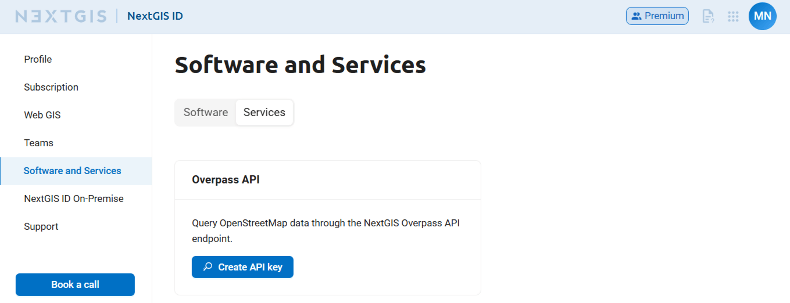

Additional services
========================

Additional services are a number of small services that can help you with you daily GIS tasks. 

To use a service you need to get a personal API key in your `account <https://docs.nextgis.com/docs_ngcom/source/create.html#ngcom-ngid-my>`_.

.. _services_overpass:

Overpass
---------

Overpass API is a data extraction tool and database access gateway for OpenStreetMap (OSM) that lets you query specific map features by location, tags, or attributes.

Individual Overpass servers may be unavailable or slow at times. In this case you can use NextGIS Overpass server.

To get your API key, go to the `Software and services  <https://my.nextgis.com/software?tab=api-keys>`_ section of your account. On the Overpass API click **Create API key**.

   Services in NextGIS ID account

The card changes, showing the API key separately and the NextGIS Overpass link. You can use this link, for example, in the `OSMInfo plugin <https://docs.nextgis.com/docs_ngqgis/source/osminfo.html#osminfo-overpass>`_.

