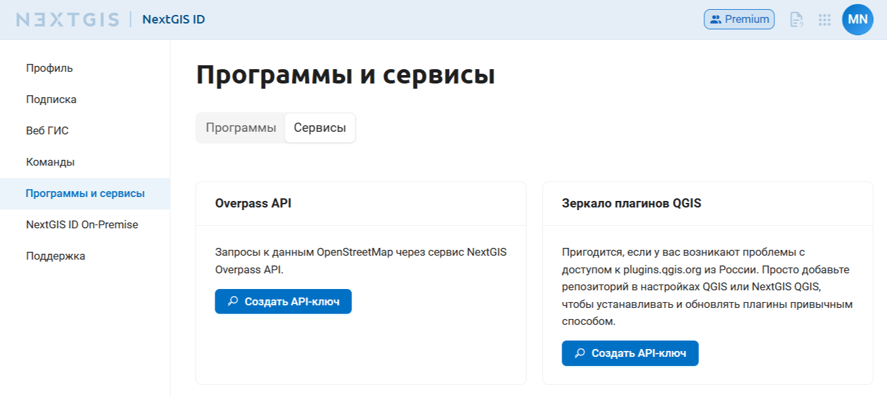
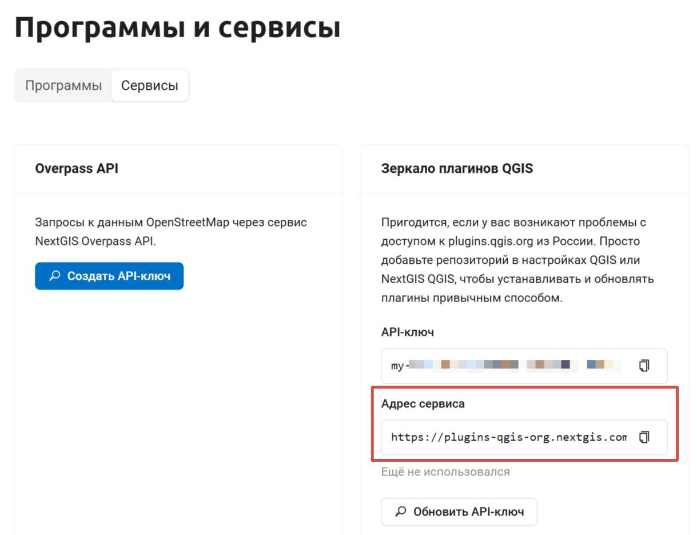
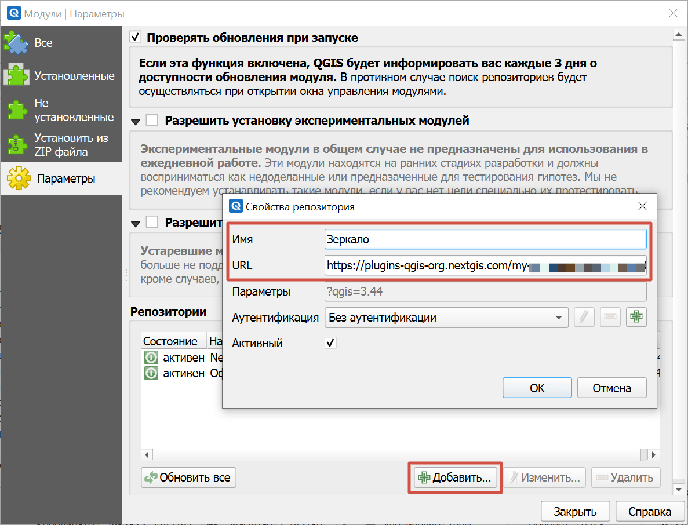

Вспомогательные сервисы
========================

Вспомогательные сервисы - это набор небольших сервисов которые помогут решить ряд повседневных ГИС задач. 

Чтобы использовать конкретный сервис, нужно получить для него API ключ в `личном кабинете <https://docs.nextgis.ru/docs_ngcom/source/create.html#ngcom-ngid-my>`_.

.. _services_overpass:

Overpass
---------

Overpass API — это специальный инструмент для быстрого поиска и выгрузки конкретных данных из базы OpenStreetMap по заданным критериям (тегам, координатам, типам объектов).

Отдельные серверы Overpass могут быть недоступны или работать медленно. В таком случае вы можете воспользоваться сервером Overpass от NextGIS.

Получить API-ключ можно в личном кабинете в разделе `Программы и сервисы <https://my.nextgis.com/software?tab=api-keys>`_. Для этого на плашке "Overpass API" нажмите **Создать API-ключ**.

   Раздел личного кабинета "Сервисы"

После этого станет доступен отдельно API-ключ и ссылка на сервер Overpass NextGIS. Вы можете использовать её, например, в `модуле OSMInfo <https://docs.nextgis.ru/docs_ngqgis/source/osminfo.html#osminfo-overpass>`_.

.. _services_plugins:

Зеркало репозитория модулей QGIS
--------------------------------

Пригодится, если у вас возникают проблемы с доступом к plugins.qgis.org из России.

Получить API-ключ для доступа к репозиторию можно в личном кабинете в разделе `Программы и сервисы <https://my.nextgis.com/software?tab=api-keys>`_. Для этого на плашке "Зеркало плагинов QGIS" нажмите **Создать API-ключ**.

   Раздел личного кабинета "Сервисы"

Когда ключ будет сгенерирован, скопируйте появившуюся ссылку на адрес сервиса.

   Адрес зеркала

В QGIS или NextGIS QGIS откройте меню :menuselection:`Модули --> Управление модулями`.

Перейдите на вкладку "Параметры". В разделе "Репозитории" нажмите **Добавить**. Вставьте скопированный адрес сервиса и нажмите **Ок**.

   Добавление репозитория в QGIS

Деактивируйте основной репозиторий QGIS, чтобы программа не пыталась обращаться к нему. Для этого выберите его в списке, нажмите **Изменить** и снимите галочку "Активен".

Нажмите **Обновить все**. Теперь модули будут загружаться из репозитория со стабильной доступностью.
