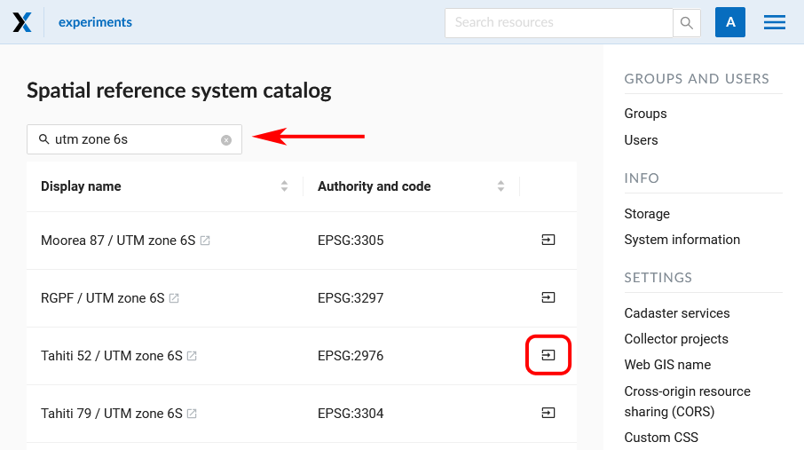
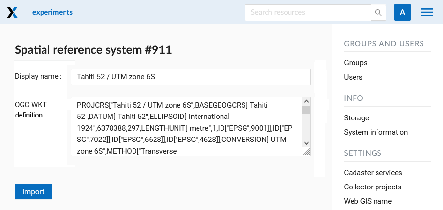
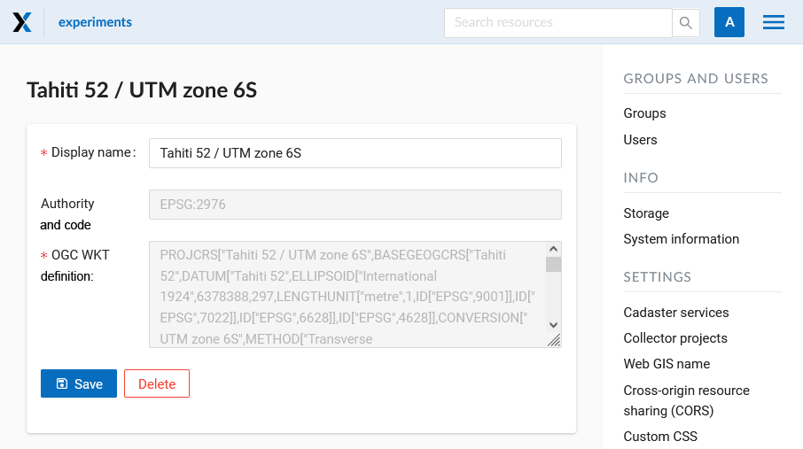
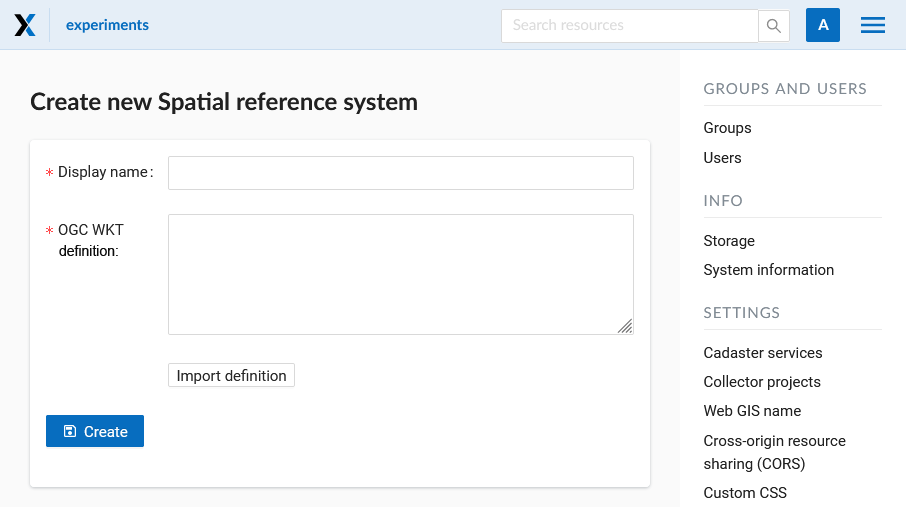
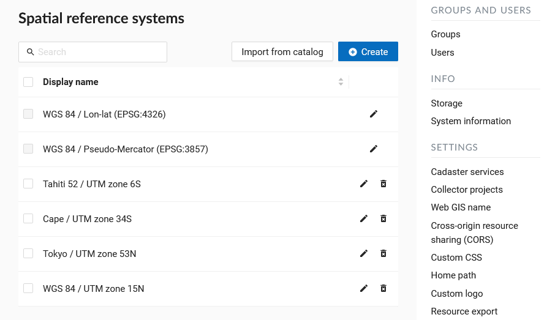
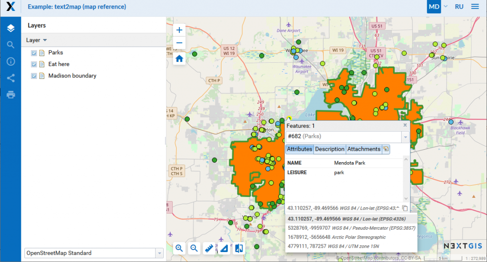

.. _ngcom_srs:

Custom coordinate systems
=============================

.. note::
    Custom SRS functionality is available on `Premium <http://nextgis.com/pricing/#premium/>`_ and while using the product `On-premise <https://nextgis.com/pricing/>`_. 

.. note::
    Only users with administrative privileges can add and modify SRS.

You can import a SRS from the catalog or create your own.

To **import SRS from the catalog** open "Control panel" in the main menu and press "Catalog" in "Spacial reference systems". Start typing the name of the SRS in the search bar. When you find the desired SRS in the search results, press the icon with the arrow next to it.

   Search results in the catalog

You will be redirected to the import page. Here you can modify the name of SRS to be displayed in your WebGIS.

   Adding SRS from catalog
   

   Completing import

On the next page, press **Save** to complete the import.

To **create a new SRS** open "Control panel" in the main menu and press "Create" in "Spatial reference systems": 

   Creation of a new SRS
   
You can give an SRS display name and enter its definition in OGC WKT format. You can also import definitions from common formats as PROJ, MapInfo and EPSG, after the import they will get converted to OGC WKT format. Then press "Create" button.

You can find a list of created and available SRS in the "List" of "Spatial reference systems" in "Control panel". In this list there are two SRS by default: «WGS 84 / Lon-lat (EPSG:4326)» and «WGS 84 / Pseudo-Mercator (EPSG:3857)», which can’t be removed or edited (except name):

   A list of SRS
   
The added SRS can be used for various purposes:

1. To capture coordinates on Web maps. If you have set up additional SRS (one or several), you can now conveniently capture coordinates in this SRS from anywhere on the map:

   The use of custom SRS
   
2. To export vector layers. All custom SRS are also available for data export (see above).

3. To extend API requests. Support for custom SRS is gradually added to NextGIS Web API too. For example, this request will return a feature in a required SRS:

    /api/resource/{id}/feature/{fid}?srs=990002

Custom SRS identifier (990002 in this example) can be known by editing a created SRS, for example:

    /srs/990002/edit
