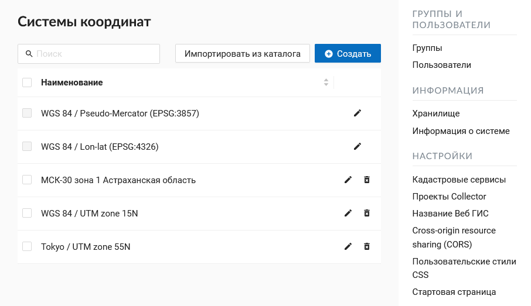

.. _ngcom_srs:

Как работать с системами координат
===================================

.. note::
    Функциональность по поддержке пользовательских систем координат доступна на планах `Премиум <http://nextgis.ru/pricing/#premium/>`_ и `Корпоративный <http://nextgis.ru/pricing/#corporate/>`_

.. note::
    Добавление и изменение систем координат доступно только пользователям с правами администратора.

Новую систему координат можно импортировать из каталога или создать самостоятельно.

Добавление систем координат из каталога
--------------------------------------------

Для того, чтобы **добавить СК из каталога**, нужно перейти в "Панель управления" и в разделе "Системы координат" нажать  "Каталог". На странице каталога в строку поиска начните вводить название нужной системы координат. В появившемся списке результатов поиска нажмите на иконку со стрелкой. 

.. figure:: _static/new_srs_catalog_ru.png
   :name: new_srs_catalog
   :align: center
   :width: 20cm    

   Поиск системы координат в каталоге
   
Откроется окно импорта, где можно задать название, под которым система координат будет отображаться в списке в вашей Веб ГИС.

.. figure:: _static/new_srs_import_ru.png
   :name: new_srs_import
   :align: center
   :width: 20cm    

   Импорт системы координат из каталога
   
.. figure:: _static/new_srs_import_save_ru.png
   :name: new_srs_import_save
   :align: center
   :width: 20cm    

   Завершение импорта системы координат
   
В следующем окне нажмите **Сохранить** для завершения импорта.

Добавление систем координат из описания
--------------------------------------------

Для того, чтобы **создать новую систему координат**, нужно перейти в "Панель управления" (см. :numref:`ngweb_main_page_administrative_interface_pic`, п.1) и в разделе "Системы координат" нажать "Создать": 

.. figure:: _static/new_srs_ru.png
   :name: new_srs_pic
   :align: center
   :width: 20cm    

   Создание новой системы координат
   
Здесь можно указать имя и описание СК в формате OGC WKT. Также поддерживается импорт описаний из распространенных форматов, таких как PROJ, MapInfo и EPSG, при импорте описаний они будут приведены к формату OGC WKT. После чего следует нажать кнопку "Создать".

Использование дополнительных систем координат
-------------------------------------------------

Список уже добавленных и доступных систем координат можно посмотреть, перейдя в "Панель управления" и в разделе "Системы координат" выбрав "Список". В данном списке всегда будут присутствовать 2 служебные системы координат: «WGS 84 / Lon-lat (EPSG:4326)» и «WGS 84 / Pseudo-Mercator (EPSG:3857)», которые нельзя ни отредактировать (только название), ни удалить:

   Список систем координат
   
Дополнительные системы координат можно использовать для разных целей:

1. В окне идентификации веб карты для определения координат места клика. Раньше можно было смотреть координаты только в EPSG:4326 и EPSG:3857. Теперь в окне индентификации можно быстро получить координаты и в заданных пользователем СК:

.. figure:: _static/use_of_custom_srs1_ru.png
   :name: use_of_custom_srs1_pic
   :align: center
   :width: 20cm    

   Использование настраиваемых систем координат
   
2. При экспорте векторного слоя в файл. Все настроенные системы координат также доступны для экспорта данных (см. выше).

3. При работе через API. Поддержка новых СК постепенно добавляется к разным методам API. Так, например, выглядит запрос для получения объекта слоя в нужной СК:

/api/resource/{id}/feature/{fid}?srs=990002

Идентификатор СК (в данном примере 990002) можно узнать из URL, открыв на редактирование созданную систему, например:

/srs/990002/edit

Работа с системами координат из внешних БД
------------------------------------------

Частый сценарий использования Веб ГИС - подключение внешней базы данных PostGIS/PostgreSQL с созданием слоёв PostGIS 
https://docs.nextgis.ru/docs_ngcom/source/data_connect.html#postgis. Частая проблема с которой сталкиваются 
пользователи - некорректное описание системы координат во внешней базе данных и как следствие неправильно отображение
слоёв в Веб ГИС. Для эффективной работы связки Веб ГИС - внешняя база данных необходимо, чтобы:

1. Во внешней базе данных присутствовала таблица описаний систем координат spatial_ref_sys
2. Загруженные данные были привязаны к одной из систем координат из этой таблицы
3. Данные во внешней БД должны действительно быть в указанной системе координат.

Если эти требования выполнены, то независимо от системы координат которую вы используете в своей базе данных - созданные слои 
в Веб ГИС будут корректно отображаться на любых других данных.

Проверить корректность работы можно с помощью Диагностики соединений и слоёв PostGIS 
https://docs.nextgis.ru/docs_ngweb/source/layers.html#ngw-postgis-diagnostics.
