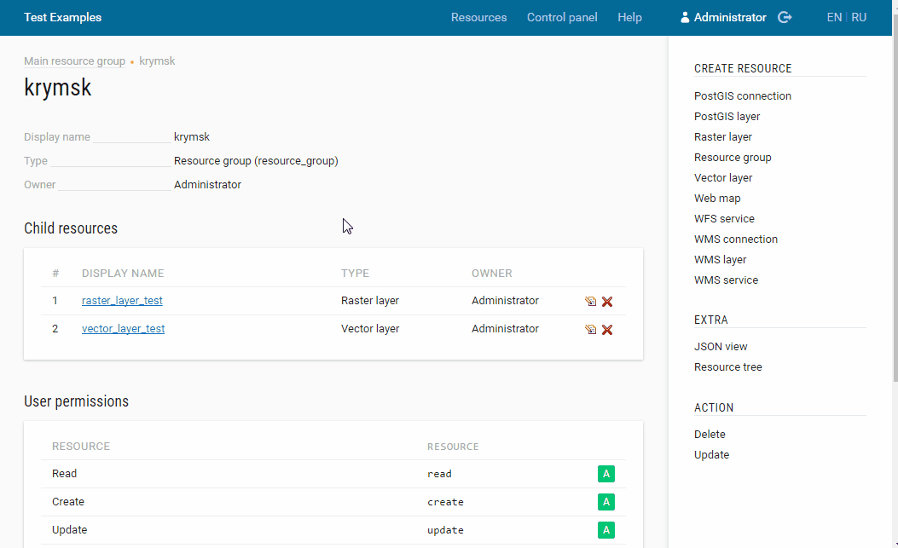
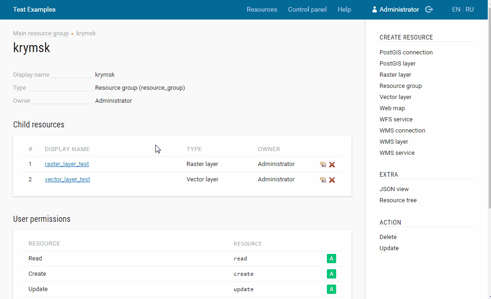

.. _ngcom_styles:

Как создавать стили для визуализации данных
============================================

Стиль является особым видом ресурса, необходимым для визуализации геоданных на :ref:`Веб-карте <ngcom_webmap_create>` или с помощью :ref:`Сервиса WMS <ngcom_wms_service>`. При добавлении слоя на Веб-карту или его публикации по протоколу :term:`WMS` используется именно его стиль, описывающий способ визуального представления геоданных. 

Исключением являются :ref:`Слои WMS <ngcom_wms_layer>`, для которых создание Стилей не требуется, так как необходимая для их отображения на карте информация передается в :ref:`Веб ГИС <ngcom_description>` с внешнего сервера WMS.

Для :ref:`Векторных слоев <ngcom_vector_layer>` и :ref:`Слоев PostGIS <ngcom_postgis_layer>` Веб ГИС поддерживает возможность создания двух видов стилей - :ref:`Стиля MapServer <ngcom_mapserver_style>` и :ref:`Стиля QGIS <ngcom_qgis_style>`. Для :ref:`Растровых слоев <ngcom_raster_layer>` в Веб ГИС создается `Растровый стиль <https://docs.nextgis.ru/docs_ngcom/source/styles.html#ngcom-raster-style>`_.

.. _ngcom_mapserver_style:

Стиль MapServer 
----------------------------

#. Откройте окно свойств :ref:`Векторного слоя <ngcom_vector_layer>` или :ref:`Слоя PostGIS <ngcom_postgis_layer>`, для которого вы хотите создать Стиль;
#. Выберите :menuselection:`Создать ресурс --> Стиль MapServer` на правой панели :ref:`веб-интерфейса <ngw_admin_interface>` Веб ГИС;
#. В открывшемся окне заполните поле :guilabel:`Наименование` на вкладке :guilabel:`Ресурс`. Отредактировать параметры стиля можно на вкладке :guilabel:`Стиль MapServer` (необязательно). Примеры стилей :term:`MapServer` вы можете найти :ref:`здесь <ngw_mapserver_templates>`;
#. Нажмите кнопку :guilabel:`Создать`. Если Стиль создался успешно, то информация о нем появится в блоке :guilabel:`Дочерние ресурсы` соответствующего Векторного слоя или Слоя PostGIS.

.. figure:: _static/Mapserver_style.gif
   :name: Mapserver_style
   :align: center
   :width: 850px
   
   Создание Стиля MapServer

.. _ngcom_qgis_style:

Стиль QGIS 
-----------------------

#. Откройте окно свойств :ref:`Векторного слоя <ngcom_vector_layer>` или :ref:`Слоя PostGIS <ngcom_postgis_layer>`, для которого вы хотите создать Стиль;
#. Выберите :menuselection:`Создать ресурс --> Стиль QGIS` на правой панели :ref:`веб-интерфейса <ngw_admin_interface>` Веб ГИС;
#. В открывшемся окне заполните поле :guilabel:`Наименование` на вкладке :guilabel:`Ресурс`;
#. На вкладке :guilabel:`Стиль QGIS` загрузите файл в формате :term:`QML`, созданный с помощью :term:`QGIS` (о том, как создать файл QML с помощью NextGIS QGIS - :ref:`здесь <ngq_save_style>`);
#. Нажмите кнопку :guilabel:`Создать`. Если Стиль создался успешно, то информация о нем появится в блоке :guilabel:`Дочерние ресурсы` соответствующего Векторного слоя или Слоя PostGIS.

.. note:: 
	Для Векторных слоев, загружаемых в Веб ГИС :ref:`с помощью настольного приложения NextGIS QGIS <ngcom_ngqgis_connect_data_upload>`, Стиль QGIS создается автоматически.

   
   Создание Стиля QGIS

.. _ngcom_raster_style:

Растровый стиль
-----------------------------

#. Откройте окно свойств :ref:`Растрового слоя <ngcom_raster_layer>`, для которого вы хотите создать Стиль;
#. Выберите :menuselection:`Создать ресурс --> Растровый стиль` на правой панели :ref:`веб-интерфейса <ngw_admin_interface>` Веб ГИС;
#. В открывшемся окне заполните поле :guilabel:`Наименование` на вкладке :guilabel:`Ресурс`;
#. Нажмите кнопку :guilabel:`Создать`. Если Стиль создался успешно, то информация о нем появится в блоке :guilabel:`Дочерние ресурсы` соответствующего Растрового слоя.

.. note:: 
	Для Растровых слоев, загружаемых в Веб ГИС :ref:`с помощью настольного приложения NextGIS QGIS <ngcom_ngqgis_connect_data_upload>`, Растровый стиль создается автоматически.

   
   Создание Растрового стиля

Больше информации о создании и редактировании Стилей - :ref:`здесь <ngw_style_create>`.
