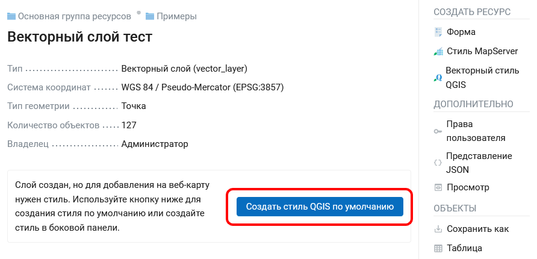
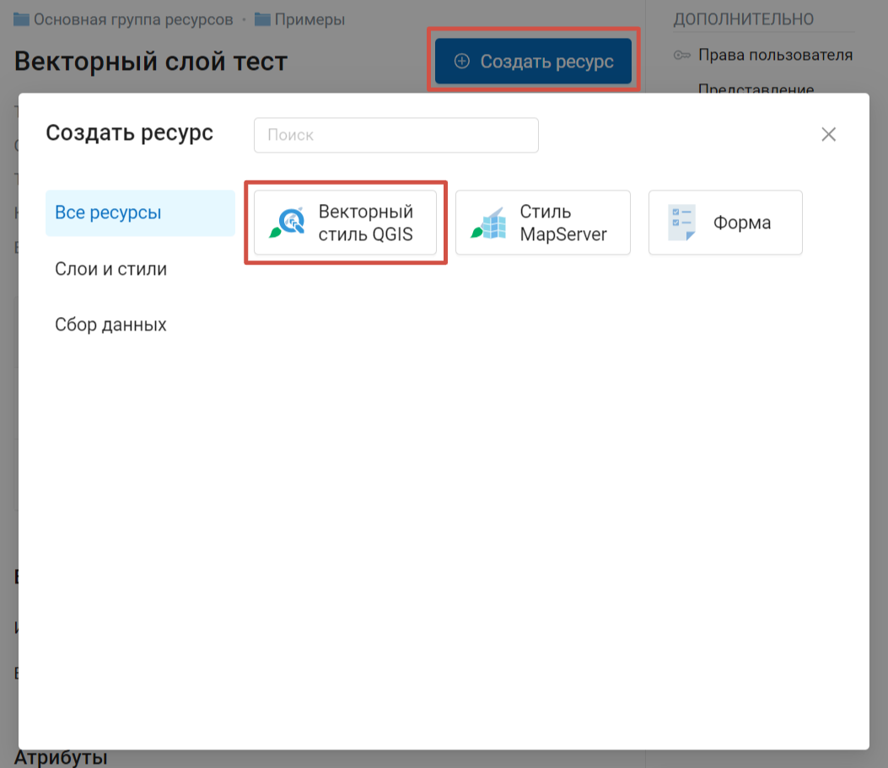
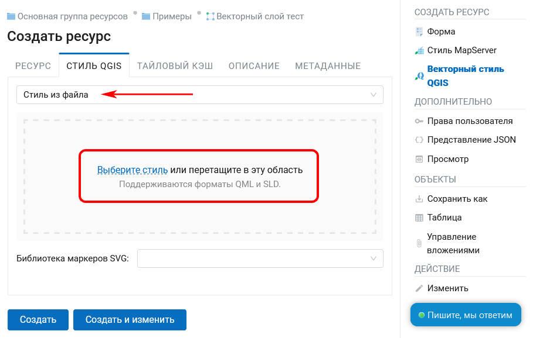
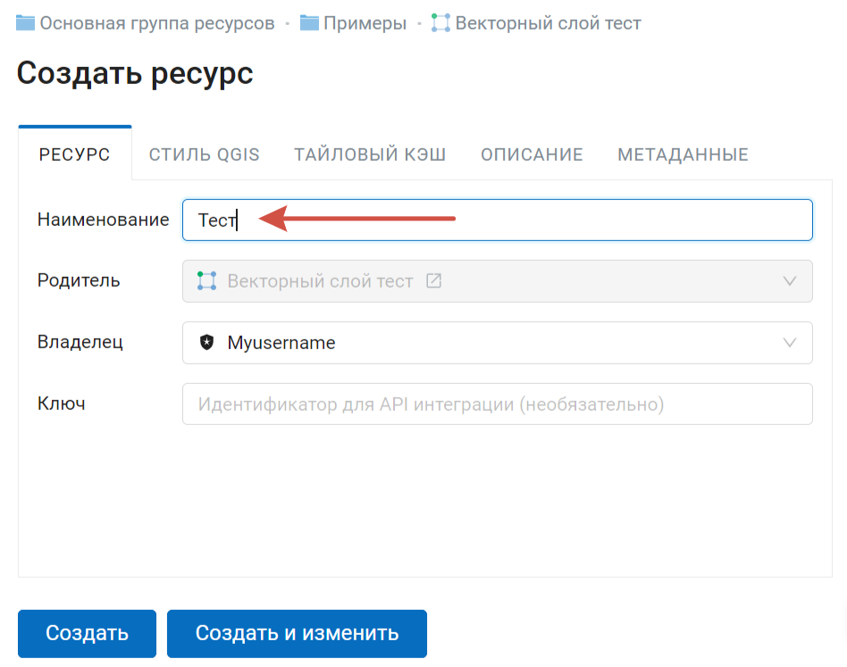
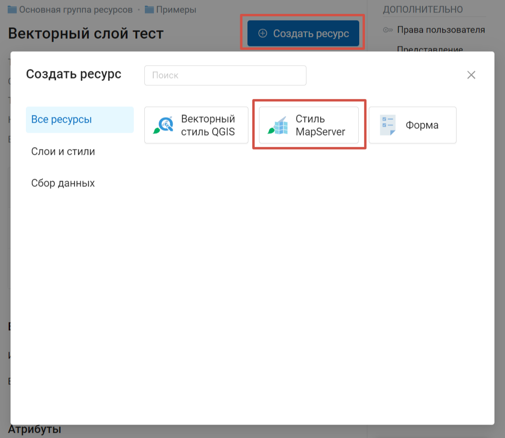
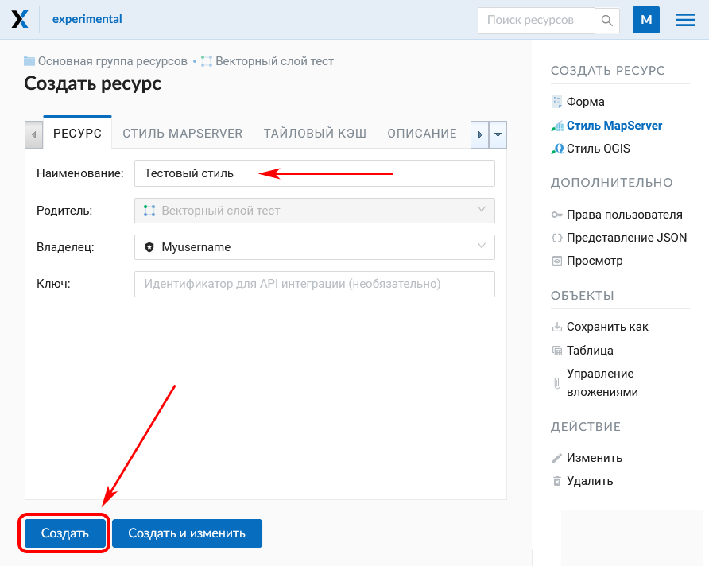
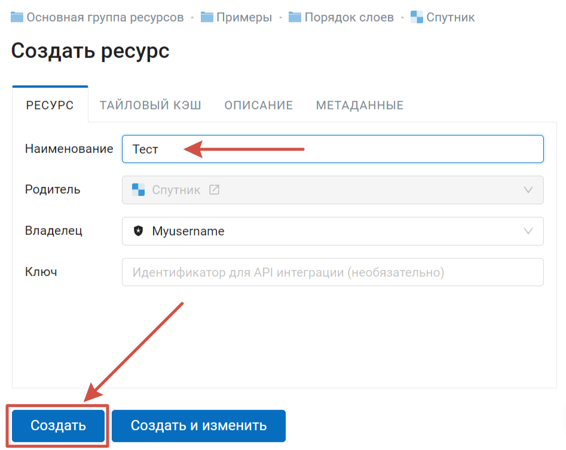

.. _ngcom_styles:

Как создавать стили для визуализации данных
============================================

Стиль является особым видом ресурса, необходимым для визуализации геоданных на `Веб-карте <https://docs.nextgis.ru/docs_ngweb/source/webmaps_admin.html>`_ или с помощью `Сервиса WMS <https://docs.nextgis.ru/docs_ngweb/source/services.html#ngw-wms-service>`_. При добавлении слоя на Веб-карту или его публикации по протоколу :term:`WMS` используется именно его стиль, описывающий способ визуального представления геоданных. 

Исключением являются `Слои WMS <https://docs.nextgis.ru/docs_ngweb/source/connections.html#ngw-create-layer-wms
>`_ и `Слои TMS <https://docs.nextgis.ru/docs_ngweb/source/connections.html#ngw-tms-layer>`_, для которых создание Стилей не требуется, так как необходимая для их отображения на карте информация передается в :ref:`Веб ГИС <ngcom_description>` с внешнего сервера.

ВебГИС поддерживает возможность создания разных видов стилей.

* Для `Векторных слоев <https://docs.nextgis.ru/docs_ngweb/source/layers.html#ngw-create-vector-layer>`_ и `Слоев PostGIS <https://docs.nextgis.ru/docs_ngweb/source/postgis_details.html#ngw-create-postgis-layer>`_ можно создать `Стиль MapServer <https://docs.nextgis.ru/docs_ngweb/source/mapstyles.html#mapserver>`_ или `Векторный стиль QGIS <https://docs.nextgis.ru/docs_ngweb/source/mapstyles.html>`_;
* Для `Растровых слоев <https://docs.nextgis.ru/docs_ngweb/source/layers.html#ngw-create-raster-layer>`_ можно создать `Растровый стиль или Растровый стиль QGIS <https://docs.nextgis.ru/docs_ngweb/source/mapstyles.html#ngw-process-create-raster-style>`_.

Для того, чтобы создать стиль QGIS с настройками по умолчанию для нового слоя, достаточно нажать на кнопку на странице ресурса.

   
   Создание стиля QGIS по умолчанию

.. _ngcom_qgis_style:

Стиль QGIS 
-----------------------

#. Откройте окно свойств слоя, для которого вы хотите создать Стиль;
#. Нажмите кнопку **Создать ресурс** и выберите во всплывающем окне тип ресурса "Стиль QGIS";
#. В открывшемся окне на вкладке :guilabel:`Стиль QGIS` загрузите файл в формате :term:`QML` или SLD, созданный с помощью :term:`QGIS` (о том, как создать файл QML с помощью NextGIS QGIS - `здесь <ngq_save_style>`). Для векторных слоев также можно создать простой пользовательский стиль (подробнее см `здесь <https://docs.nextgis.ru/docs_ngweb/source/mapstyles.html>`__);
#. Нажмите кнопку **Создать**. Если Стиль создался успешно, то информация о нем появится в блоке :guilabel:`Дочерние ресурсы` соответствующего слоя.

   
   Выбор создаваемого ресурса "Стиль QGIS"

   
   Загрузка QML файла

При желании можно задать пользовательское имя стиля в поле :guilabel:`Наименование` на вкладке :guilabel:`Ресурс`.

   
   Наименование стиля

Простые векторные стили можно редактировать непосредственно в облаке (`подробнее <https://docs.nextgis.ru/docs_ngweb/source/mapstyles.html#ngw-qgis-style-custom-edit>`_.

.. note:: 
	Для Векторных слоев, загружаемых в Веб ГИС `с помощью настольного приложения QGIS <https://docs.nextgis.ru/docs_ngconnect/source/index.html>`_, Стиль QGIS создается автоматически.

.. _ngcom_mapserver_style:

Стиль MapServer 
----------------------------

#. Откройте окно свойств `Векторного слоя <https://docs.nextgis.ru/docs_ngweb/source/layers.html#ngw-create-vector-layer>`_ или `Слоя PostGIS <https://docs.nextgis.ru/docs_ngweb/source/postgis_details.html#ngw-create-postgis-layer>`_, для которого вы хотите создать Стиль;
#. Нажмите кнопку **Создать ресурс** и выберите во всплывающем окне тип ресурса "Стиль MapServer";
#. Нажмите кнопку **Создать**. Если Стиль создался успешно, то информация о нем появится в блоке :guilabel:`Дочерние ресурсы` соответствующего Векторного слоя или Слоя PostGIS.

   
   Выбор создаваемого ресурса "Стиль MapServer"

При желании можно задать пользовательское имя стиля в поле :guilabel:`Наименование` на вкладке :guilabel:`Ресурс`. Отредактировать параметры стиля можно на вкладке :guilabel:`Стиль MapServer` (необязательно).

   
   Пользовательское имя стиля 

Примеры стилей :term:`MapServer` вы можете найти `здесь <https://docs.nextgis.ru/docs_ngweb/source/mapservertemplates.html>`__.

.. _ngcom_raster_style:

Растровый стиль
-----------------------------

#. Откройте окно свойств `Растрового слоя <https://docs.nextgis.ru/docs_ngweb/source/layers.html#ngw-create-raster-layer>`_, для которого вы хотите создать Стиль;
#. Нажмите кнопку **Создать ресурс** и выберите во всплывающем окне тип ресурса "Растровый стиль";
#. Нажмите кнопку **Создать**. Если Стиль создался успешно, то информация о нем появится в блоке :guilabel:`Дочерние ресурсы` соответствующего Растрового слоя.

.. note:: 
	Для Растровых слоев, загружаемых в Веб ГИС `с помощью настольного приложения QGIS <https://docs.nextgis.ru/docs_ngconnect/source/index.html>`_., Растровый стиль создается автоматически.

.. figure:: _static/raster_style_select_ru_2.png
   :name: raster_style_select
   :align: center
   :width: 17cm
   
   Выбор создаваемого ресурса "Растровый стиль"

При желании можно задать пользовательское имя стиля в поле :guilabel:`Наименование` на вкладке :guilabel:`Ресурс`.

   
   Создание растрового стиля с пользовательским именем

Больше информации о создании и редактировании Стилей - `здесь <https://docs.nextgis.ru/docs_ngweb/source/mapstyles.html#>`__.
