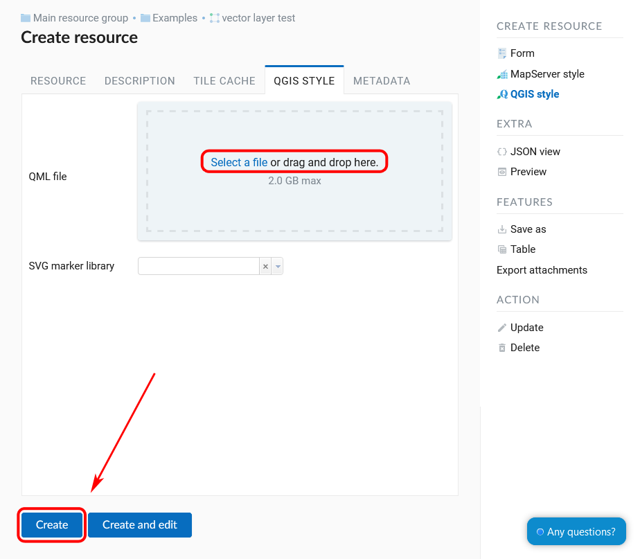

.. _ngcom_styles:

How to create map styles for data visualization
============================================

Style is a special type of resource necessary to visualize geodata on :ref:`Web Map <ngcom_webmap_create>` or with :ref:`WMS service <ngcom_wms_service>` When displaying a data layer on a Web Map or publishing it using :term:`WMS` protocol, you actually use its style which describes how geodata is visually presented on a map.  

The only exception are :ref:`WMS layers <ngcom_wms_layer>` and :ref:`TMS layers <ngcom_tms_layer>` which don't need you to create Styles, because the information about their visualization is passed to :ref:`Web GIS <ngcom_description>` from the external server.

Web GIS supports several types of Styles.

* For :ref:`Vector <ngcom_vector_layer>` and :ref:`PostGIS <ngcom_postgis_layer>` layers you can create :ref:`MapServer style <ngcom_mapserver_style>` or :ref:`QGIS vector style <ngcom_qgis_style>`.
* For :ref:`Raster layers <ngcom_raster_layer>` you can create :ref:`Raster style <ngcom_raster_style>` or :ref:`QGIS raster style <ngcom_qgis_style>`.

To create a default QGIS style, just press the blue button on the resource page of the layer.

   
   Creating default QGIS style

.. _ngcom_qgis_style:

QGIS style 
-----------------------

#. Open the Properties page of the layer for which you want to create a style;
#. Select :menuselection:`Create resource --> QGIS style` on the right side of the Web GIS :ref:`admin console <ngw_admin_interface>`;
#. In the opened dialog, Go to :guilabel:`QGIS style` tab and upload a file in :term:`QML` format created with :term:`QGIS` (learn how to :ref:`create QML file <ngq_save_style>` with QGIS);

#. Press :guilabel:`Create` button.  If Style is created successfully, you'll see its name in :guilabel:`Child resources` pane of the relevant layer.

   
   Selecting QGIS style

   
   Uploading QML file

You can type a custom name for the new style in the field :guilabel:`Display name` of the :guilabel:`Resource` tab.

   
   Display name field of a QGIS style

Simple vector styles can be edited directly from NextGIS Web (more about it `here <https://docs.nextgis.com/docs_ngweb/source/mapstyles.html#editing-qgis-style>`_).

.. note:: 
	For Vector layers uploaded to Web GIS :ref:`with desktop app QGIS <ngcom_ngqgis_connect_data_upload>` a QGIS style is created automatically.

.. _ngcom_mapserver_style:

MapServer style 
----------------------------

#. Open the Properties page of a :ref:`Vector layer <ngcom_vector_layer>` or :ref:`PostGIS layer <ngcom_postgis_layer>` for which you want to create a style;
#. Select :menuselection:`Create resource --> MapServer style` on the right side of the Web GIS :ref:`admin console <ngw_admin_interface>`;
#. Press :guilabel:`Create` button.  If Style is created successfully, you'll see its name in the :guilabel:`Child resources` pane of the relevant Vector layer or PostGIS layer.

   
   Selecting MapServer style

You can type a custom display name for the new style in the :guilabel:`Resource` tab and edit style parameters in the :guilabel:`MapServer style` tab.

   
   Display name field of a MapServer style

Examples of :term:`MapServer` style can be found :ref:`here <https://docs.nextgis.com/docs_ngweb/source/mapservertemplates.html>`.

.. _ngcom_raster_style:

Raster style
-----------------------------

#. Open the Properties page of :ref:`Raster layer <ngcom_raster_layer>` for which you want to create a style;
#. Select :menuselection:`Create resource --> Raster style` on the right side of the Web GIS :ref:`admin console <ngw_admin_interface>`;
#. Press :guilabel:`Create` button.  If Style is created successfully, you'll see its name in :guilabel:`Child resources` pane of the relevant Raster layer.

.. note:: 
	For Raster layers uploaded to Web GIS :ref:`with desktop app QGIS <ngcom_ngqgis_connect_data_upload>` a Raster style is created automatically. 

   
   Selecting "Raster style"

You can type a custom name for the new style in the field :guilabel:`Display name` of the :guilabel:`Resource` tab.

   
   Creating Raster style with a custom name

Read more on how to create and edit Styles :ref:`here <ngw_style_create>`. 
