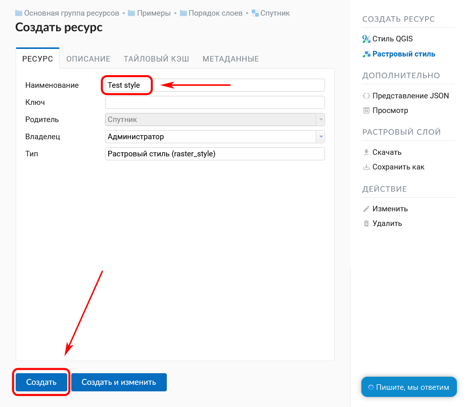

.. _ngcom_styles:

Как создавать стили для визуализации данных
============================================

Стиль является особым видом ресурса, необходимым для визуализации геоданных на :ref:`Веб-карте <ngcom_webmap_create>` или с помощью :ref:`Сервиса WMS <ngcom_wms_service>`. При добавлении слоя на Веб-карту или его публикации по протоколу :term:`WMS` используется именно его стиль, описывающий способ визуального представления геоданных. 

Исключением являются :ref:`Слои WMS <ngcom_wms_layer>` и :ref:`Слои TMS <ngcom_tms_layer>`, для которых создание Стилей не требуется, так как необходимая для их отображения на карте информация передается в :ref:`Веб ГИС <ngcom_description>` с внешнего сервера.

ВебГИС поддерживает возможность создания разных видов стилей.

* Для :ref:`Векторных слоев <ngcom_vector_layer>` и :ref:`Слоев PostGIS <ngcom_postgis_layer>` можно создать :ref:`Стиль MapServer <ngcom_mapserver_style>` или :ref:`Векторный стиль QGIS <ngcom_qgis_style>`;
* Для :ref:`Растровых слоев <ngcom_raster_layer>` можно создать :ref:`Растровый стиль <ngcom_raster_style>` или :ref:`Растровый стиль QGIS <ngcom_qgis_style>`.

Для того, чтобы создать стиль QGIS с настройками по умолчанию для нового слоя, достаточно нажать на кнопку на странице ресурса.

.. figure:: _static/default_style_select_ru.png
   :name: mapserver_style_select
   :align: center
   :width: 20cm
   
   Создание стиля QGIS по умолчанию

.. _ngcom_qgis_style:

Стиль QGIS 
-----------------------

#. Откройте окно свойств слоя, для которого вы хотите создать Стиль;
#. Выберите :menuselection:`Создать ресурс --> Стиль QGIS` на правой панели :ref:`веб-интерфейса <ngw_admin_interface>` Веб ГИС;
#. В открывшемся окне на вкладке :guilabel:`Стиль QGIS` загрузите файл в формате :term:`QML` или SLD, созданный с помощью :term:`QGIS` (о том, как создать файл QML с помощью NextGIS QGIS - :ref:`здесь <ngq_save_style>`). Для векторных слоев также можно создать простой пользовательский стиль (подробнее см `здесь <https://docs.nextgis.ru/docs_ngweb/source/mapstyles.html>`_);
#. Нажмите кнопку :guilabel:`Создать`. Если Стиль создался успешно, то информация о нем появится в блоке :guilabel:`Дочерние ресурсы` соответствующего слоя.

   
   Выбор создаваемого ресурса "Стиль QGIS"

.. figure:: _static/QGIS_style_upload_ru_2.png
   :name: QGIS_style_upload
   :align: center
   :width: 20cm
   
   Загрузка QML файла

При желании можно задать пользовательское имя стиля в поле :guilabel:`Наименование` на вкладке :guilabel:`Ресурс`.

   
   Наименование стиля

Простые векторные стили можно редактировать непосредственно в облаке (`подробнее <https://docs.nextgis.ru/docs_ngweb/source/mapstyles.html#ngw-qgis-style-custom-edit>`_.

.. note:: 
	Для Векторных слоев, загружаемых в Веб ГИС :ref:`с помощью настольного приложения QGIS <ngcom_ngqgis_connect_data_upload>`, Стиль QGIS создается автоматически.

.. _ngcom_mapserver_style:

Стиль MapServer 
----------------------------

#. Откройте окно свойств :ref:`Векторного слоя <ngcom_vector_layer>` или :ref:`Слоя PostGIS <ngcom_postgis_layer>`, для которого вы хотите создать Стиль;
#. Выберите :menuselection:`Создать ресурс --> Стиль MapServer` на правой панели :ref:`веб-интерфейса <ngw_admin_interface>` Веб ГИС;
#. Нажмите кнопку :guilabel:`Создать`. Если Стиль создался успешно, то информация о нем появится в блоке :guilabel:`Дочерние ресурсы` соответствующего Векторного слоя или Слоя PostGIS.

   
   Выбор создаваемого ресурса "Стиль MapServer"

При желании можно задать пользовательское имя стиля в поле :guilabel:`Наименование` на вкладке :guilabel:`Ресурс`. Отредактировать параметры стиля можно на вкладке :guilabel:`Стиль MapServer` (необязательно).

   
   Пользовательское имя стиля 

Примеры стилей :term:`MapServer` вы можете найти :ref:`здесь <ngw_mapserver_templates>`.

.. _ngcom_raster_style:

Растровый стиль
-----------------------------

#. Откройте окно свойств :ref:`Растрового слоя <ngcom_raster_layer>`, для которого вы хотите создать Стиль;
#. Выберите :menuselection:`Создать ресурс --> Растровый стиль` на правой панели :ref:`веб-интерфейса <ngw_admin_interface>` Веб ГИС;
#. Нажмите кнопку :guilabel:`Создать`. Если Стиль создался успешно, то информация о нем появится в блоке :guilabel:`Дочерние ресурсы` соответствующего Растрового слоя.

.. note:: 
	Для Растровых слоев, загружаемых в Веб ГИС :ref:`с помощью настольного приложения QGIS <ngcom_ngqgis_connect_data_upload>`, Растровый стиль создается автоматически.

   
   Выбор создаваемого ресурса "Растровый стиль"

При желании можно задать пользовательское имя стиля в поле :guilabel:`Наименование` на вкладке :guilabel:`Ресурс`.

   
   Создание растрового стиля с пользовательским именем

Больше информации о создании и редактировании Стилей - :ref:`здесь <ngw_style_create>`.
