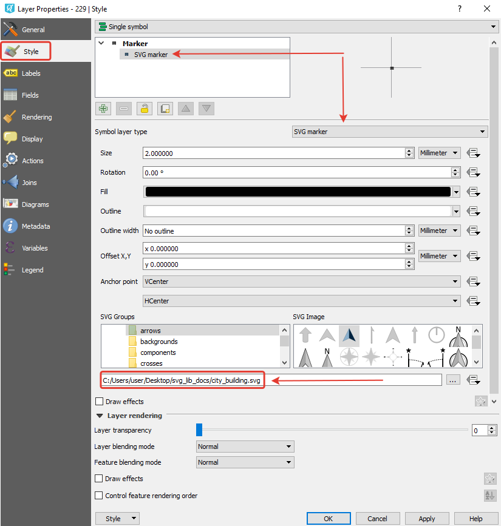
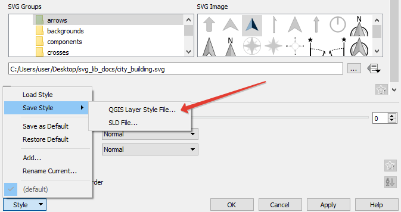

.. _ngcom_svgmarkers:

How to use the SVG Marker Library
=================================

Web GIS provides the ability to use native SVG icons to style vector data in web maps.
There is a special resource for this `SVG Marker Library <https://docs.nextgis.com/docs_ngweb/source/layers.html#svg-marker-library>`_. ЕIts customization is related to the QGIS style.

To display your icons on web maps:

1. Prepare SVG files
2. Create a point vector layer in QGIS.
3. In the layer style settings, select **Single symbol**, layer type **SVG marker**.
4. Select the SVG file on your computer and put it in the special field below.

   Style properties in NextGIS QGIS

.. note:: 
	The file name and format must match the one that will be uploaded to the SVG Marker Library resource below.
  
5. Save style file (QML).

   Save QML file in NextGIS QGIS

6. Create Web GIS resource `SVG Marker Library <https://docs.nextgis.com/docs_ngweb/source/layers.html#svg-marker-library>`_.
7. On the **SVG Marker Library** tab, add icon files. Press **Create**.
8. Create `Vector layer <https://docs.nextgis.com/docs_ngweb/source/layers.html#ngw-create-vector-layer>`_ resource, upload data.
9. Create `QGIS style <https://docs.nextgis.com/docs_ngweb/source/mapstyles.html#qgis-style>`_ inside this layer.
10. On the `QGIS style <https://docs.nextgis.com/docs_ngweb/source/mapstyles.html#upload-svg-qgis-style>`_ tab select the marker library you created earlier. Click on **Create**.
11. Add the style on a `web map <https://docs.nextgis.com/docs_ngweb/source/mapstyles.html#ngw-add-map-style>`_.
