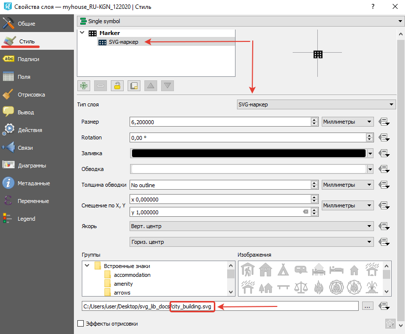
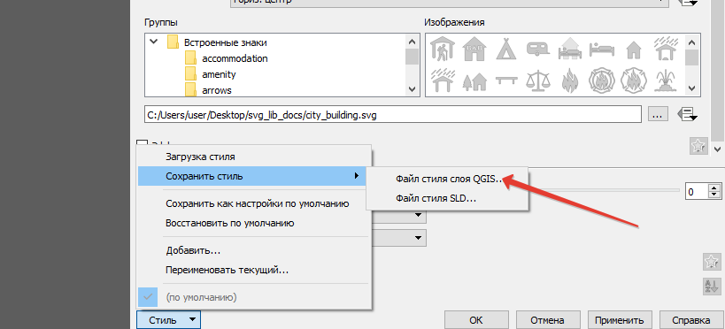

.. _ngcom_svgmarkers:

Как использовать библиотеку маркеров SVG
=========================================

В Веб ГИС есть возможность использовать собственные значки SVG, чтобы стилизовать векторные данные на веб-картах.
Для этого существует специальный ресурс `Библиотека маркеров SVG <https://docs.nextgis.ru/docs_ngweb/source/layers.html#svg>`_. Его настройка связана со стилем QGIS.

Чтобы отобразить свои значики на веб-картах, нужно:

1. Подготовить SVG файлы на компьютере.
2. Создать точечный векторный слой в QGIS.
3. В настройках стиля слоя выбрать **Простая символика**, тип слоя **SVG маркер**.
4. Ниже в специальном поле выберать файл SVG на компьютере.

   Настройка свойств стиля в NextGIS QGIS

.. note:: 
	Название и формат файла должны совпадать с тем, который будет загружен в ресурс Библиотека маркеров SVG далее.
  
5. Сохранить файл стиля (QML).

   Сохранение qml-файла в NextGIS QGIS

6. Создать в Веб ГИС ресурс `Библиотека маркеров SVG <https://docs.nextgis.ru/docs_ngweb/source/layers.html#svg>`_.
7. На вкладке **Библиотека маркеров SVG** добавить файлы иконок. Нажать **Создать**.
8. Создать ресурс `Векторный слой <https://docs.nextgis.ru/docs_ngweb/source/layers.html#ngw-create-vector-layer>`_, загрузите геоданные.
9. Создать `Стиль QGIS <hhttps://docs.nextgis.ru/docs_ngweb/source/mapstyles.html#qgis>`_ внутри этого слоя.
10. На вкладке `Стиль QGIS <https://docs.nextgis.ru/docs_ngweb/source/mapstyles.html#upload-svg-qgis-style>`_ выбрать созданную ранее библиотеку маркеров. Нажать **Создать**.
11. Добавить стиль на `веб-карту <https://docs.nextgis.ru/docs_ngweb/source/mapstyles.html#ngw-add-map-style>`_.
