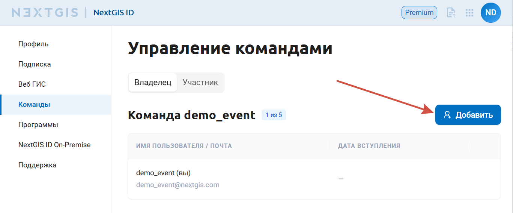
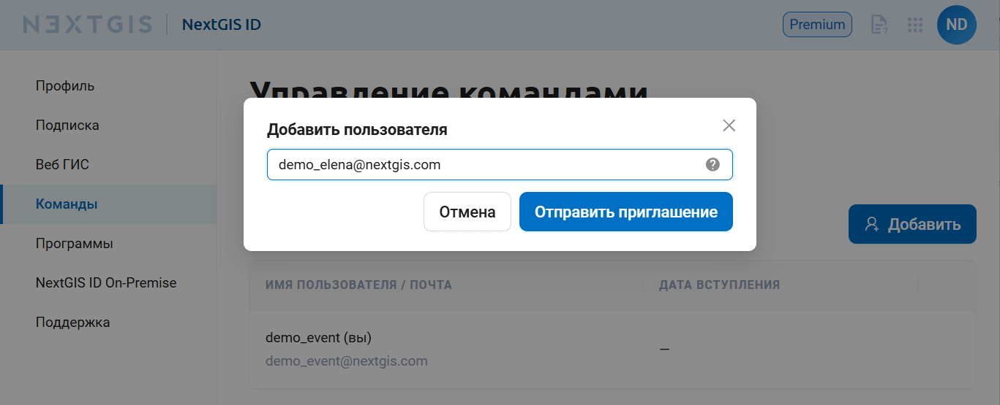
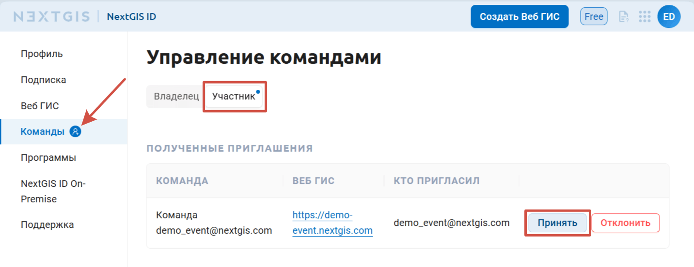
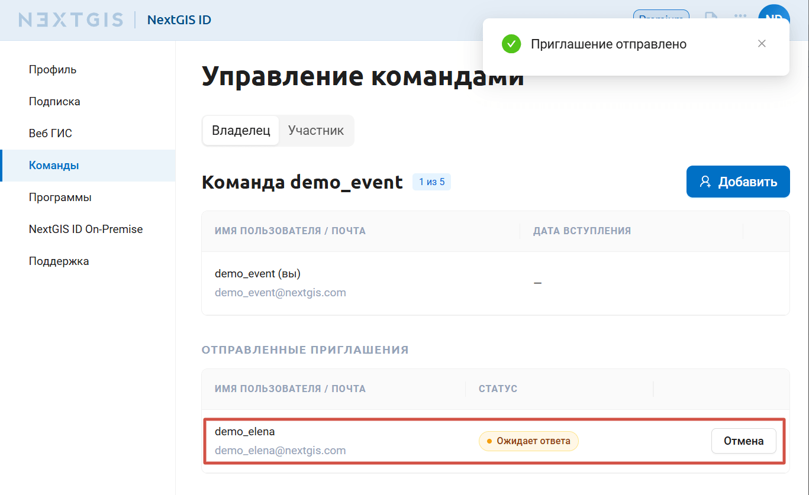
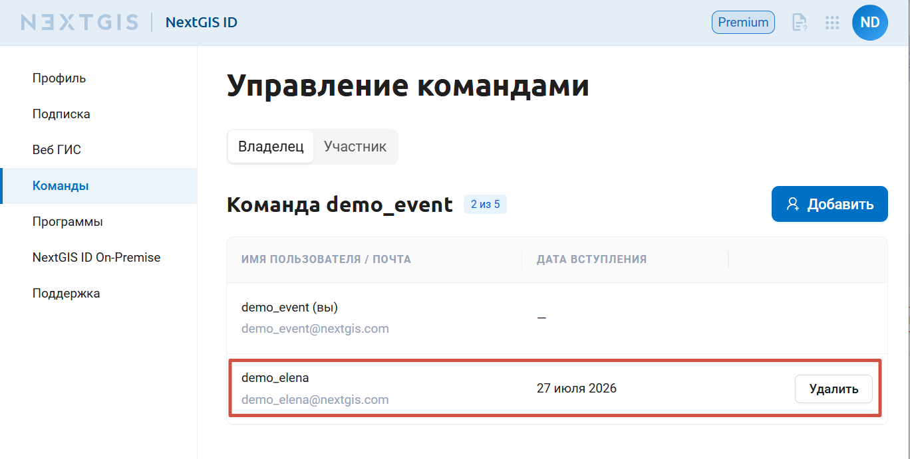
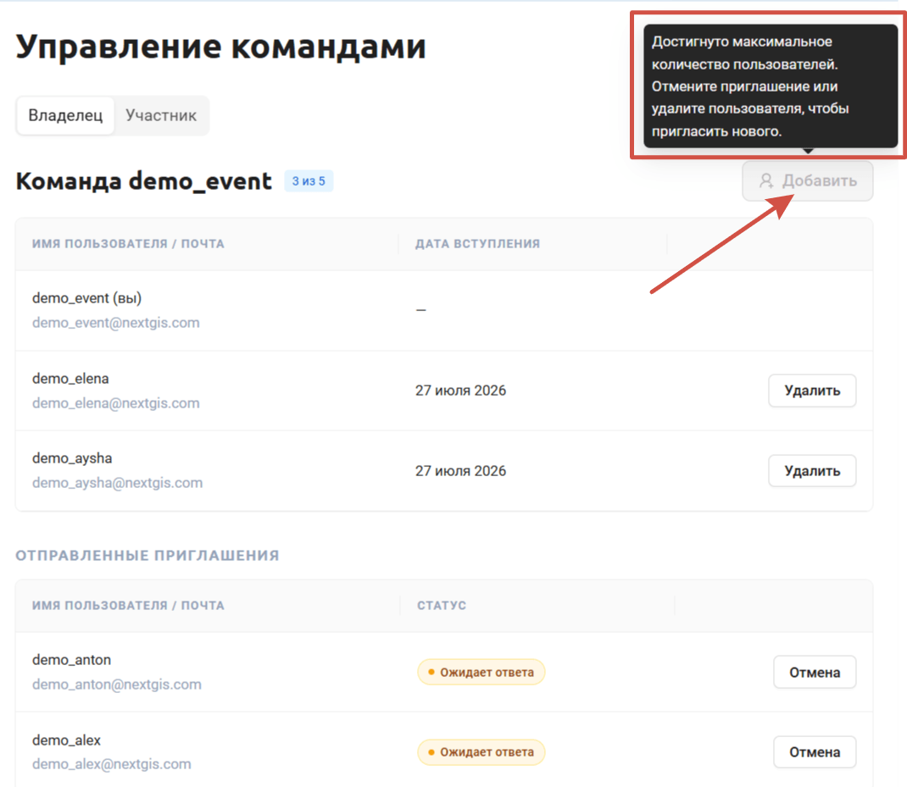
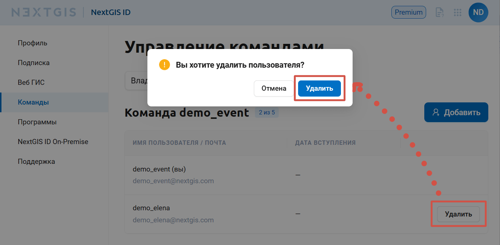

Команда
========

Участие в команде даёт доступ к Веб ГИС владельца команды и функционалу, доступному на тарифном плане Premium, независимо от подписки участника.

Для того, чтобы создать свою команду, нужно быть на плане `Premium <http://nextgis.ru/nextgis-com/plans>`_. 
Пользователи, находящиеся на плане Free, не могут быть владельцами команды, но могут быть `добавлены <https://docs.nextgis.ru/docs_ngcom/source/teams.html#ngcom-team-management>`_ в качестве участников в команду пользователем Premium.

Информация о командах, владельцем или участником которых является пользователь, доступна в личном кабинете.

.. _ngcom_team_view:

Информация о командах
------------------------

В профиле в разделе "Команды" две вкладки. Вы можете посмотреть, кто входит в вашу команду, если она есть, и в какие команды вы включены как участник.

.. figure:: _static/my_team_owner_ru.png
   :name: my_team_owner_pic
   :align: center
   :width: 20cm

   Вкладка "Владелец". Список пользователей, добавленных в команду

.. figure:: _static/my_team_member_ru.png
   :name: my_team_member_pic
   :align: center
   :width: 20cm

   Вкладка "Участник". Список команд, в которых состоит пользователь

В списке команд отображается ссылка на Веб ГИС владельца команды, к которой её участники получают доступ.

.. _ngcom_team_management:

Управление командой
-------------------

.. warning::
   Чтобы создать свою команду, пользователь должен быть на плане `Premium <http://nextgis.ru/nextgis-com/plans>`_. Управлять командой может только её владелец.
   

В соответствии с тарифными планами nextgis.com владелец Premium аккаунта имеет возможность дать доступ к Premium-функциям еще 4 пользователям, у которых есть NextGIS ID, добавив их в свою команду.

Механизм управления командой позволяет пригласить в свою команду по адресу электронной почты. Управление командой доступно через личный кабинет на https://my.nextgis.com/teammanage в разделе “Команда” (см. :numref:`Team_on_panel`).

.. figure:: _static/Team_on_panel_ru.png
   :name: Team_on_panel
   :align: center
   :width: 6cm    

   Раздел “Команда” в левой панели Личного кабинета
   
По умолчанию в команде уже находится владелец Веб ГИС, который приобрел подписку на Premium (см. :numref:`First_administrator`). Он имеет возможность добавить новых пользователей, нажав кнопку **“Добавить”**.

   Состав команды по умолчанию (только администратор)

Введите адрес электронной почты и нажмите **Отправить приглашение**.

   Отправка приглашения в команду

На указанный адрес электронной почты придёт приглашение стать участником команды. Если на этот адрес ещё не создан NextGIS ID, получателю приглашения будет предложено зарегистрироваться. Если пользователь уже зарегистрирован, он может сразу перейти в личный кабинет и принять приглашение в разделе "Команды".

   Получено приглашение в команду

Владелец команды может отслеживать статус отправленных приглашений в личном кабинете. Ещё не принятое приглашение можно отменить.

   
   Отправленное приглашение
   
После того, как пользователь принял приглашение, он появится в списке (см. :numref:`all_users`). 

   Список пользователей, добавленных в команду

В любой момент пользователя можно удалить, если достигнут доступный по тарифу лимит на размер команды (см. :numref:`limit_users`).
   

   Сообщение о превышении лимита пользователей в команде, возникающее при попытке добавить пользователя

Чтобы удалить пользователя, нажмите **Удалить** в правом конце строки и подтвердите удаление.

   Подтверждение удаления пользователя

.. _ngcom_auth_id_webgis:

Доступ к Веб ГИС для участников команды
---------------------------------------

Если администратором не назначена группа по умолчанию, то новый пользователь Веб ГИС не будет иметь никаких прав и не сможет просматривать ресурсы. 

Чтобы новые пользователи сразу могли попасть в Веб ГИС и начать работу:

* Предпочтительный способ - создать `группу пользователей <https://docs.nextgis.ru/docs_ngweb/source/users.html#ngw-create-group>`_ с нужными правами, установив флаг **“Новые пользователи”**. Пользователь будет включен в эту группу при первом входе в Веб ГИС.
* Альтернативный способ - назначать права на ресурсы для субъекта `“Прошедший проверку” <https://docs.nextgis.ru/docs_ngcom/source/permissions.html#ngcom-permissions-usertypes>`_.

