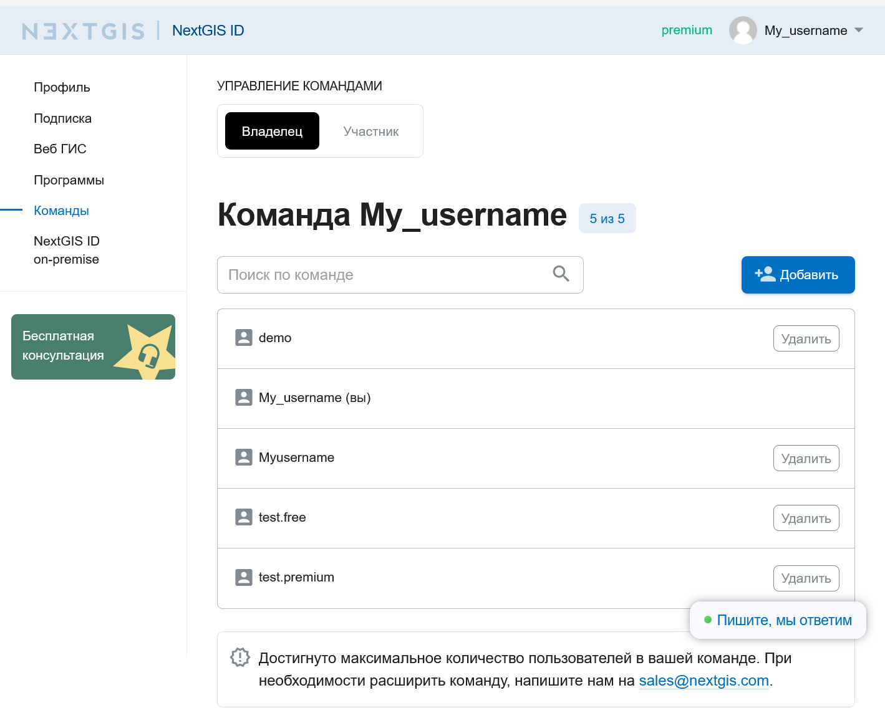
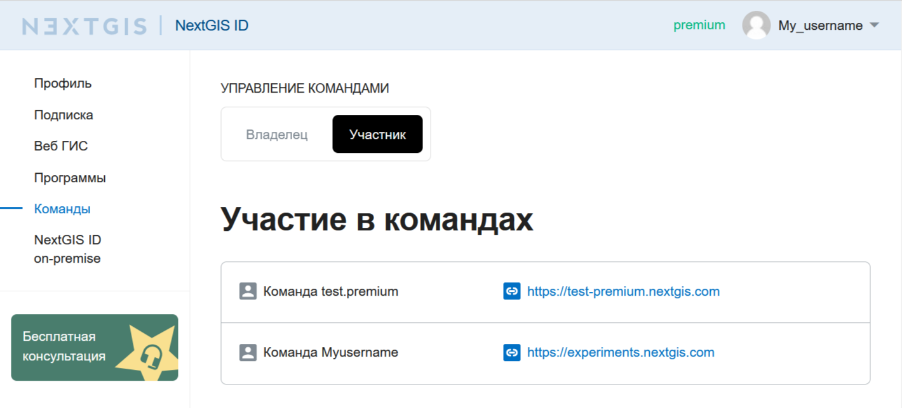
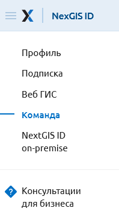
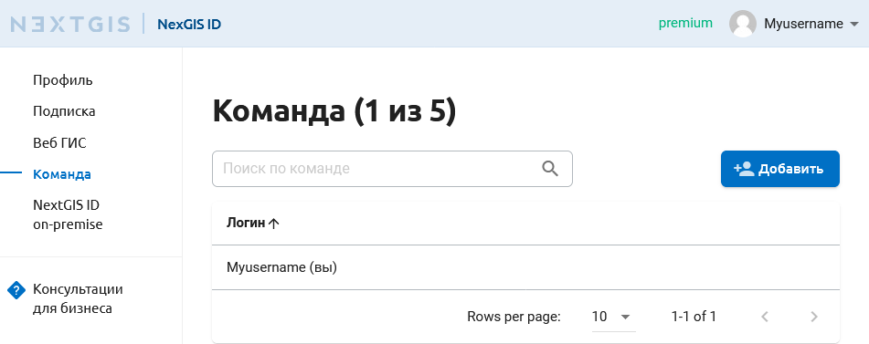
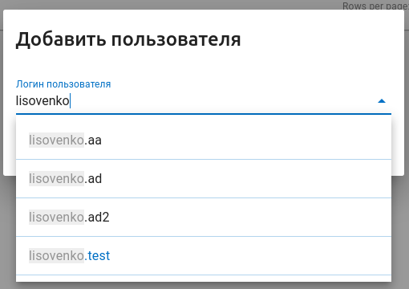
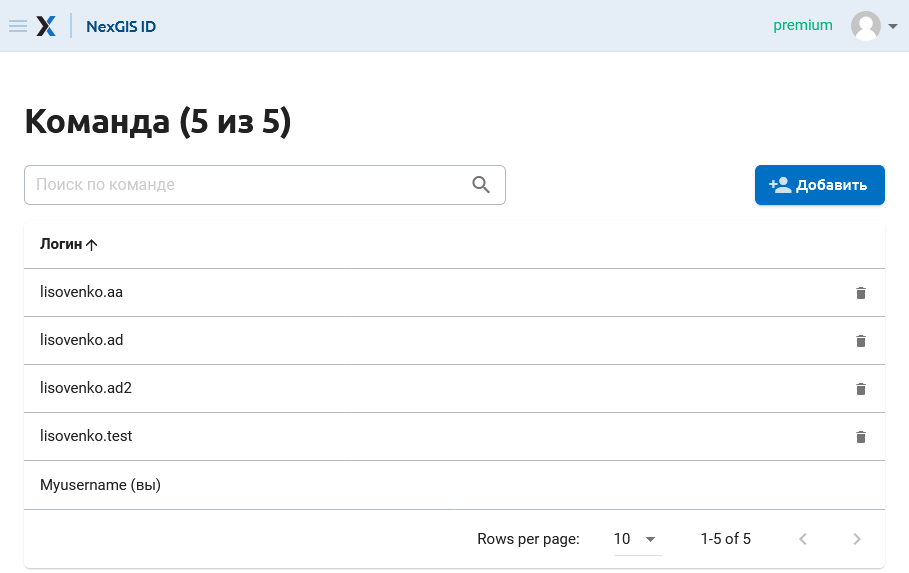
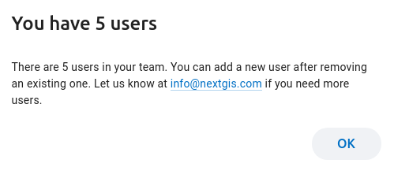

Команда
========

.. _ngcom_team_view:

Информация о командах
------------------------

В профиле в разделе "Команды" две вкладки. Вы можете посмотреть, кто входит в вашу команду, если она есть, и в какие команды вы включены как участник.

   Вкладка "Владелец". Список пользователей, добавленных в команду

   Вкладка "Участник". Список команд, в которых состоит пользователь

Пользователи, находящиеся на плане Free, не могут создать свою команду, но могут быть добавлены в качестве участников в команду пользователя плана Premium.

.. _ngcom_team_management:

Управление командой
-------------------

.. warning::
   Данный функционал доступен только для пользователей плана `Premium <http://nextgis.ru/nextgis-com/plans>`_.
   

В соответствии с тарифными планами nextgis.com владелец Premium аккаунта имеет возможность дать доступ к Premium-функциям `NextGIS QGIS <https://nextgis.ru/nextgis-qgis#pro>`_, `Mobile <https://nextgis.ru/nextgis-mobile#pro>`_ и `Formbuilder <https://nextgis.ru/nextgis-formbuilder#pro>`_ еще 4 пользователям, у которых есть NextGIS ID.

Механизм управления командой позволяет добавить в свою команду любого пользователя NextGIS по его имени. Управление командой доступно через личный кабинет на https://my.nextgis.com/teammanage в разделе “Команда” (см. :numref:`Team_on_panel`).

   Раздел “Команда” в левой панели Личного кабинета
   
По умолчанию в команде уже находится администратор, который приобрел подписку на Premium (см. :numref:`First_administrator`). Он имеет возможность добавить новых пользователей, нажав кнопку **“Добавить”** и найдя их по имени NextGIS ID (см. :numref:`list_users`). Пользователи должны быть уже зарегистрированы на my.nextgis.com. Имя пользователя можно увидеть в его профиле на https://my.nextgis.com/. У пользователя в команде будет значится план Free - это нормально, он будет иметь возможность пользоваться Premium-функциями программного обеспечения.

Если пользователь забыл своё имя и не может войти в профиль, он может восстановить `доступ <https://docs.nextgis.ru/docs_ngcom/source/faq_webgis.html#nextgis-id>`_.

   Состав команды по умолчанию (только администратор)
   
   

   Добавление пользователя
   
   
Каждый добавленный пользователь появится в списке (см. :numref:`all_users`). В любой момент пользователя можно удалить и/или заменить на другого, если достигнут доступный по тарифу лимит на размер команды (см. :numref:`limit_users`)

   Список пользователей, добавленных в команду
   
   

   Сообщение о превышении лимита пользователей в команде
