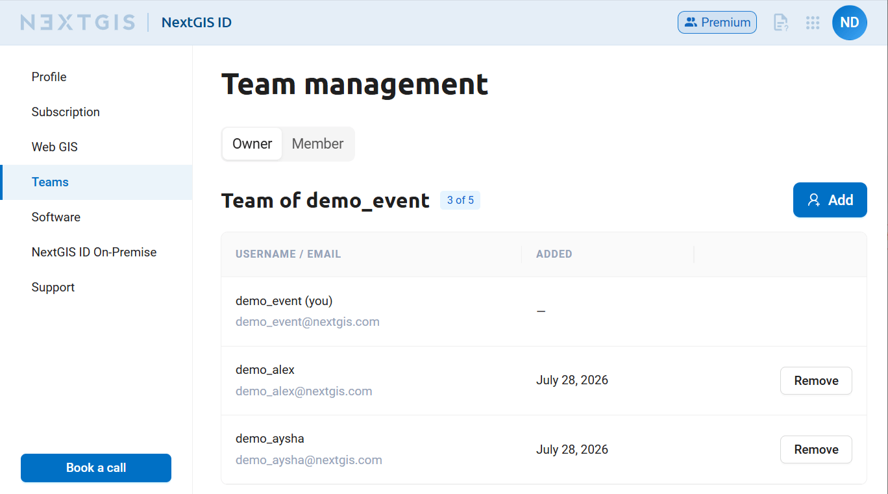
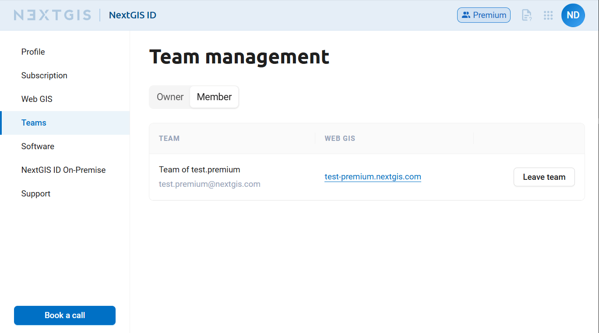
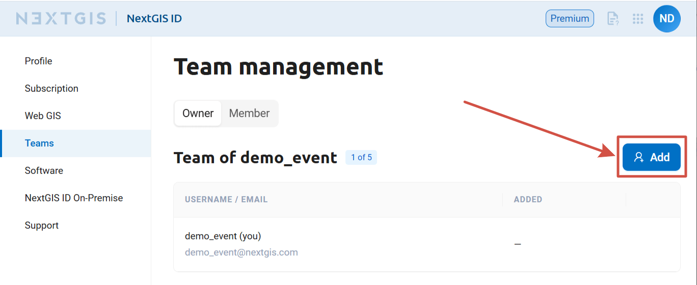
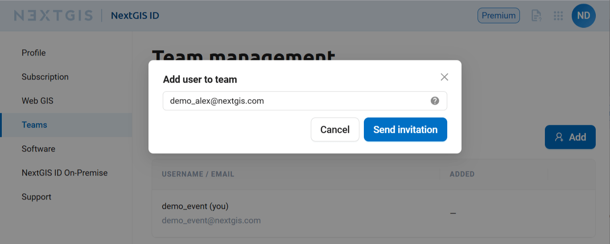
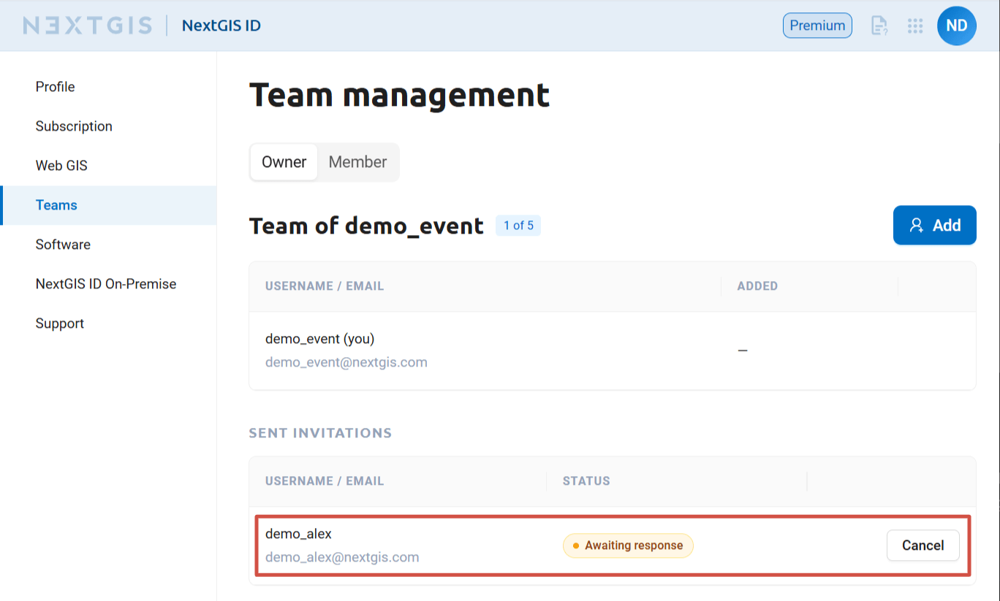
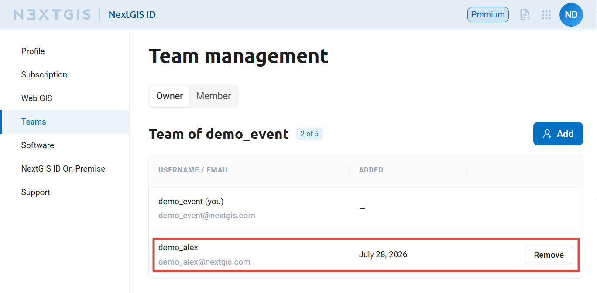
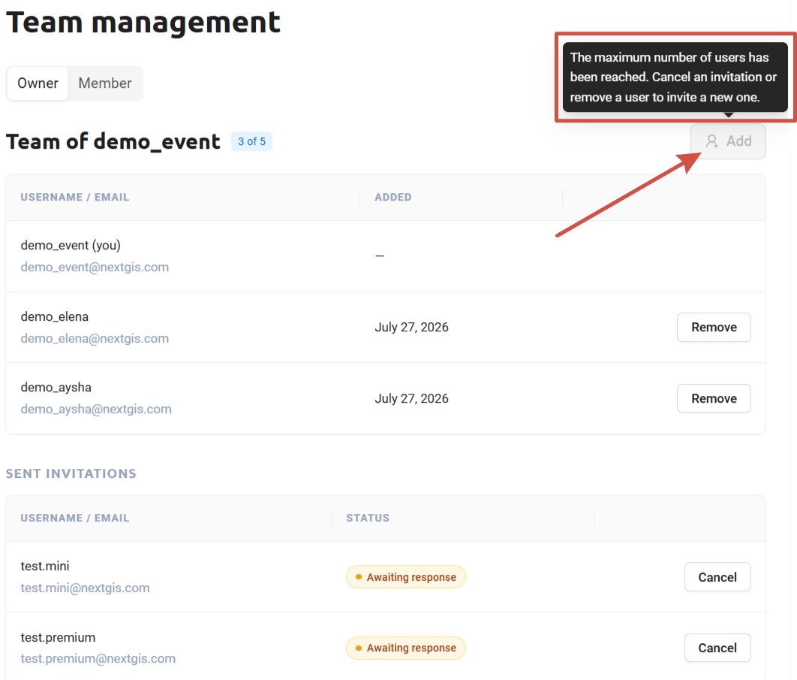
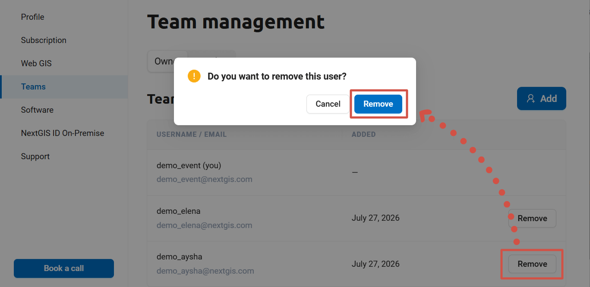
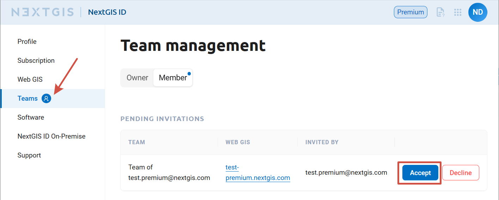
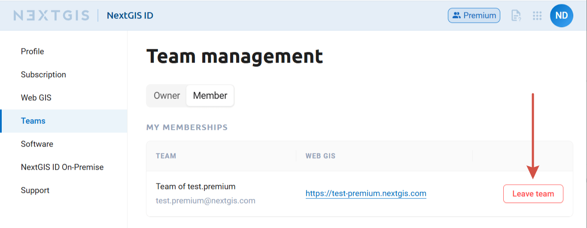

Team
========

Users added to a team get access to the team owner's Web GIS and Premium functionality even without having a Premium subscription.

To create your own team, you need to be on `Premium <http://nextgis.com/nextgis-com/plans>`_. 
User who have "Free" subscription plan cannot become team owners, but can be `added as team members <https://docs.nextgis.com/docs_ngcom/source/teams.html#ngcom-team-management>`_ by a user that has Premium subscription.

Information on your team and the teams you are a member of is available in your account.

.. _ngcom_team_view:

Team information
------------------

In the "Teams" section of your profile there are two tabs. In the "Owner" tab you can see the list of NextGIS users added to your team, if you have one. On the "Member" tab you can see the teams you participate in.

   "Owner" tab. List of the team members is displayed

   "Member" tab. List of the teams you're a member of

In the teams list you can find a link to the owner's Web GIS that you can access as a team member.

In this section you can manage `your team <https://docs.nextgis.com/docs_ngcom/source/teams.html#ngcom-team-management>`_ and your `participation on other teams <https://docs.nextgis.com/docs_ngcom/source/teams.html#team-memberships>`_.

.. _ngcom_team_management:

Manage your team
------------------

.. warning::
   To create your own team, you need to be on `Premium <http://nextgis.com/nextgis-com/plans>`_. Only the team owner can add and delete team members.
   

According to nextgis.com plans, the Premium account holder has an opportunity to give access to Premium-functions to 4 more users who have a NextGIS ID by adding them to the team.

To mange your team, go to your account and select Teams - Owner: https://my.nextgis.com/teammanage/owner.

.. _team_invite:

Invite user to your team
~~~~~~~~~~~~~~~~~~~~~~~~

By default, the team includes the owner of the Premium subscription (see :numref:`First_administrator`). To add other users to your team click **Add**.

   Default team view (just the owner)

Enter an email address and click **Send invitation**.

   Sending an invitation

The user receives the invitation to this email address. If the email is not yet associated with a NextGIS ID, the user needs to `sign up <https://docs.nextgis.com/docs_ngcom/source/create.html>`_. If a NextGIS ID is already created, the user can just go to their account and accept the invitation in `Teams - Member <https://docs.nextgis.ru/docs_ngcom/source/teams.html#team-memberships>`_.

Team owner can check the status of the invitations in the account. Pending invitations can be cancelled.

   
   Invitation is awaiting response

Once the invitation is accepted, the user is moved to the list of team members (see :numref:`all_users`). 

   List of the team members is displayed

If you wish to let user access your Web GIS, set up `permissions <https://docs.nextgis.com/docs_ngcom/source/teams.html#ngcom-auth-id-webgis>`_.

If adding new users is unavailable, it means that you've reached the limit of users for your subscription plan. Both team members and pending invitations are counted towards the limit. 

You can increase the size of your team. To do so, email us at sales@nextgis.com.

To free a slot in your team, you can cancel a pending invitation or delete one of the team members.

   Message about exceeding the limit of members in the team

.. _team_delete:

Delete user from team
~~~~~~~~~~~~~~~~~~~~~

You can delete users from your team at any moment. To delete a user, click **Remove** and confirm the user removal.

   User removal confirmation

When you remove a user from your team it doesn't delete them from Web GIS, instead the Web GIS user is deactivated. Administrators still have access to the resources owned by the deactivated user and the history of their activity in versioning logs.

.. _ngcom_auth_id_webgis:

Allow team members to access Web GIS
-------------------------------------

By default a new Web GIS user has no permissions and cannot view any resources. 

To allow new users to immediately start working in your Web GIS, set up permissions for them in advance:

* The best way is to set up permissions for a `user group <https://docs.nextgis.com/docs_ngweb/source/users.html#create-new-user-group>`_ with the option "New users" enabled. Users will be included in this group upon their first login to the Web GIS.
* An alternative way is to set up permissions for the principal `"Authenticated" <https://docs.nextgis.com/docs_ngcom/source/permissions.html#ngcom-permissions-usertypes>`_.

.. _team_memberships:

Team memberships
------------------

On the Member tab you can see the list of teams you joined and the received invitations awaiting your decision. Here you can:

* open Web GIS of the team owner by clicking on the link;
* accept invitation and join a team or decline an invitation. A blue circle means that you have incoming invitations;

   An invitation is received

* leave a team you're currently a member of.

To leave a team, click **Leave team**.

   Leaving a team
