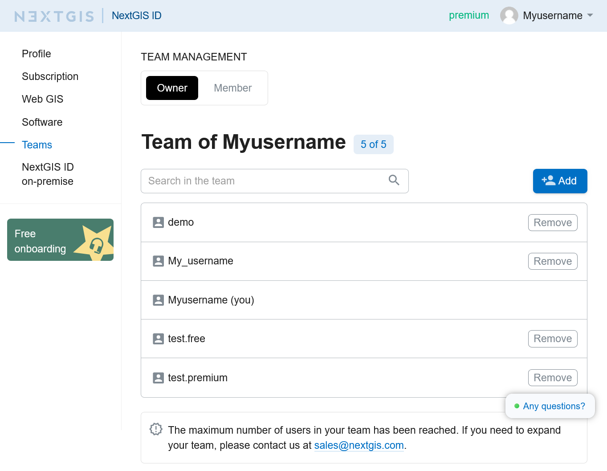
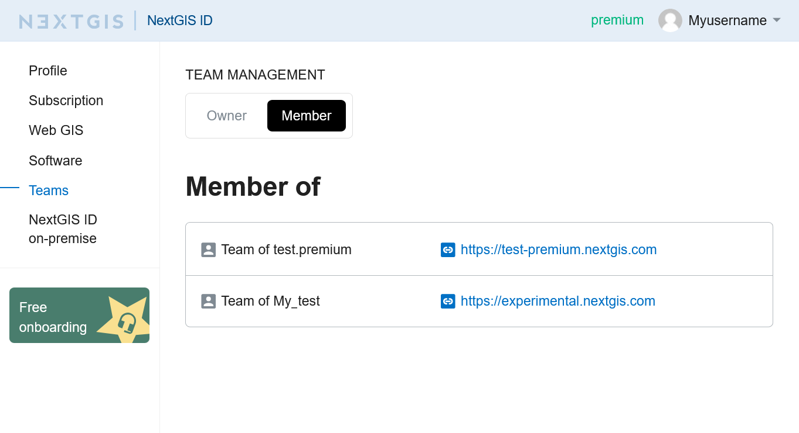
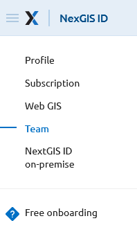
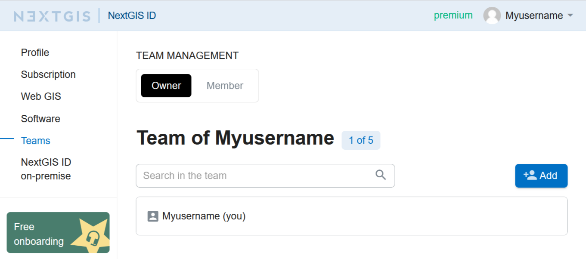
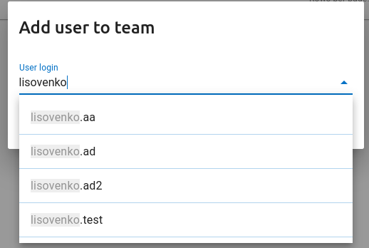

.. sectionauthor:: Yulia Grigorenko <yulia.grigorenko@nextgis.com>

Teams
======

.. _ngcom_team_view:

Team info
----------

.. _ngcom_team_view:

Team information
------------------------

In the "Teams" section of your profile there are two tabs. In the "Owner" tab you can see the list of NextGIS users added to your team, if you have one. On the "Member" tab you can see the teams you participate in.

   "Owner" tab. List of the team members is displayed

   "Member" tab. The user is a member of the teams listed on this tab

In the teams list you can find a link to the owner's Web GIS that you can access as a team member.

User who have "Free" subscription plan cannot create their own teams, but can be `added as team members <https://docs.nextgis.com/docs_ngcom/source/teams.html#ngcom-team-management>`_ by a user that has `Premium <http://nextgis.com/nextgis-com/plans>`_ subscription.

.. _ngcom_ream_management:

Team management
---------------

.. warning::
   This functionality is only available for `Premium <http://nextgis.com/nextgis-com/plans>`_ users.
   
   
According to nextgis.com plans, the Premium account holder has an opportunity to give access to Premium-functions of `NextGIS QGIS <https://nextgis.com/nextgis-qgis#pro>`_, `Mobile <https://nextgis.com/nextgis-mobile#pro>`_ и `Formbuilder <https://nextgis.com/nextgis-formbuilder#pro>`_ to 4 more users who have a NextGIS ID.

Team management allows adding any NextGIS user by username to your team. Team management is available through your personal account at https://my.nextgis.com/teammanage in the Team section (see :numref:`Team_on_panel`).

   The Team section of the Personal Account
   
By default, the team includes the owner of the Premium subscription (see :numref:`First_administrator`). The owner can add team members by clicking the **Add** button and finding them by using their NextGIS ID username (see :numref:`teamlist_users`). Team members must already be registered on my.nextgis.com. The username can be seen in the `profile <https://my.nextgis.com/>`_. Team member will have Free plan under subscription, it's normal, he/she will also have access Premium-functionality.

If the user has forgotten his username and cannot login, he can `restore <https://docs.nextgis.com/docs_ngcom/source/faq_webgis.html#access-recovery-and-passwords>`_ access.

   Default view (owner only)
   
   

   Adding user to the team
   
Each added team member will appear in the list (see :numref:`my_team_owner_pic`). At any moment, a team member can be removed and/or replaced by another if the limit of the team is reached (see :numref:`limit_users`).   
   
.. figure:: _static/limit_users.png
   :name: limit_users
   :align: center
   :width: 12cm    

   Message about exceeding the limit of members in the team

.. _ngcom_auth_id_webgis:

Allow team members to access Web GIS
------------------------------------------------------

Users added to the `team <https://docs.nextgis.com/docs_ngcom/source/teams.html#ngcom-team-management>`_ do not automatically become users of the Web GIS. To get access to the Web GIS, the user must log in to it.
By default a new Web GIS user has no permissions. `Set up permissions <https://docs.nextgis.com/docs_ngcom/source/permissions.html>`_ for your team before their first login.
It can be done in one of two ways:

* The best way is to set up permissions for a `user group <https://docs.nextgis.com/docs_ngweb/source/users.html#create-new-user-group>`_ with the option "New users" enabled. Users will be included in this group upon their first login to the Web GIS.
* An alternative way is to set up permissions for the principal "Authenticated".
