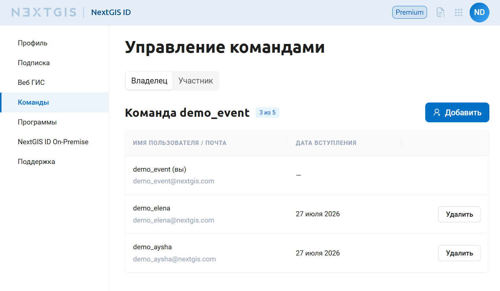
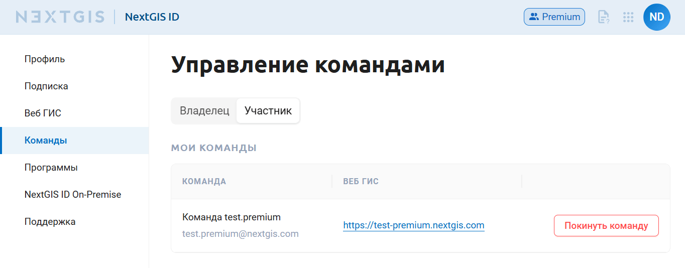
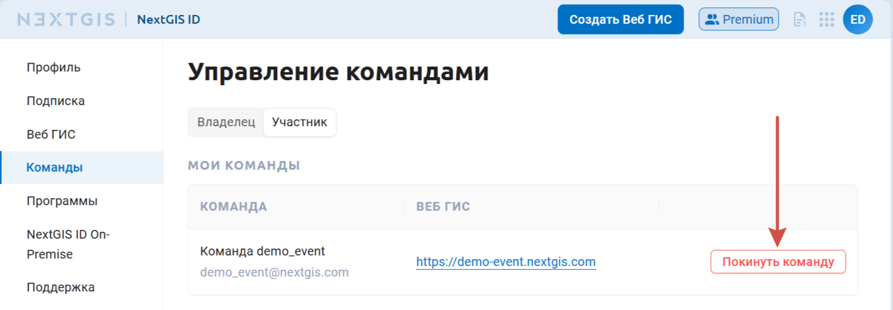

Команда
========

Участие в команде даёт доступ к Веб ГИС владельца команды и функционалу, доступному на тарифном плане Premium, независимо от подписки участника.

Для того, чтобы создать свою команду, нужно быть на плане `Premium <http://nextgis.ru/nextgis-com/plans>`_. 
Пользователи, находящиеся на плане Free, не могут быть владельцами команды, но могут быть `добавлены <https://docs.nextgis.ru/docs_ngcom/source/teams.html#ngcom-team-management>`_ в качестве участников в команду пользователем Premium.

Информация о командах, владельцем или участником которых является пользователь, доступна в личном кабинете.

.. _ngcom_team_view:

Информация о командах
------------------------

В профиле в разделе "Команды" две вкладки. Вы можете посмотреть, кто входит в вашу команду, если она есть, и в какие команды вы включены как участник.

   Вкладка "Владелец". Список пользователей, добавленных в вашу команду

   Вкладка "Участник". Список команд, в которых вы состоите

В списке команд отображается ссылка на Веб ГИС владельца команды, к которой её участники получают доступ.

Через этот раздел вы можете управлять `своей командой <https://docs.nextgis.ru/docs_ngcom/source/teams.html#ngcom-team-management>`_ и своим `участием в командах других пользователей <https://docs.nextgis.ru/docs_ngcom/source/teams.html#team-memberships>`_.

.. _ngcom_team_management:

Управление командой
-------------------------

.. warning::
   Чтобы создать свою команду, пользователь должен быть на плане `Premium <http://nextgis.ru/nextgis-com/plans>`_. Управлять командой может только её владелец.
   

В соответствии с тарифными планами nextgis.com владелец Premium аккаунта имеет возможность дать доступ к Premium-функциям еще 4 пользователям, у которых есть NextGIS ID, добавив их в свою команду.

Управление командой доступно в личном кабинете в разделе Команды - Владелец: https://my.nextgis.com/teammanage/owner.

.. _team_invite:

Приглашение в команду
~~~~~~~~~~~~~~~~~~~~~

По умолчанию в команде уже находится владелец Веб ГИС, который приобрел подписку на Premium (см. :numref:`First_administrator`). Чтобы пригласить в свою команду других пользователей, нажмите кнопку **“Добавить”**.

.. figure:: _static/my_teams_owner_empty_ru_2.png
   :name: First_administrator
   :align: center
   :width: 20cm    

   Состав команды по умолчанию (только администратор)

Введите адрес электронной почты и нажмите **Отправить приглашение**.

.. figure:: _static/invitation_ru.png
   :name: invitation_pic
   :align: center
   :width: 20cm

   Отправка приглашения в команду

На указанный адрес электронной почты придёт приглашение стать участником команды. Если на этот адрес ещё не создан NextGIS ID, получателю приглашения будет предложено `зарегистрироваться <https://docs.nextgis.ru/docs_ngcom/source/create.html>`_. Если пользователь уже зарегистрирован, он может сразу перейти в личный кабинет и принять приглашение в разделе `Команды - Участник <https://docs.nextgis.ru/docs_ngcom/source/teams.html#team-memberships>`_.

После того, как пользователь принял приглашение, он появится в списке участников команды (см. :numref:`all_users`). 

.. figure:: _static/my_team_users_ru_2.png
   :name: all_users
   :align: center
   :width: 20cm    

   Список пользователей, добавленных в команду

Если вы хотите дать пользователю доступ к ресурсам Веб ГИС, ему нужно `назначить соответствующие права <https://docs.nextgis.ru/docs_ngcom/source/teams.html#ngcom-auth-id-webgis>`_.

Владелец команды может отслеживать статус отправленных приглашений в личном кабинете. Ещё не принятое приглашение можно отменить.

.. figure:: _static/invitation_pending_ru.png
   :name: invitation_pending_pic
   :align: center
   :width: 20cm
   
   Отправленное приглашение

Если добавление новых пользователей недоступно, это значит, вы достигли лимита количества участников. Учитываются как пользователи, уже являющиеся участниками команды, так и активные отправленные приглашения. 

Вы можете увеличить размер своей команды. Для этого напишите нам на sales@nextgis.ru.

Чтобы освободить место в команде, отмените одно из отправленных приглашений или удалите одного из участников команды.

.. figure:: _static/limit_users_ru.png
   :name: limit_users
   :align: center
   :width: 18cm    

   Сообщение о превышении лимита пользователей в команде, возникающее при попытке добавить пользователя

.. _team_delete:

Удаление из команды
~~~~~~~~~~~~~~~~~~~

В любой момент пользователя можно удалить. Чтобы удалить пользователя, нажмите **Удалить** в правом конце строки и подтвердите удаление.

.. figure:: _static/delete_user_from_team_ru.png
   :name: delete_user_from_team_pic
   :align: center
   :width: 20cm

   Подтверждение удаления пользователя

Удаление пользователя из команды не удаляет информацию о нём из Веб ГИС, но деактивирует пользователя Веб ГИС. Администратор по-прежнему будет иметь доступ к ресурсам, владельцем которых являлся этот пользователь, и истории его действий над данными в системе версионирования.

.. _ngcom_auth_id_webgis:

Доступ к Веб ГИС для участников команды
---------------------------------------

Если администратором не назначена группа по умолчанию, то новый пользователь Веб ГИС не будет иметь никаких прав и не сможет просматривать ресурсы. 

Чтобы новые пользователи сразу могли попасть в Веб ГИС и начать работу:

* Предпочтительный способ - создать `группу пользователей <https://docs.nextgis.ru/docs_ngweb/source/users.html#ngw-create-group>`_ с нужными правами, установив флаг **“Новые пользователи”**. Пользователь будет включен в эту группу при первом входе в Веб ГИС.
* Альтернативный способ - назначать права на ресурсы для субъекта `“Прошедший проверку” <https://docs.nextgis.ru/docs_ngcom/source/permissions.html#ngcom-permissions-usertypes>`_.

.. _team_memberships:

Участие в командах
------------------

На вкладке "Участник" отображаются команды, участником которых вы являетесь, а также полученные приглашения. Здесь вы можете:

* перейти в Веб ГИС, в команде которых состоите, нажав на ссылку;
* принять приглашение и стать участником чьей-то команды или отклонить приглашение. Синий кружок показывает, что у вас есть неотвеченные приглашения;

.. figure:: _static/invitation_accept_ru.png
   :name: invitation_accept_pic
   :align: center
   :width: 20cm

   Получено приглашение в команду

* покинуть команду, в которой участвуете сейчас.

Чтобы выйти из команды, нажмите **Покинуть команду**.

   Выход из команды