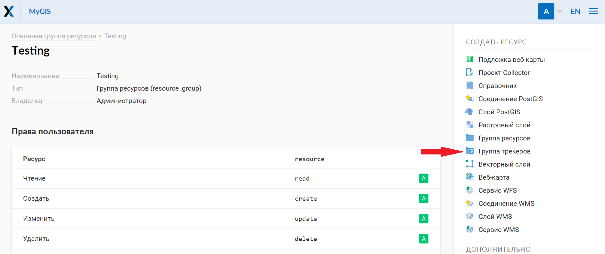
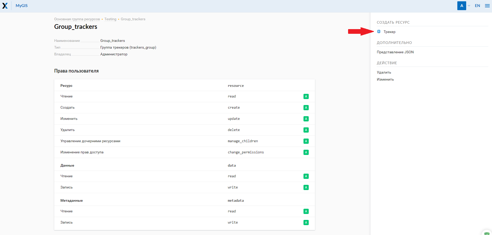
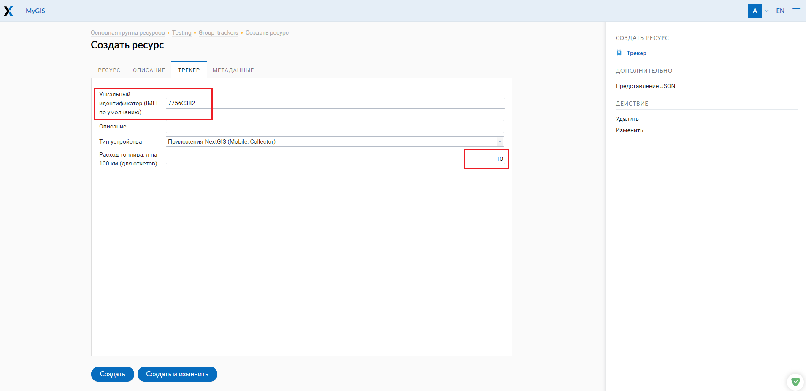

.. _tracking:

Как подключить мониторинг движущихся объектов (трекинг)
======================================

.. note::
    Количество доступных трекеров зависит от текущего `тарифного плана <https://nextgis.ru/pricing-base/>`_. На плане ‘Mini’- 1 трекер, на плане ‘Premium’- 5 трекеров.

Введение
--------

Функция мониторинга движущихся объектов (трекинга) основана на регистрации изменения геолокации пользователя во времени
и необходима для записи истории его передвижения на местности. Трекинг может быть полезен, когда нужно сохранить запись
маршрута, отследить и в дальнейшем проанализировать траектории перемещения объектов в пространстве.

Принципы работы трекинга
------------------------

Трек - это последовательность точек в пространстве с течением времени для последующего отображения на Веб карте.

Процесс мониторинга выглядит следующим образом - человек запускает запись трека в мобильном приложении,
проходит маршрут, по окончании останавливает запись трека. После этого происходит автоматическая отправку результата
на сервер Веб ГИС и отображение записанных треков на веб карте, если произведены соответствующие  `настройки <https://docs.nextgis.ru/docs_ngcom/source/tracking.html#id4>`_.

Создание группы трекеров и трека
--------------------------------

Чтобы просматривать записи треков на Веб-карте, необходимо настроить свою Веб ГИС - создать для этого определенные группы ресурсов:

1. Создать ресурс **“Группа трекеров”**. Это папка, в которой находятся трекеры (устройства, с которых будут отправляться данные в Веб ГИС).

   
   Создание группы трекеров

2. Внутри *группы трекеров* создать ресурс **“Трекер”**. Чтобы синхронизировать его с устройством, в разделе “Трекер” настроек ресурса нужно ввести уникальный идентификатор (ID) вашего устройства (его можно посмотреть в настройках приложения NextGIS Mobile и NextGIS Collector).

   
   Создание трекера

   
   Настройки трекера

Трекинг в NextGIS Mobile и NextGIS Collector
--------------------------------------------

На данный момент запись треков можно вести в мобильных приложениях
`NextGIS Mobile <https://play.google.com/store/apps/details?id=com.nextgis.mobile>`_,
`NextGIS Collector <https://play.google.com/store/apps/details?id=com.nextgis.collector>`_ и NextGIS Tracker.
Для этого необходим смартфон на базе ОС Android.

**1. NextGIS Mobile**

Это полноценная мобильная `ГИС <https://nextgis.ru/nextgis-mobile/>`_, позволяющая создавать, редактировать и выгружать геоданные, в режиме онлайн и оффлайн. 

Первым делом необходимо установить мобильное приложение и пройти авторизацию. 
Затем в настройках приложения в разделе “Мои треки” активировать функцию **“Отправлять местоположение на сервер”**. 
Здесь также можно посмотреть уникальный идентификатор (ID) устройства, 
который необходимо указать в настройках трекера в веб ГИС (раздел 3).

Процесс записи трека подробно описан в разделе `Треки <https://docs.nextgis.ru/docs_ngmobile/source/tracks.html#id2>`_ документации к NextGIS Mobile.

**2. NextGIS Collector**

Это приложение для коллективного сбора данных. Оно дает возможность владельцу Веб ГИС, созданной на nextgis.com, 
организовать команду из нескольких человек и начать `сбор данных <https://docs.nextgis.ru/docs_ngcom/source/collector.html#id13>`_ с помощью мобильных устройств.

Процедура записи трека здесь аналогична `алгоритму <https://docs.nextgis.ru/docs_ngmobile/source/tracks.html#id2>`_ в NextGIS Mobile, но с небольшими различиями в интерфейсе.

Так для того, чтобы начать новую запись, необходимо нажать на иконку “человека” на верхней панели и в контекстном меню выбрать “Старт”.
Окончание записи можно произвести как в панели в фоновом режиме, так и в том же контекстном меню верхней панели по нажатию “Стоп”. 
После этого запись трека появится в вашей Веб ГИС.

Список треков в NextGIS Collector находится по второй строке в контекстном меню иконки треков (человек).
Здесь можно выключить видимость треков, раскрасить их по палитре, удалить или отправить их в формате GPX.

**3. NextGIS Tracker**

Это простое приложение, предназначенное только для записи треков.

*...Coming up...*

Результаты трекинга на Веб карте
--------------------------------

Результаты мониторинга можно отобразить на любой веб карте в вашей Веб ГИС. Для этого нужно создать ресурс “Веб-карта” и открыть её.
Если процедуры, описанные в разделе 3 были выполнены, то в левой панели отобразится иконка мониторинга движущихся объектов (трекеры).

Интерфейс панели трекеров состоит из двух частей - календаря и дерева ресурсов трекеров (папки названий “групп трекеров” и
созданных наборов самих трекеров внутри них). Календарь позволяет отфильтровать записанные треки по дате и времени.
В дереве трекеров находится содержимое тех ресурсов, которые были созданы в веб ГИС или выгружены из мобильного приложения.

Сам трек на карте состоит из 4 частей:

- линий
- точек
- текущего местоположения
- и мест продолжительных стоянок 

Операции, доступные по правому клику на трек:

- Увеличить до слоя (отображение экстента слоя)
- Увеличить до последней точки (центрирование последней точки трека)
- Установить фильтр на последний день (отображение трека за последние сутки)
- Показать последнюю активность (посмотреть почасовую активность)

Отчеты
------

По иконке “Отчеты” есть возможность сформировать различные вариации отчетов в зависимости от выбранного трекера и выбранных параметров.

Открывается отдельная страница получения отчетов по трекингу. 
В первом блоке необходимо выбрать трекеры, по которым нужно получить информационную сводку.
Во второй части необходимо настроить параметры:
- тип отчета
- период времени
- группировка по дням/часам

.. note::
    Чтобы получить отчет по израсходованному топливу, необходимо в Веб ГИС в настройках трекера установить значение расхода топлива (л/100 км)
    
Также существует возможность экспорта отчета в формате GPX-файла.
