.. sectionauthor:: Roman Gaunullov <roman.gainullov@nextgis.com>

.. _tracking:

How to enable the monitoring of moving objects (tracking)
========================================================

.. note::
    The number of available trackers depends on the current `plan <https://nextgis.com/pricing-base/>`_. For **Mini** - 1 tracker, for **Premium** - 5 trackers

Introduction
-------------

Monitoring of moving objects function is based on registration of changing user’s geolocation in time
and is necessary to record the history of its movement on the ground.
Tracking can be useful when you need to save a record of the route,
track and further analyze the trajectories of movement of objects in space.

How tracking works
-------------------

A track is a sequence of points in space over time to be displayed on a web map.

Monitoring process looks like this - a person launches tracking in the mobile application, follows the route, stops tracking in the end.
After that, recorded tracks are sent to the Web GIS server and are displayed on the web map (if it's configured).

Creating tracker groups
-----------------------

If you want see tracks on a web map, it’s needed to set up your Web GIS - create special resources groups:

1. Create a resource **Trackers group**. This is a folder which contains trackers (devices that sent data to Web GIS).

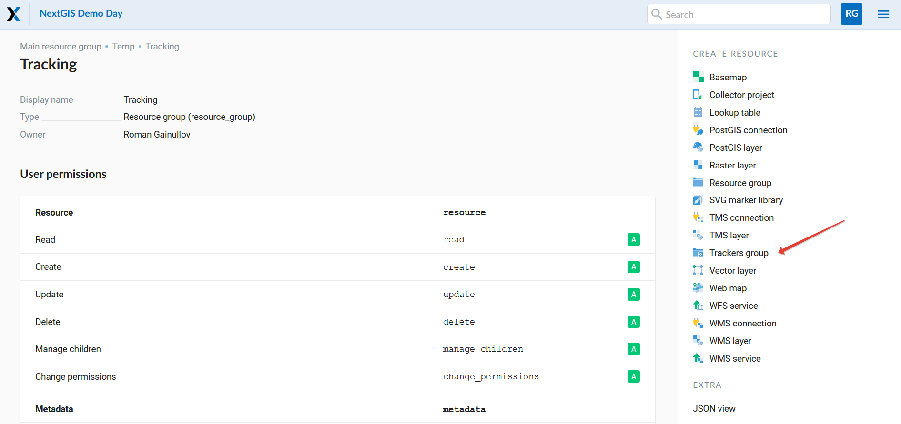
   
   Creating a group of trackers

2. Create a resource **Tracker** into a trackers group. For sync tracker with a mobile device, it’s needed enter ID (it can be found in NextGIS Mobile/Collector app’s settings (Mobile: Settings -> My tracks -> under Send location to server).

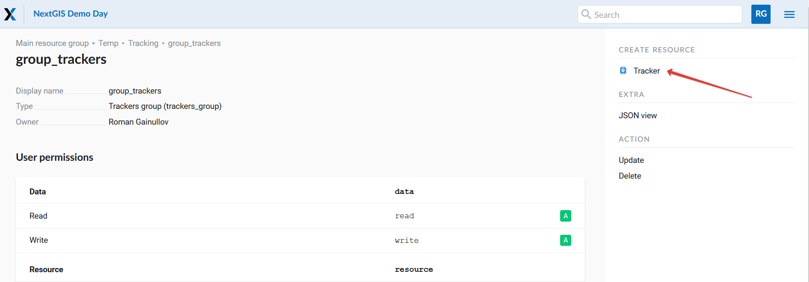
   
   Creating a tracker

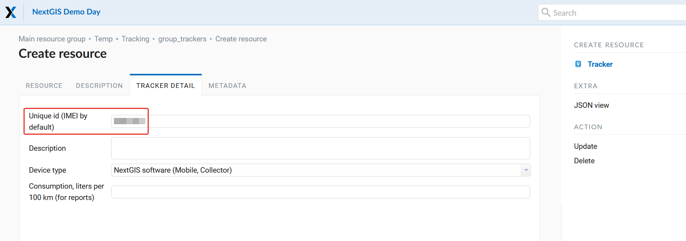
   
   Tracker settings
   

Tracking in NextGIS Mobile, Collector and Tracker
-------------------------------------------------

For now you can track in mobile apps such as
`NextGIS Mobile <https://play.google.com/store/apps/details?id=com.nextgis.mobile>`_,
`NextGIS Collector <https://play.google.com/store/apps/details?id=com.nextgis.collector>`_ и NextGIS Tracker.
An Android smartphone is required for that.

**1. NextGIS Mobile**

It’s the complete mobile `GIS <https://nextgis.com/nextgis-mobile/>`_ that allows create, edit and share geodata both online and offline mode.

First of all you need to install an application and sign in.
Then activate the ‘Send location to server’ option in the ‘My tracks’ section of Settings.

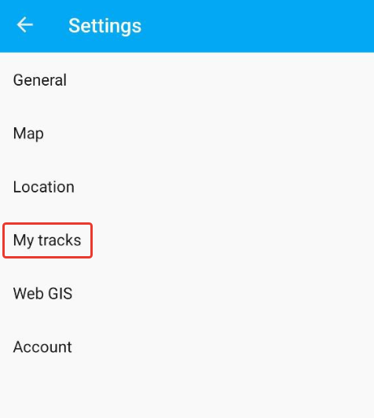
   
   NextGIS Mobile Settings

Here you can also see the unique identifier (ID) of the device, which must be specified in the tracker settings in Web GIS.

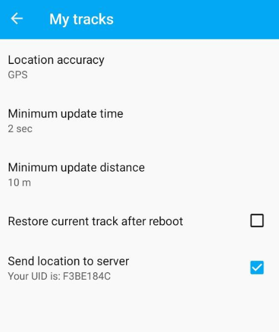
   
   Send location to server. Device ID

The process of recording a track is described in details in the `Tracks <https://docs.nextgis.com/docs_ngmobile/source/tracks.html/>`_ section of the documentation for NextGIS Mobile.

**2. NextGIS Collector**

This application is intended for collective data collection. It allows to Web GIS’s owner to get people on a team and begin `data collection <https://docs.nextgis.com/docs_ngcom/source/collector.html#team-participants-mobile-app-installation-and-start-of-data-collection>`_ using mobile devices.

A track recording process is similar to NextGIS Mobile’s `algorithm <https://docs.nextgis.com/docs_ngmobile/source/tracks.html#recording-a-track>`_ but with some interface differences.  

So in order to start a new track it’s needed to tap on the ‘human’ icon in the upper panel and select ‘Start’. 

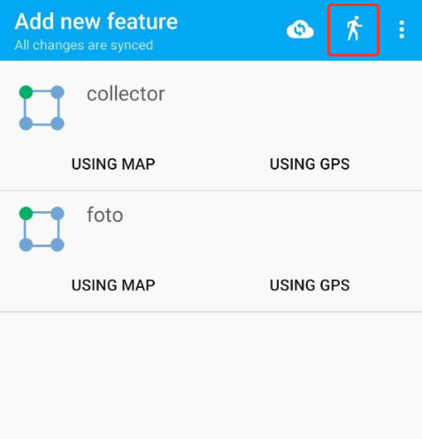
   
   Tracker icon in NextGIS Collector

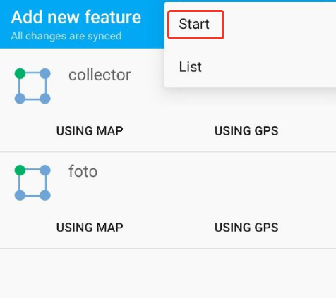
   
   Start recording track

The end of the recording can be done both in the panel in the background mode, and in the same context menu of the top panel by clicking “Stop”.
The track record will then appear in your Web GIS.

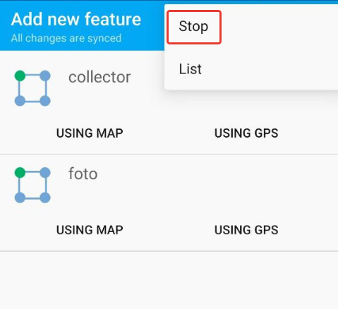
   
   Stop recording track

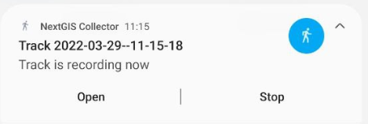
   
   Popup notification

The track list is in the second line of the context menu track icons. Here you can enable/disable tracks, color them according to the palette, remove or share in GPX format.

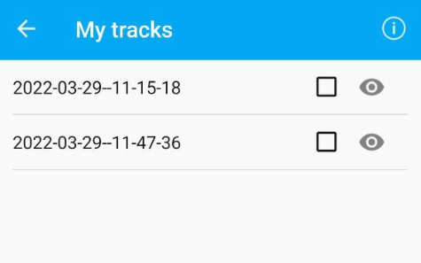
   
   List of recorded tracks

**3. NextGIS Tracker**

This is a simple app that allows you to track recording.

*...Coming up...*

Tracking results on the web map
--------------------------------

Tracking results can be displayed on any web map of your Web GIS. For that create a ‘web map’ resource and open it. If procedures, described in `Section 3 <https://docs.nextgis.com/docs_ngcom/source/tracking.html#creating-tracker-groups>`_, are done - you will see the corresponding icon (trackers)  in the left panel of the web map.

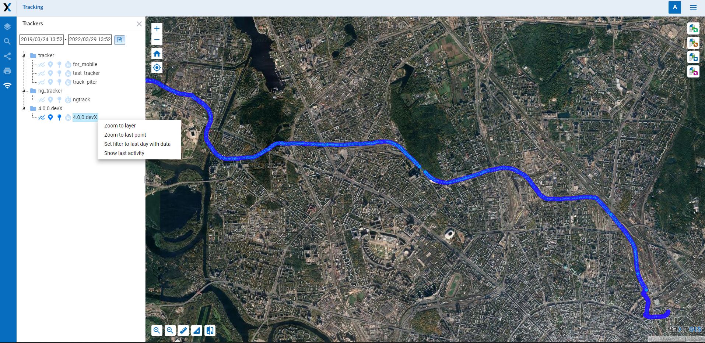
   
   Tracking interface on Web map

The interface of trackers consists of 2 parts - a calendar and a resources tree of trackers (folders ‘tracker groups’ and a set of trackers themselves inside). A calendar allows you to filter recorded tracks by the date and time. Tracker's tree contains the content of those resources that were created in Web GIS or were uploaded from the mobile application.

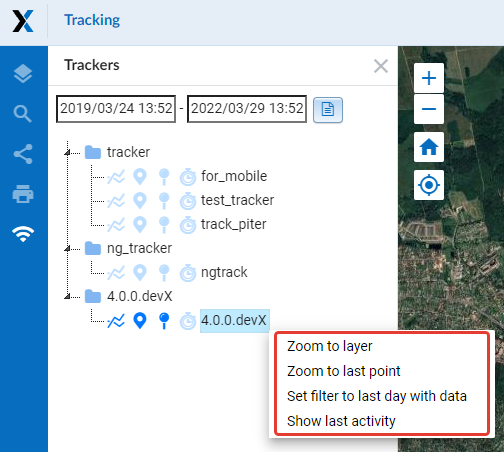
   
   Tracker tree and track operations on Web map

A track consists of 4 parts:

- lines
- points
- current location
- and long stopovers

Operations that are available by right click on the track:

- Zoom to layer (display layer extent)
- Zoom to the last point (center last track point)
- Set up a filter on the last day (display a track for the last day)
- Show the last activity (see hourly activity)

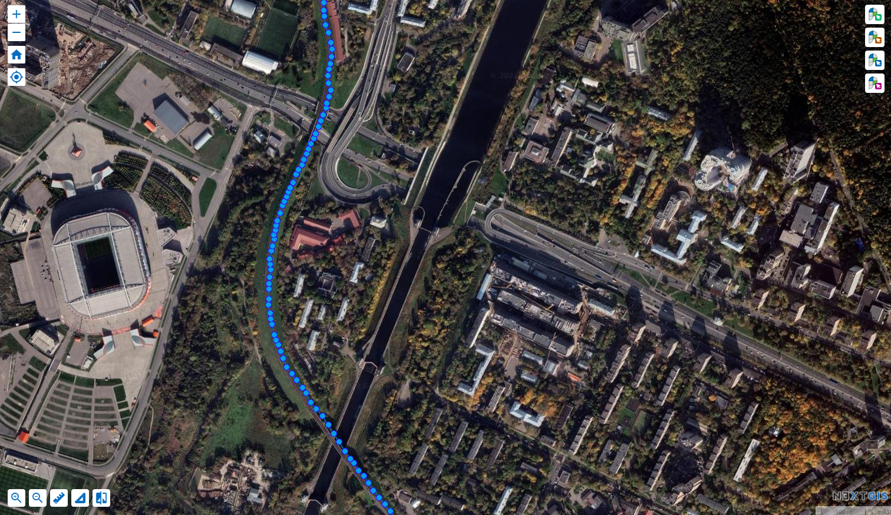
   
   Displaying track points, lines and current location on the Web map

Reports
-------

There is a possibility by ‘Reports’ button to create various types of reports depending on selected tracker and parameters.

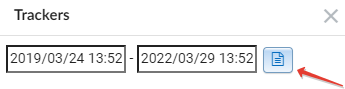
   
   Report tool icon

A separate page for receiving tracking reports is opening.
In the first block, you need to select the trackers for which you want to get an information summary.

The second block is for configuring the following parameters:

- report type
- time range
- grouping by days/hours

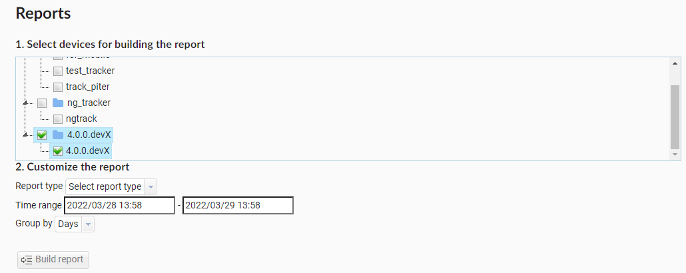
   
   Tracker report
   
.. note::
    For getting the spent fuel report you need to set up a `fuel consumption <https://docs.nextgis.com/docs_ngcom/source/tracking.html#tracker-settings>`_ in NextGIS Web settings (l/100 km)
    
Also you can export reports in GPX format. 
