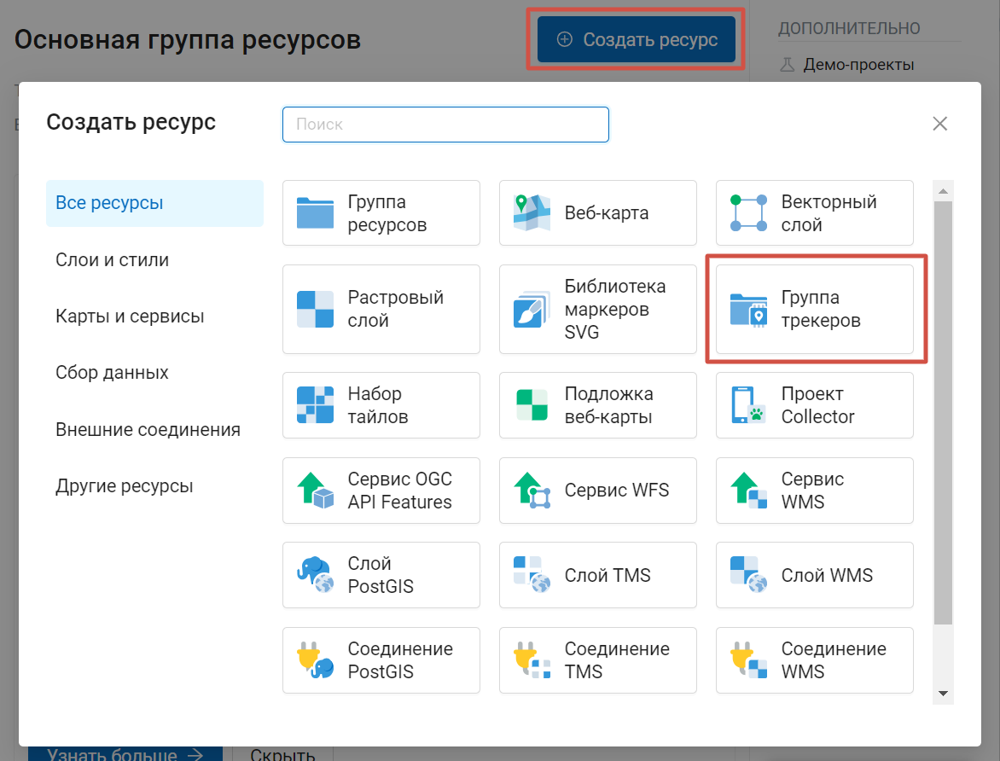
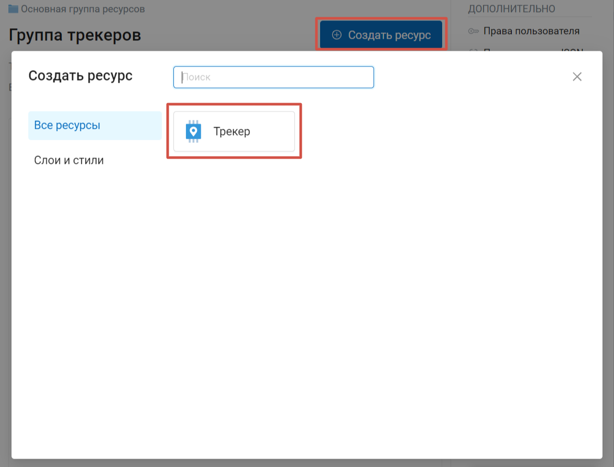
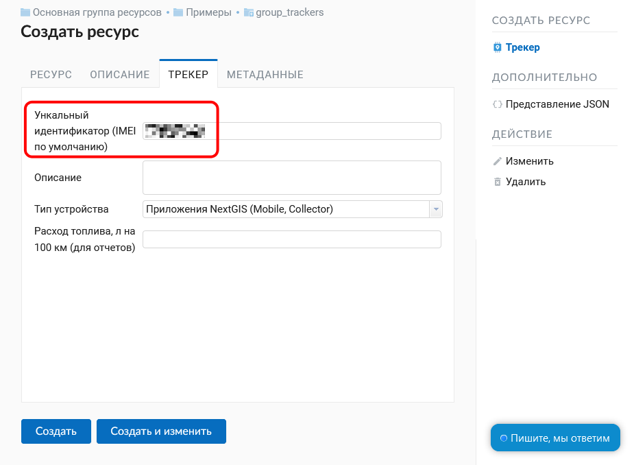
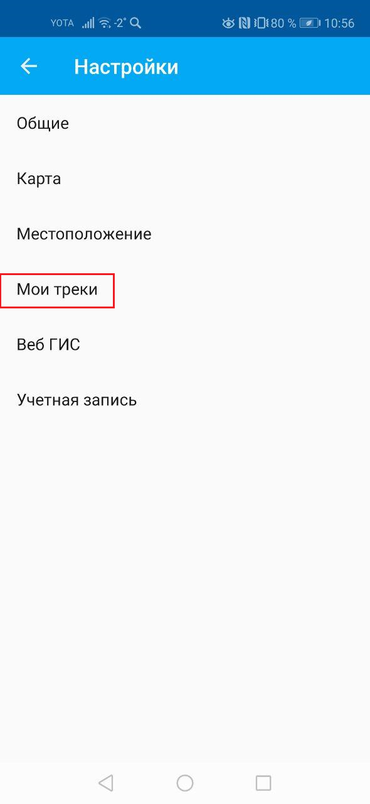
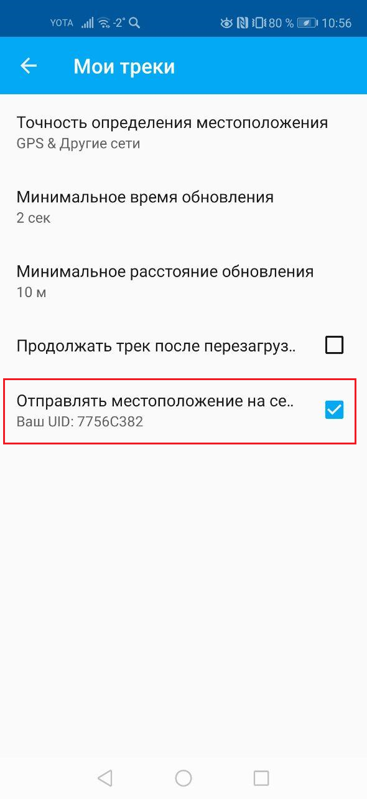
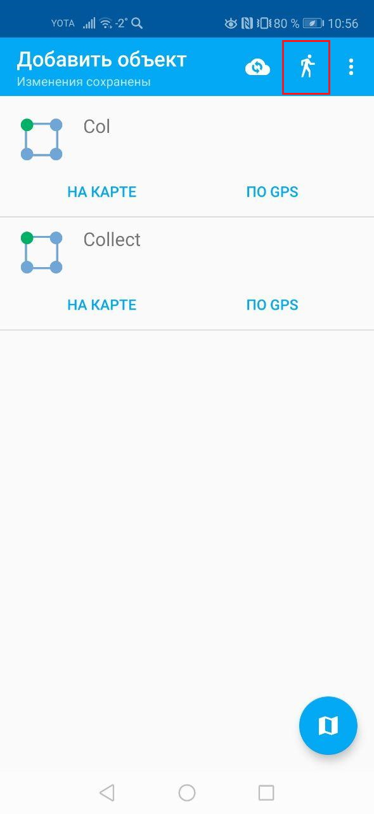
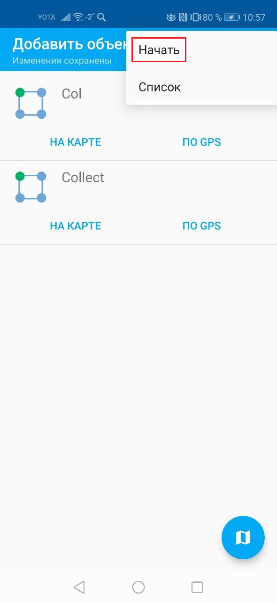
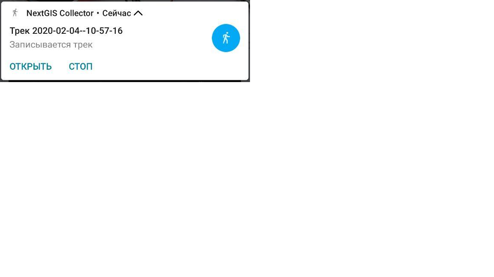
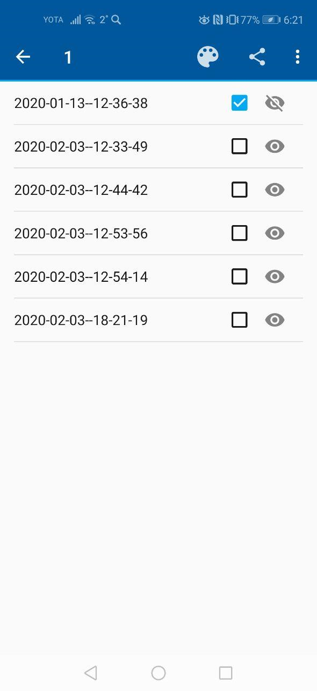
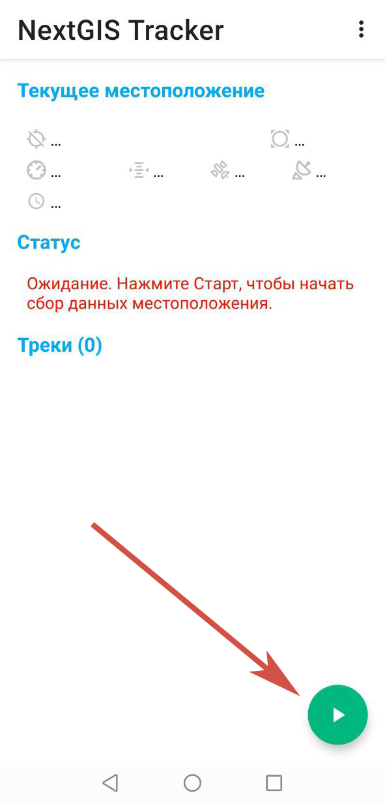

.. _tracking:

Как подключить мониторинг движущихся объектов (трекинг)
========================================================

.. note::
    Количество доступных трекеров зависит от текущего `тарифного плана <https://nextgis.ru/pricing-base/>`_. На плане **‘Mini’** - 1 трекер, на плане **‘Premium’** - 5 трекеров.

Введение
--------

Функция мониторинга движущихся объектов (трекинга) основана на регистрации изменения геолокации пользователя во времени
и необходима для записи истории его передвижения на местности. Трекинг может быть полезен, когда нужно сохранить запись
маршрута, отследить и в дальнейшем проанализировать траектории перемещения объектов в пространстве.

.. _tracking_principles:

Принципы работы трекинга
------------------------

Трек - это последовательность точек в пространстве с течением времени для последующего отображения на Веб карте.

Процесс мониторинга выглядит следующим образом - человек запускает запись трека в мобильном приложении,
проходит маршрут, по окончании останавливает запись трека. После этого происходит автоматическая отправка результата
на сервер Веб ГИС и отображение записанных треков на веб карте, если произведены соответствующие  `настройки <https://docs.nextgis.ru/docs_ngcom/source/tracking.html#tracking-create>`_.

.. _tracking_create:

Создание группы трекеров и трекера
----------------------------------

Чтобы просматривать записи треков на Веб-карте, необходимо настроить свою Веб ГИС - создать для этого определенный набор ресурсов:

1. Создать ресурс **“Группа трекеров”**. Это папка, в которой находятся трекеры (устройства, с которых будут отправляться данные в Веб ГИС).

   
   Создание группы трекеров

2. Внутри *группы трекеров* создать ресурс **“Трекер”**. Чтобы связать его с устройством, в разделе “Трекер” настроек ресурса нужно ввести уникальный идентификатор (ID) вашего устройства (его можно посмотреть в настройках приложения NextGIS Mobile и NextGIS Collector).

   
   Создание трекера

   
   Настройки трекера

.. _tracking_mobile_collector:

Трекинг в NextGIS Mobile и NextGIS Collector
--------------------------------------------

На данный момент запись треков можно вести в мобильных приложениях
`NextGIS Mobile <https://play.google.com/store/apps/details?id=com.nextgis.mobile>`_,
`NextGIS Collector <https://play.google.com/store/apps/details?id=com.nextgis.collector>`_ и NextGIS Tracker.
Для этого необходим смартфон на базе ОС Android.

.. _tracking_ngmobile:

1. NextGIS Mobile
^^^^^^^^^^^^^^^^^^^^^^^

Это полноценная мобильная `ГИС <https://nextgis.ru/nextgis-mobile/>`_, позволяющая создавать, редактировать и выгружать геоданные, в режиме онлайн и оффлайн. 

Первым делом необходимо установить мобильное приложение и пройти авторизацию. 
Затем в настройках приложения в разделе “Мои треки” активировать функцию **“Отправлять местоположение на сервер”**.

   
   Настройки NextGIS Mobile

Здесь также можно посмотреть уникальный идентификатор (ID) устройства, 
который необходимо указать в настройках трекера в `Веб ГИС <https://docs.nextgis.ru/docs_ngcom/source/tracking.html#tracking-create>`_.

   
   Отправка местоположения на сервер. ID устройства

Процесс записи трека подробно описан в разделе `Треки <https://docs.nextgis.ru/docs_ngmobile/source/tracks.html#ngmobile-record-tracks>`_ документации к NextGIS Mobile.

.. _tracking_ngcollector:

2. NextGIS Collector
^^^^^^^^^^^^^^^^^^^^^^^^

Это приложение для коллективного сбора данных. Оно дает возможность владельцу Веб ГИС, созданной на nextgis.com, 
организовать команду из нескольких человек и начать `сбор данных <https://docs.nextgis.ru/docs_ngcom/source/collector.html>`_ с помощью мобильных устройств.

Процедура записи трека здесь аналогична `алгоритму <https://docs.nextgis.ru/docs_ngmobile/source/tracks.html#ngmobile-record-tracks>`_ в NextGIS Mobile, но с небольшими различиями в интерфейсе.

Так для того, чтобы начать новую запись, необходимо нажать на иконку “человека” на верхней панели и в контекстном меню выбрать *“Начать”*.

   
   Иконка трекера в NextGIS Collector
   

   
   Начать запись трека

Окончание записи можно произвести как в панели в фоновом режиме, так и в том же контекстном меню верхней панели по нажатию *“Стоп”*. 
После этого запись трека появится в вашей Веб ГИС.

   
   Завершить запись трека
   

   
   Всплывающее уведомление

Список треков в NextGIS Collector находится по второй строке в контекстном меню иконки треков (человек).
Здесь можно выключить видимость треков, раскрасить их по палитре, удалить или отправить их в формате GPX.

   
   Список записанных треков

.. _tracking_ngtracker:

3. NextGIS Tracker
^^^^^^^^^^^^^^^^^^^^^^^^

Это простое приложение, предназначенное только для записи треков.

В главном окне приложения внизу справа нажмите зеленую кнопку старта, см. :numref:`ngtr_track_start_pic`.

   Старт записи трека

В панели уведомлений мобильного устройства появился значок человека, который говорит о том, что идет запись трека. Открыв эту панель, можно остановить запись трека, посредством кнопки **Стоп**.

Записываемые треки можно:

* `автоматически отправлять в Веб ГИС <https://docs.nextgis.ru/docs_ngtracker/source/setting_up.html#ngtr-set-send>`_ 
* `экспортировать <https://docs.nextgis.ru/docs_ngtracker/source/export.html>`_ в виде GPX-файла.

.. _tr_web_map:

Результаты трекинга в Веб ГИС
--------------------------------

Подключив трекер к Веб ГИС, вы можете:

* `отобразить треки на веб-карте <https://docs.nextgis.ru/docs_ngweb/source/trackers.html#tracking-web-map>`_;
* составить `отчёт <https://docs.nextgis.ru/docs_ngweb/source/trackers.html#tracking-report>`_ по трекам, где автоматически будут подсчитаны такие параметры, как пробег, максимальная скорость, средняя скорость, израсходованное топливо, остановки;
* `экспортировать трек <https://docs.nextgis.ru/docs_ngweb/source/trackers.html#export-as-gpx-pic>`_ в формате GPX.

