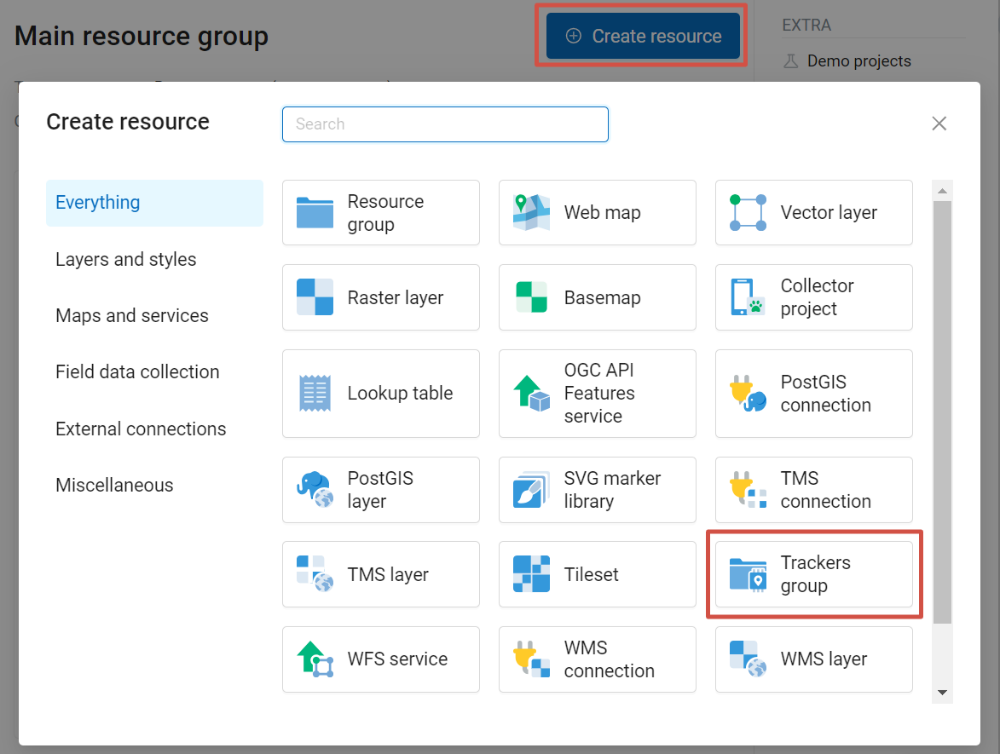
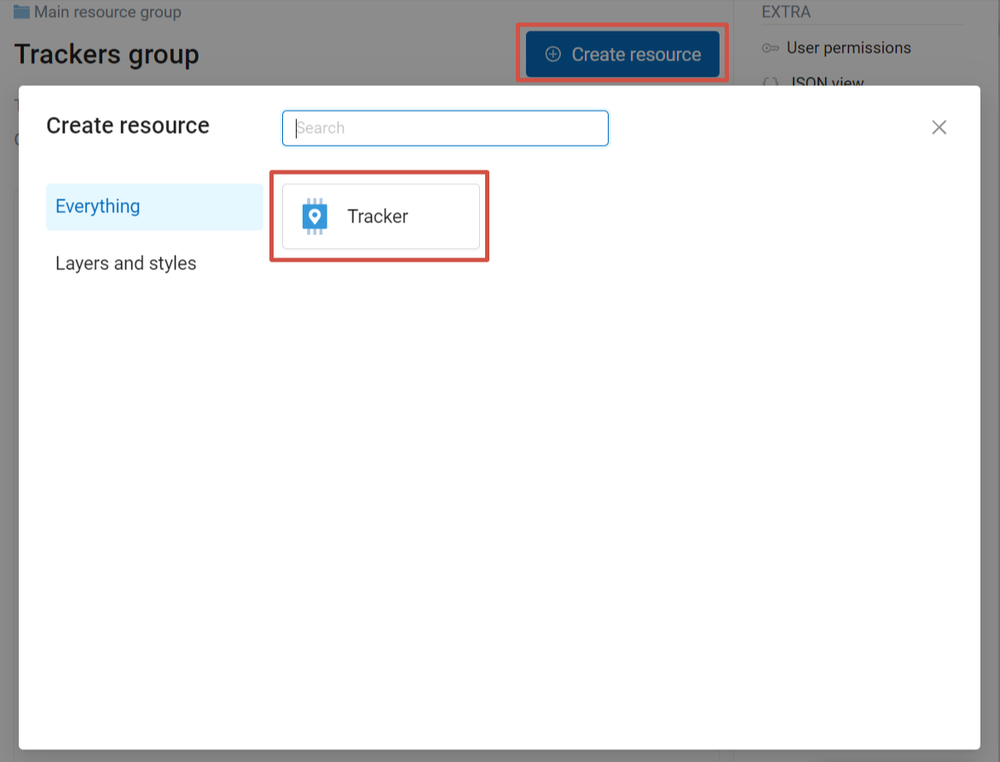
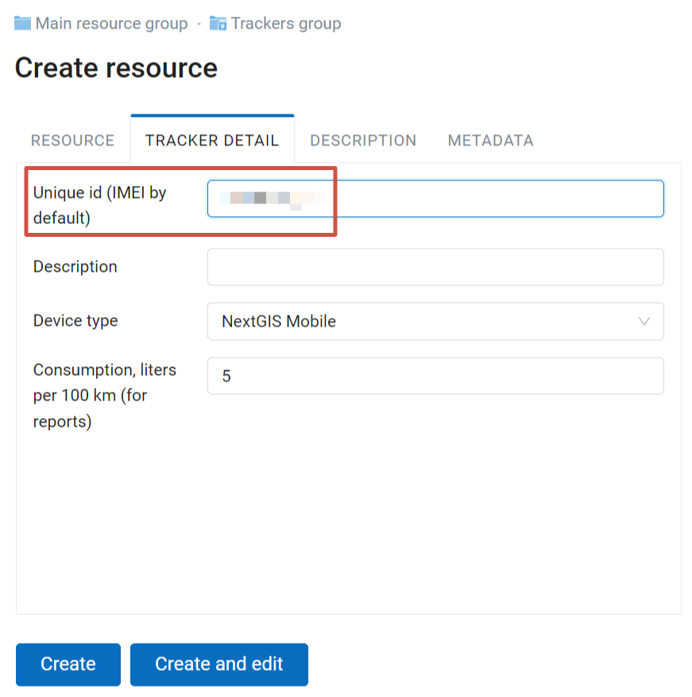
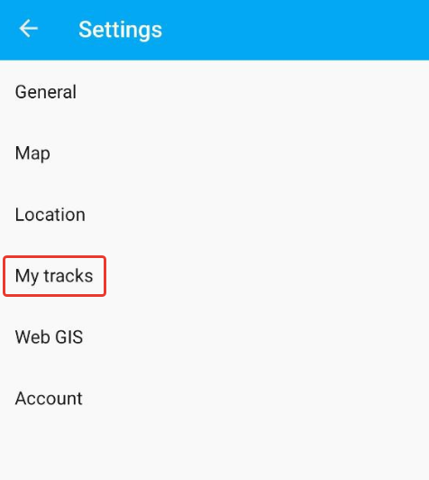
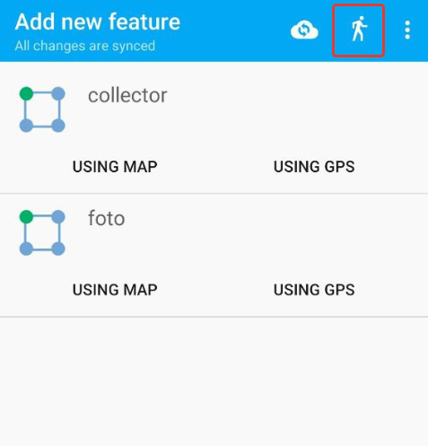
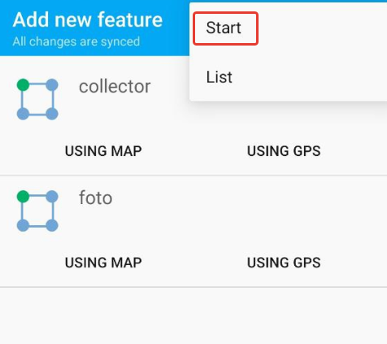
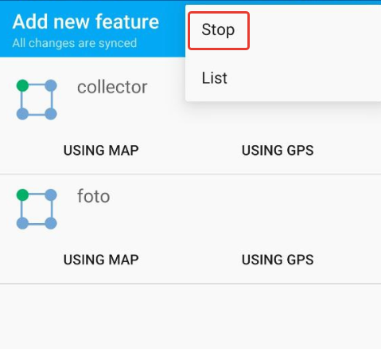
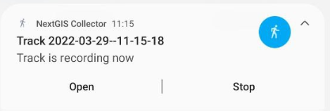
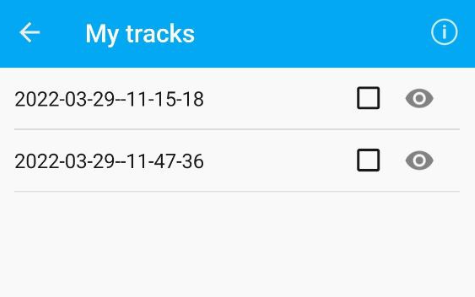

.. _tracking:

How to enable the monitoring of moving objects (tracking)
=========================================================

.. note::
    The number of available trackers depends on the current `plan <https://nextgis.com/pricing-base/>`_. For **Mini** - 1 tracker, for **Premium** - 5 trackers.

    For on-premise solutions, Tracking Hub is available for NextGIS Web `Extended <https://nextgis.com/pricing/#ngwextended>`_ and `Enterprise <https://nextgis.com/pricing/#ngwenterprise>`_.

Introduction
-------------

Monitoring of moving objects function is based on registration of the user’s geolocation changing over time
and is necessary to record the history of its movement on the ground.
Tracking can be useful when you need to save a record of the route,
track and further analyze the trajectories of objects moving in space.

.. _tracking_principles:

How tracking works
-------------------

A track is a sequence of points in space over time to be displayed on a Web Map.

Monitoring process looks like this - a person launches tracking in the mobile application, follows the route, stops tracking at the end.
After that, the recorded tracks are sent to the Web GIS server and are displayed on the Web Map (if it's configured).

.. _tracking_create:

Creating tracker groups
-----------------------

If you want see tracks on a Web Map, you need to set up your Web GIS - create special resource groups:

1. Create a resource **Trackers group**. This is a folder which contains trackers (devices that send data to Web GIS).

   
   Creating a group of trackers

2. Create a resource **Tracker** in the trackers group. To sync a tracker with a mobile device, you need to enter the device's ID. It can be found in NextGIS Mobile/Collector app’s settings (Mobile: Settings -> My tracks -> under Send location to server).

   
   Creating a tracker

   
   Tracker settings
   
.. _tracking_mobile_collector:

Tracking in NextGIS Mobile, Collector and Tracker
-------------------------------------------------

For now you can track in mobile apps such as
`NextGIS Mobile <https://play.google.com/store/apps/details?id=com.nextgis.mobile>`_,
`NextGIS Collector <https://play.google.com/store/apps/details?id=com.nextgis.collector>`_ and `NextGIS Tracker <https://play.google.com/store/apps/details?id=com.nextgis.tracker>`_.
An Android smartphone is required for that.

.. _tracking_ngmobile:

1. NextGIS Mobile
^^^^^^^^^^^^^^^^^

It’s the complete mobile `GIS <https://nextgis.com/nextgis-mobile/>`_ that allows you to create, edit and share geodata both online and offline.

First of all you need to install the application and sign in.
Then activate the ‘Send location to server’ option in the ‘My tracks’ section of Settings.

   
   NextGIS Mobile Settings

Here you can also see the unique identifier (ID) of the device, which must be specified in the tracker settings in Web GIS.

.. figure:: _static/Mobile_send_to_server_en.png
   :name: Send location to server. Device ID
   :align: center
   :scale: 70%
   :width: 425.0px
   :height: 685.0px
   
   Send location to server. Device ID

The process of recording a track is described in details in the `Tracks <https://docs.nextgis.com/docs_ngmobile/source/tracks.html/>`_ section of the documentation for NextGIS Mobile.

.. _tracking_ngcollector:

2. NextGIS Collector
^^^^^^^^^^^^^^^^^^^^^^^^^^

This application is intended for collective data collection. It allows the Web GIS’s owner to get people on a team and begin `data collection <https://docs.nextgis.com/docs_ngcom/source/collector.html#team-participants-mobile-app-installation-and-start-of-data-collection>`_ using mobile devices.

Track recording process is similar to NextGIS Mobile’s `algorithm <https://docs.nextgis.com/docs_ngmobile/source/tracks.html#recording-a-track>`_ but with some interface differences.  

So in order to start a new track you need to tap on the ‘human’ icon in the upper panel and select ‘Start’. 

   
   Tracker icon in NextGIS Collector

   
   Start recording track

The end of the recording can be done both in the panel in the background mode, and in the same context menu of the top panel by clicking “Stop”.
The track record will then appear in your Web GIS.

   
   Stop recording track

   
   Pop-up notification

The track list is in the second line of the context menu for the track icons. Here you can enable/disable tracks, color them according to the palette, remove or share in GPX format.

   
   List of recorded tracks

**3. NextGIS Tracker**

This is a simple app for track recording.

`Learn more <https://docs.nextgis.com/docs_ngtracker/source/intro.html>`_.

.. _tracking_web_map:

Tracking results on the Web Map
--------------------------------

If the tracker is added to the Web GIS, you can:

* `View tracking results <https://docs.nextgis.com/docs_ngweb/source/trackers.html#viewing-tracks-on-a-web-map>`_ on any Web Map of your Web GIS;
* `Generate reports <https://docs.nextgis.com/docs_ngweb/source/trackers.html#reports>`_ on mileage, top speed, average speed, spent fuel, stops;
* `Export tracks <https://docs.nextgis.com/docs_ngweb/source/trackers.html#track-export>`_ as GPX files.

