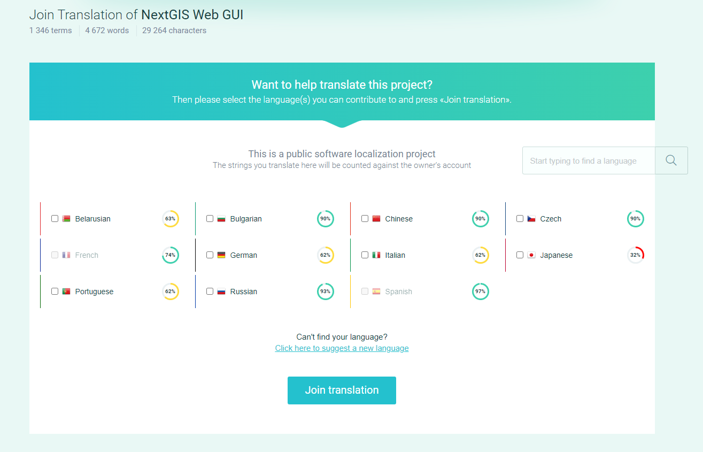
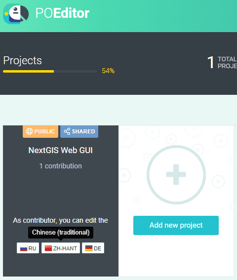
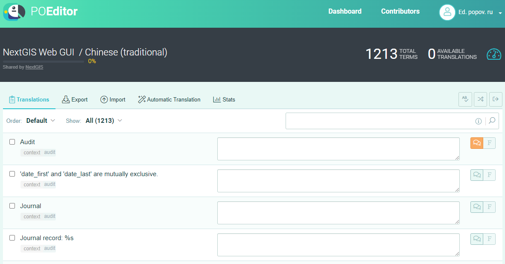

.. _ngcom_improve_translation:

Как улучшить текущий перевод
=============================

NextGIS Web - открытое решение, в улучшении которого может принять участие любой пользователь.
На текущий момент в NGW доступен выбор из следующих языков пользовательского интерфейса:

* Болгарский
* Чешский
* Немецкий
* Английский
* Испанский
* Французский
* Итальянский
* Португальский
* Русский
* И китайский

Мы предлагаем пользователям внести вклад в качество наших переводов.
Если вы экспертно владеете каким-либо из перечисленных языков, вы можете самостоятельно дополнить и/или улучшить текущий пользовательский интерфейс.

   Проект NextGIS Web GUI по переводу пользовательского интерфейса

Присоединиться к проекту
-------------------------

Перевод `NextGIS Web <https://nextgis.ru/nextgis-web/>`_ осуществляется на платформе `POEditor <https://poeditor.com/>`_.
В первую очередь нужно `зарегистрироваться <https://poeditor.com/login/>`_.
После авторизации на платформе присоединиться к проекту можно по  `ссылке <https://poeditor.com/join/project?hash=dOVs4gs2WS>`_.
Выбираем нужные языки и нажимаем **Join translation**.
После этого на `странице <https://poeditor.com/projects/>`_ будет показываться список проектов (в нашем случае: NextGIS Web GUI) с языками, которые выбрали.

   Выбор языка для перевода

Как переводить
---------------

Чтобы непосредственно приступить к переводу, нажимаем на значок языка в нужном проекте.
В таблице можно настроить порядок и фильтр строк. Также имеется поиск.

   Окно интерфейса переводчика

В строках часто встречаются названия параметров, например ‘date_first’ и ‘date_last’ как на последней картинке. Их переводить не нужно.

Пример перевода на русский язык:

* англ. - *'date_first' and 'date_last' are mutually exclusive*.
* русс. - *'date_first' и 'date_last' взаимоисключающие*.

Также могут встречаться конструкции %s, %d, %f и прочие, которые также не требуют перевода.
Во время работы программы они заменяются на строковые или числовые параметры.

Пример 1:

* англ. - *User count: %d*.
* русс. - *Количество пользователей: %d*.

Пример 2:

* англ. - *Field ‘%s(?)’ encoding is broken*.
* русс. - *Кодировка поля ‘%s(?)’ повреждена*.

Параметры часто заключены в одинарные кавычки ‘, двойные кавычки “ или скобки ().
Такое разнообразие не несёт особого смысла и объясняется отсутствием договорённости среди разработчиков по форматированию.
Оставляем в переводе так, как в оригинальной строке.
