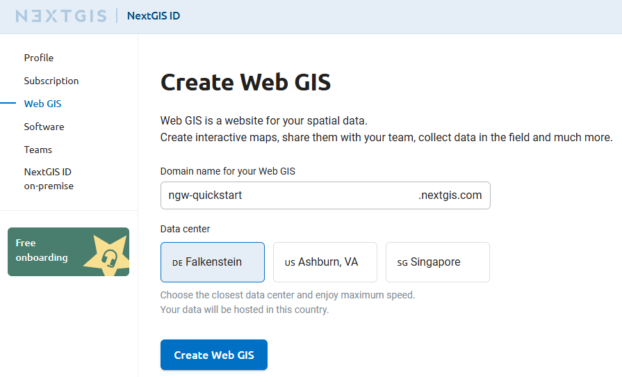

Seamless QGIS Integration
===========================

.. |button_settings| image:: _static/button_settings.png
   :width: 6mm
   :alt: gear

.. |button_to_wg| image:: _static/button_to_wg.png
   :width: 6mm

.. |NextGISLogo| image:: _static/NextGISLogo.png
   :width: 6mm
   :alt: blue and black X

.. |mActionToggleEditing| image:: _static/mActionToggleEditing.png
   :width: 6mm

.. |mActionSaveEdits| image:: _static/mActionSaveEdits.png
   :width: 6mm
   
.. |button_add_point| image:: _static/button_add_point.png
   :width: 6mm

.. admonition:: Availability

   Cloud SaaS (all editions), On premise (all editions), Open Source

NextGIS Web is a data-centric server GIS, that allows you to store, manage and publish spatial data in a flexible and effective way. It has a deep integration with QGIS, the leading free and open-source GIS software. 

Integration covers publishing QGIS projects as Web Maps, connecting to Web Maps as QGIS projects, data syncing and collaborative editing from several QGIS instances.

In this step-by-step tutorial you will learn how to publish your QGIS project to the web, then connect to it from another QGIS instance, manage styles at Web Maps from QGIS and edit data from QGIS directly at the server. Register a free cloud account and try it right away!

:download:`Download tutorial data <https://nextgis.com/tutorials/seamless_qgis_integration.zip>` (source: `OpenStreetMap <https://www.openstreetmap.org/>`_, `data.nextgis.com <http://data.nextgis.com>`_, `Copernicus <https://browser.dataspace.copernicus.eu/>`_)

.. seealso:: `Store, manage and publish your spatial data <https://docs.nextgis.com/docs_ngcom/source/tutorial_webgis.html>`_

Publish your QGIS project online

1. Create free account and Web GIS
2. Open and explore QGIS project
3. Install NextGIS Connect plugin
4. Create a connection
5. Publish QGIS project to NextGIS Web

Result: Explore the Web Map and resources

Use QGIS to edit data stored in Web GIS 

6. Connect to Web Map from QGIS
7. Update layer styles at the Web Map from QGIS
8. Edit data from QGIS and explore results at the Web Map

.. _account:

Step 1/6 Create free account and Web GIS
-----------------------------------------

Go to `my.nextgis.com`, click the **Create Account** button and sign up using your email address. 

After registration your account page would appear. Select the **Web GIS** menu on the left, come up with a name (ngw-quickstart.nextgis.com in this example) and select the nearest Data center location (DE Falkenstein in this example). Then click **Create Web GIS**.

When the creation process is complete, the contents of the page will change. Direct link to your new Web GIS will appear.

.. figure:: _static/tutorial_my_wg_en.png
   :name: tutorial_my_wg_pic
   :align: center
   :width: 20cm

Copy the address of the created Web GIS. In this example: ``https://ngw-quickstart.nextgis.com``. You'll need it later to create a connection.

Step 2/5 Open and explore QGIS project
---------------------------------------

`Download the tutorial data <https://nextgis.com/tutorials/seamless_qgis_integration.zip>`_ and unzip the archive.

Click on the file called ``Sursee.qgz`` to open it in QGIS. 

.. note:: If you don't have QGIS yet, `download <https://qgis.org/download/>`_ and install it.

This is a typical QGIS project with raster and vector layers, a couple of basemaps and rich scale-dependent styles set up with expressions. Points of interest are styled with advanced “Point Cluster” renderer using dynamic cluster symbol size. There are also embeded SVG icons in the “Road network” layer.

.. figure:: _static/_.png
   :name: 
   :align: center
   :width: 20cm

Zoom in to explore multiscale styling.

.. figure:: _static/_.png
   :name: 
   :align: center
   :width: 20cm

Step 3/5 Install NextGIS Connect plugin
----------------------------------------

Go to the “Plugins” — “Manage and Install Plugins” menu

.. figure:: _static/_.png
   :name: 
   :align: center
   :width: 20cm

Go to the “All” tab and find a plugin named NextGIS Connect. Use a search bar at the top of the interface for faster access. Press the **Install Plugin** button.

.. figure:: _static/_.png
   :name: 
   :align: center
   :width: 20cm

After installation NextGIS Connect is available in the “Internet” menu and as a toolbar icon: |ngconnect_icon|. When NextGIS Connect is active, the side panel is visible.

Go to the plugin settings, using |button_settings| icon. This is a place for setting up everything related to QGIS–NextGIS Web integration. First, let’s create a connection. 

Step 4/5 Create a connection
-----------------------------

To establish a link between your QGIS app and a Web GIS, you need to create a connection. 

Go to the `Web GIS page <https://my.nextgis.com/webgis/>`_ of your NextGIS ID account and copy the link to your Web GIS. In this example the link is: ``https://ngw-quickstart.nextgis.com``.

In QGIS open the NG Connect settings and click on the **New** button in the “Connections” group.

.. figure:: _static/_.png
   :name: 
   :align: center
   :width: 20cm

Enter the Web GIS address to the URL field, then press |symbologyAdd| to create a new Authentication configuration.

.. figure:: _static/_.png
   :name: 
   :align: center
   :width: 20cm

In the new dialog enter the email and password you used to register at my.nextgis.com at step 1, and press the **Save** button.

.. tip:: If you are going to **edit data collaboratively**, you can activate the checkbox “Enable feature versioning for vector layers when uploading”.

Exit settings by pressing the **OK** button in the bottom of the page. 

Now in the NextGIS Connect panel you can see the resource tree of your Web GIS.

.. figure:: _static/_.png
   :name: 
   :align: center
   :width: 20cm

Using this panel you could upload local data to Web GIS, connect remote layers and maps to QGIS, update styles, create services and many more.

Step 5 Publish QGIS project to NextGIS Web
--------------------------------------------

In NextGIS Connect panel select the *Main resource group* folder, then open dropdown menu with |button_to_wg| icon and select **Upload all**.

.. figure:: _static/_.png
   :name: 
   :align: center
   :width: 20cm

Enter a name for the project. In this example, it is ``Sursee``.A folder with this name is created in Web GIS, and all the project data is uploaded there.

.. figure:: _static/_.png
   :name: 
   :align: center
   :width: 20cm

The process of uploading the whole project has started. You can track it by checking the status message.

.. figure:: _static/_.png
   :name: 
   :align: center
   :width: 20cm

By default, after Web Map is published successfully it opens automatically in your browser. You can also right-click on a Web Map in the NextGIS Connect panel and use the context menu to open it. 

Note that all project layers are now visible in the NextGIS Connect panel.

.. figure:: _static/_.png
   :name: 
   :align: center
   :width: 20cm

Now you can explore the Web Map. 

Explore the Web Map and resources
~~~~~~~~~~~~~~~~~~~~~~~~~~~~~~~~~~~~

A Web Map has been created from the project. It looks exactly the same as the original QGIS project, because NextGIS Web uses QGIS styles as primary way to define layer styles.

.. figure:: _static/_.png
   :name: 
   :align: center
   :width: 20cm

You can enable and disable layers and categories within layers. Web Map has its own URL, so you can easily share it. Play with the Web Map interface. Learn more about it: https://docs.nextgis.com/docs_ngweb/source/webmaps_client.html

By pressing the |NextGISLogo| icon at the top left corner you could go to the resource management interface.

.. figure:: _static/_.png
   :name: 
   :align: center
   :width: 20cm

Go to the Sursee directory and see that for each original layer a dedicated resource was created. You can work with the uploaded vector and raster layers independently from the Web Map — modify them, publish the data using different protocols etc.

Step 6 Connect to Web Map from QGIS
-----------------------------------

Close QGIS project (Project - Close). Imagine that you work from another computer, another QGIS instance. The NextGIS Connect panel is still open (reopen it if closed).

Find the Web Map resource *Sursee - webmap* in the NextGIS Connect panel, right-click on it to open the context menu, and select |button_to_qgis| **Add to QGIS**.

.. figure:: _static/_.png
   :name: 
   :align: center
   :width: 20cm

QGIS reconstructs the Web Map content locally - downloads all relevant layers and styles and organizes them the same way as on the Web Map.

What you get is the initial project fully reconstructed from the NextGIS Web.

.. figure:: _static/_.png
   :name: 
   :align: center
   :width: 20cm

Note that in the Layers panel vector layers have special marks to the right of their names: |synchronized|.

.. figure:: _static/_.png
   :name: 
   :align: center
   :width: 20cm

They are now linked to the server storage. If data is updated on the server side, QGIS will know about it and synchronize. If data is updated in QGIS, it will communicate it to the server and update the data on the server.

Modify layer styles on the Web Map from QGIS
---------------------------------------------

Let’s modify Web Map styles! In QGIS, find the *Railroad network* layer in the Layers panel. Open the context menu of the “rail” symbol category. On the palette click on the color ring to select the red color — we’ll make railroads more bright and visible. Click on the empty part of the panel to close the dialog.

.. figure:: _static/_.png
   :name: 
   :align: center
   :width: 20cm

Then find and select the *Railroad network* layer in the NextGIS Connect panel.

.. figure:: _static/_.png
   :name: 
   :align: center
   :width: 20cm

Go back to the Layers panel, open the context menu of the “Railroad network” layer and press **NextGIS Connect --> Update layer style**.

.. figure:: _static/_.png
   :name: 
   :align: center
   :width: 20cm

Go back to the web browser with the Web Map opened (reopen it from NextGIS Connect panel if it is closed). You'll find that railroads have changed their color to red.

.. figure:: _static/_.png
   :name: 
   :align: center
   :width: 20cm

You can modify raster styles as well. 

Update raster layer style on a Web Map
-----------------------------------------

In QGIS, activate *Sentinel 2 imagery* layer. It is a 4 band satellite dataset, currently configured to display in natural colors.

.. figure:: _static/_.png
   :name: 
   :align: center
   :width: 20cm

Open its context menu and go to the “Properties”.

.. figure:: _static/_.png
   :name: 
   :align: center
   :width: 20cm

In the Properties, go to the Symbology tab, and change ``Band 3`` to ``Band 4`` in the *Red band* selector. The press **OK**.

.. figure:: _static/_.png
   :name: 
   :align: center
   :width: 20cm

We've just replaced the Red reflectance data to the Near-InfraRed reflectance data, so the raster visualization has changed significantly.

.. figure:: _static/_.png
   :name: 
   :align: center
   :width: 20cm

Open the Web Map and activate the “Sentinel 2 imagery” layer there. It still has its original appearance.

.. figure:: _static/_.png
   :name: 
   :align: center
   :width: 20cm

Return to QGIS, select the *Sentinel 2 imagery* layer in the NextGIS Connect panel.

.. figure:: _static/_.png
   :name: 
   :align: center
   :width: 20cm

Then open the context menu of the layer and click **NextGIS Connect --> Update layer style**.

.. figure:: _static/_.png
   :name: 
   :align: center
   :width: 20cm

Open the Web Map again — layer style has changed. 

.. figure:: _static/_.png
   :name: 
   :align: center
   :width: 20cm

NextGIS Web can handle multiband rasters with QGIS styles of any complexity.

Edit data from QGIS and explore results on the Web Map
-------------------------------------------------------

Return to QGIS, in the Layers panel select *Points of interest* layer, open its context menu and enable |mActionToggleEditing| Editing mode. Since this layer was added from NextGIS Connect, it is linked with Web GIS, so the edits are synchronized with the server.

.. figure:: _static/_.png
   :name: 
   :align: center
   :width: 20cm

Enable Digitizing toolbar and activate the |button_add_point| **Add point feature** tool.

.. figure:: _static/_.png
   :name: 
   :align: center
   :width: 20cm

Let’s place another bbq spot in the forest. Left-click on a suitable place on the map, then enter one attribute value, AMENITY = ``bbq``. Then press **OK**.

.. figure:: _static/_.png
   :name: 
   :align: center
   :width: 20cm

Save the changes |mActionSaveEdits| and exit the Editing mode.

.. figure:: _static/_.png
   :name: 
   :align: center
   :width: 20cm

After you exit the Editing mode synchronization starts automatically. A new feature is sent to the server. Return to the Web Map to view it.

.. figure:: _static/_.png
   :name: 
   :align: center
   :width: 20cm

Users can connect to the same server data from multiple QGIS instances and edit the data simultaneously. Our stack provides a seamless, ready-to-go solution to enable team digitizing and data editing in QGIS.

