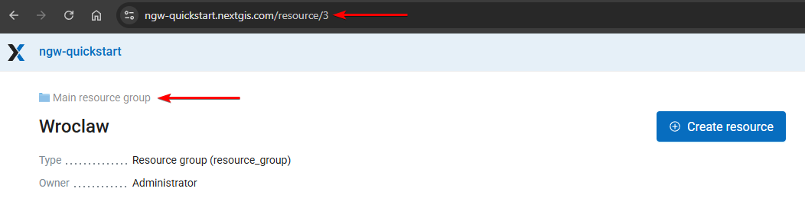
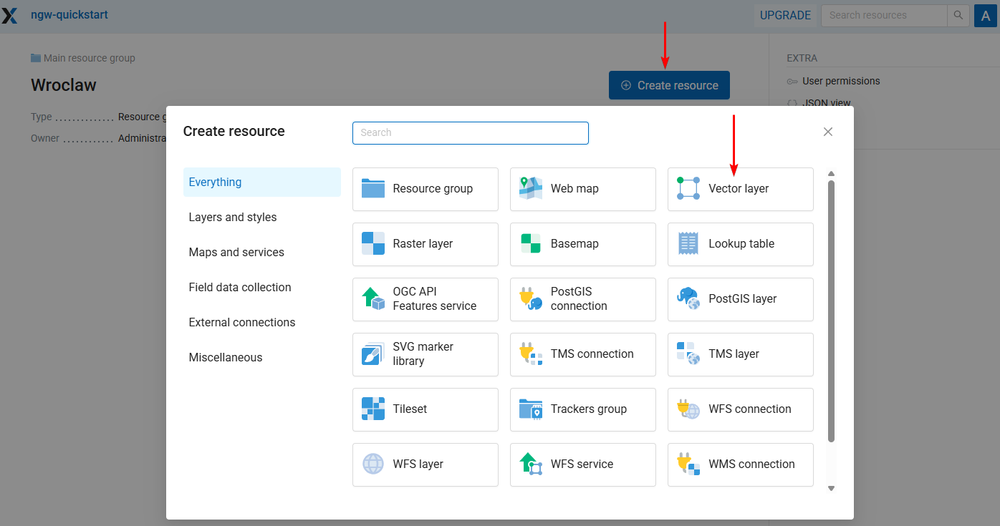
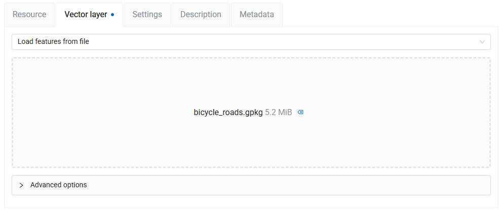
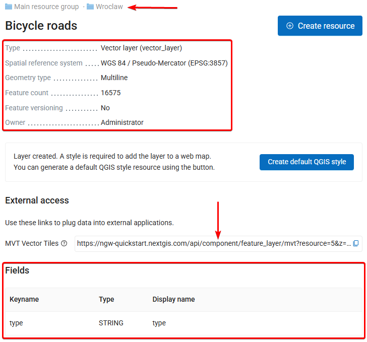
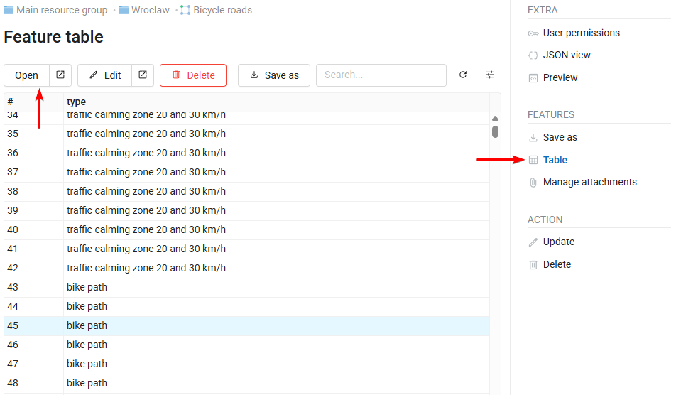

Store, manage and publish your spatial data
============================================

.. note:: Availability: Cloud SaaS (all editions), On premise (all editions), Open Source

NextGIS Web is a data-centric server GIS, allowing you to store, manage and publish spatial data in a flexible and effective way. In this step-by-step tutorial you will learn how to convert your GIS files into shareable Web Maps, tile and OGC services, as well as to create and manage data directly on the server. Register a free cloud account and try it right away!

:download:`Download tutorial data <https://nextgis.com/tutorials/store_manage_publish_geospatial_data.zip>` (source: `Wrocław Spatial Information System <https://geoportal.wroclaw.pl/>`_)

Basic

1. Create Account and Web GIS
2. Create Resource group
3. Upload vector layer and style
4. Upload raster layer
5. Publish Web Map

Advanced

6. Add external WMS layer to Web Map
7. Add basemaps
8. Create vector layer inside Web GIS
9. Edit vector layer on Web Map, add file attachments
10. Publish OGC API — Features service
11. Behind the scenes

1 Create free account and Web GIS
----------------------------------

Go to `my.nextgis.com`, press the **Create Account** button and sign up using your email address. 

After registration your account page would appear. Select the **Web GIS** menu on the left, come up with a name (ngw-quickstart.nextgis.com in this example) and select the nearest Data center location (DE Falkenstein in this example). Then press **Create Web GIS**.

.. figure:: _static/tutorial_create_wg_en.png

When the creation process is complete, the contents of the page will change. Direct link to your new Web GIS will appear.

.. figure:: _static/tutorial_my_wg_en.png

2 Access your Web GIS and create resource group
------------------------------------------------

Click on the Web GIS link or type it into your browser.

You'll see the main interface of your Web GIS.

.. figure:: _static/tutorial_wg_main_en.png

In NextGIS Web everything is a resource — layers, Web Maps, folders (groups), connections to services and databases. Resources are organized as files at your computer — in a tree. 

Let’s create our first resource, a folder or *resource group* named Wroclaw. To do that, press the blue **Create resource** button at the top of the page. 

.. tip:: If you don’t see the “Create resource” button, you should log in first. Press the “Sign in” button in the top right corner and then select “Sign in with NextGIS ID".

.. figure:: _static/tutorial_log_in_en.png

When you press **Create resource**, a window appears showing all available options of what could you create in the current context. Select **Resource group**.

.. figure:: _static/tutorial_select_group_en.png

The resource creation window consists of several tabs, in this case we need to set only the name ``Wroclaw`` on the “Resource” tab.

.. figure:: _static/tutorial_create_group_en.png

Press **Create** and you'll be redirected to the page of the new resource.

The URL in your browser is the path to the resource, and the numbers at the end of the URL are the resource ID. 

*Wroclaw* is a child for the *Main resource group* folder where we created it. The parent resource is shown above the resource name.

Now you can upload data to this folder.

3 Upload and publish vector layer and style
-------------------------------------------

`Download the tutorial data <https://nextgis.com/tutorials/store_manage_publish_geospatial_data.zip>`_ and unzip the archive.

**Inside the Wroclaw folder, press Create resource** and select the **Vector layer** type of resource.

You'll see the interface for resource creation with several tabs. 

The default tab is called **Vector layer**. Add the file called ``bicycle_roads.gpkg`` from the tutorial dataset to the field **Select a dataset** by drag-and-drop or click on the field and then select the file.

When the file has finished uploading its size is displayed. 

Switch to the **Resource tab** and enter the Dislpay name for the new layer, for example, ``Bicycle roads``. Then press **Create** button.

.. figure:: _static/tutorial_create_vlayer_name_en.png

The vector layer was created and you were redirected to its page. The numbers at the end of the URL are the ID of the layer.

This page has the information about the layer:

* Its place in the resource tree (Main resource group / Wroclaw);
* Basic metadata (geometry type, feature count etc.);
* List of fields a.k.a. attribute structure;
* URL to access the layer via MVT vector tiles. Right away you can connect this data to external resources using this link.

To view the features select **Table** in menu on the right.

Select any feature and press **Open** to view it.

In the opened window you see all properties of the selected feature, including its attributes, geometry and a map representation on top of the default basemap.

.. figure:: _static/tutorial_feature_preview_en.png 

The feature table allows you to inspect and manage vector layer features as independent database records, without using maps or other applications. (`More on how to do it <https://docs.nextgis.ru/docs_ngweb/source/feature_table.html#ngw-feature-table-blank>`_)

If you want to **add the layer to a Web Map**, you need a definition of its appearance a.k.a. a **style**. You can click **Create default QGIS style**, but for this layer we have a special file defining colors and structures of the lines, so let's upload it.

On the layer page press **Create resource** button. You'll see a different set of available resources, because a vector layer could only be a parent for styles and forms. We use QGIS styles as the primary way to define data appearance. Select **QGIS vector style**.

.. figure:: _static/tutorial_select_qstyle_en.png

Upload the file called ``bicycle_roads.qml`` from the tutorial dataset. Then press the **Create** button.

.. figure:: _static/tutorial_create_qstyle_en.png

The vector style was created and you were redirected to its page. Press **Preview** in the menu on the right to see how the style looks.

Now you can add another type of layer or skip right to the Web Map creation.

