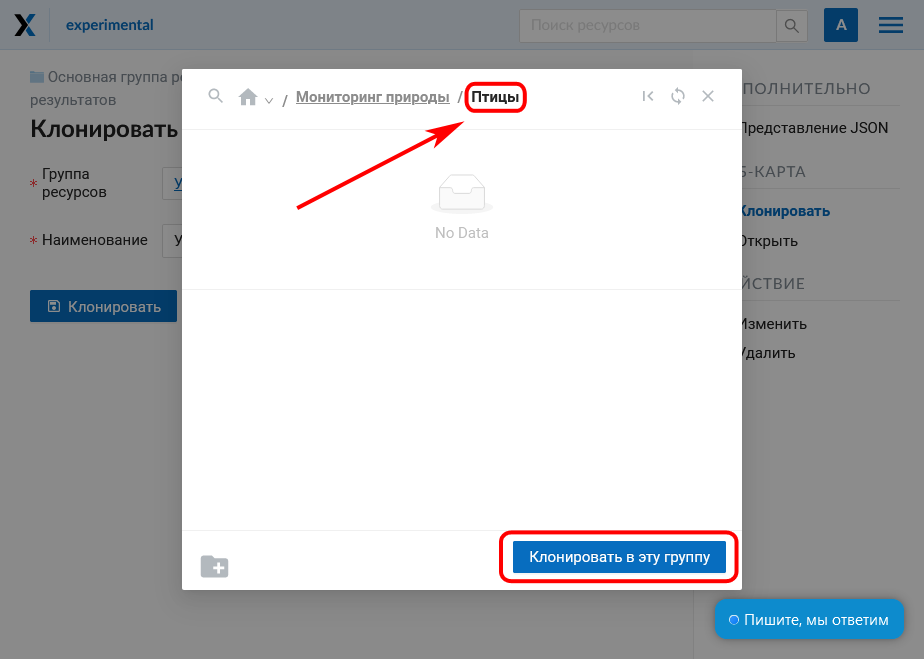

.. sectionauthor:: Юлия Григоренко <grigorenko.j@gmail.com>

.. _ngcom_webmap_clone:

Как клонировать (копировать) веб-карту
======================================

Иногда возникает необходимость внутри одной Веб-ГИС создать копию веб-карты с теми же параметрами и слоями. Для упрощения этого процесса в NextGIS Web есть инструмент клонирования.
Чтобы клонировать веб-карту, зайдите на страницу ресурса. В панели справа выберите “Клонировать”.

   Выбор действия "Клонировать"

Откроется окно параметров клонирования. Здесь вы можете задать наименование новой веб-карты. По умолчанию к названию исходной карты добавляется номер в скобках, “(1)”, “(2)” и т.д.
Также необходимо выбрать группу ресурсов, где будет создана копия карты. По умолчанию это та же группа, где находится исходная карта.

.. figure:: _static/webmap_clone_page_ru.png
   :name: webmap_clone_page_pic
   :align: center
   :width: 20cm
   
   Окно "Клонирование веб-карты"
   
Если все параметры вас устраивают, нажмите “Клонировать”. Копия карты будет создана.
После успешного завершения клонирования будет открыта страница “Обновить ресурс”, где вы можете изменить настройки только что созданной копии карты.

.. _ngcom_webmap_clone_select:

Выбор группы для клонирования
------------------------------

Если вы хотите создать копию в другой папке, нажмите на иконку с лупой в правом конце поля “Группа ресурсов”.

   
   Вызов окна выбора группы
   
Появится всплывающее окно выбора группы. 

В нём можно воспользоваться поиском, нажав на лупу в левом верхнем углу (см. :numref:`webmap_clone_selected_group_pic` п.1) и начав вводить название нужной группы. 

Для перемещения по дереву групп вверх используйте путь к папке в верхней части окна. Чтобы перейти в папку из списка, нажмите стрелку справа от ее названия (см. :numref:`webmap_clone_selected_group_pic` п.4).

Если вы хотите снова открыть группу, в которой находится исходная карта, нажмите значок **|<** в верхней части окна (см. :numref:`webmap_clone_selected_group_pic` п.2).

Чтобы отметить выбранную группу для клонирования, поставьте маркер в кружке слева от её названия (см. :numref:`webmap_clone_selected_group_pic` п.3). Затем нажмите кнопку “Клонировать в выбранную группу”.

.. figure:: _static/webmap_clone_selected_group_elements_ru.png
   :name: webmap_clone_selected_group_pic
   :align: center
   :width: 20cm
   
   Окно выбора группы. 1 - поиск группы и путь к открытой группе; 2 - возврат к исходной группе, обновление дерева ресурсов, закрытие окна; 3 - радиокнопка выбора группы; 4 - переход в группу; 5 - создание новой группы; 6 - снятие выделения; 7 - кнопка завершения выбора группы

Другой вариант - открыть нужную группу и нажать кнопку “Клонировать в эту группу”. При отсутствиии маркера клонирование будет произведено в ту группу, которая открыта в настоящий момент. 

   
   Открытая группа в окне выбора группы

Используйте этот способ, если нужно скопировать веб-карту в основную группу ресурсов (обозначена домиком в строке пути к папке).

.. _ngcom_webmap_clone_new:

Создание новой группы для клонирования
--------------------------------------

Если нужно создать новую группу, нажмите на изображение папки со знаком “плюс” в левом нижнем углу всплывающего окна.

   
   Выбор действия "Создать группу"
   
Появится поле, в которое нужно ввести название новой группы. Для подтверждения создания группы нажмите синюю галочку справа.

   
   Создание новой группы
   
Созданная группа появится в списке.
Группа создаётся внутри той группы, которая отрыта в настоящий момент. 
