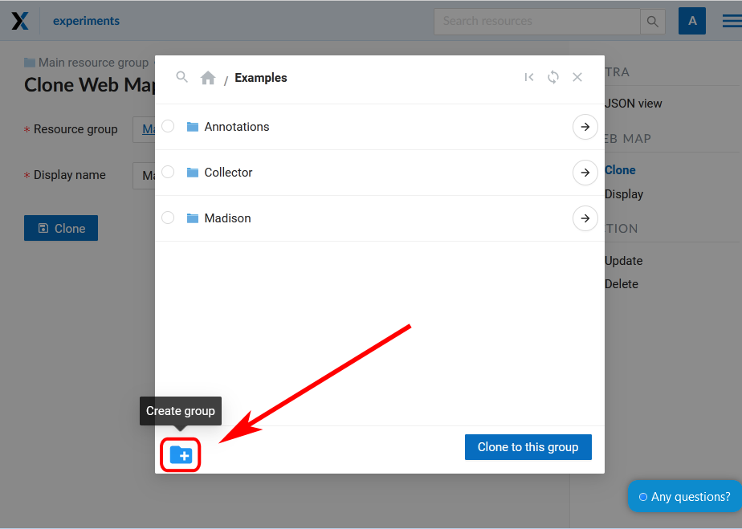

.. sectionauthor:: Юлия Григоренко <grigorenko.j@gmail.com>

.. _ngcom_webmap_clone:

How to clone (copy) a Web Map
======================================

With NextGIS you can copy a Web Map within a Web GIS by using Cloning. The copy will have the same parameters and layers.
To clone a map, first open its resource page. Select "Clone" in the actions pane on the right.

   Selecting "Clone" action

A page with cloning settings will open. You can set a name for the new Web Map. By default it's the name of the original Web Map with an added number, "(1)", "(2)" etc.
Also you need to choose the group for the copy. By default it's the group containing the original Web Map.

   
   "Clone Web Map" page
   
If all the parameters are correct, press "Clone". A copy of the map will be created.
After the cloning process is completed successfully you will be redirected to "Update resource" page where you can change the settings of the newly created copy.

.. _ngcom_webmap_clone_select:

How to select a target group
------------------------------

If you wish to create a copy in a different folder, press the magnifying glass icon at the end of the "Resource group" field.

.. figure:: _static/webmap_clone_group_select_en.png
   :name: webmap_clone_group_select_pic
   :align: center
   :width: 20cm
   
   Opening the group selection window
   
A pop-up window of group selection will open. 

In this window you can use a search bar. Click the magnifying glass in the top left corner (see :numref:`webmap_clone_selected_group_pic` item 1) and start entering the name of the group you want to find. 

To go up in the resource tree, click the path indicated in the top panel of the window. To open a folder from the list, click the arrow icon on the right (see :numref:`webmap_clone_selected_group_pic` item 4).

If you want to return to the group containing the original Web Map, click the icon **|<** in the top right corner (see :numref:`webmap_clone_selected_group_pic` item 2).

To select the group as the destination for the copy, click the circle to the left of its name (see :numref:`webmap_clone_selected_group_pic` item 3), a blue dot marker will appear. Then press "Clone to selected group".

   
   Group selection window. 1 - search and the path to the opened group; 2 - return to the initial group, refresh the resource tree, close window; 3 - option button to select a group; 4 - open the group; 5 - create new group; 6 - clear selection; 7 - complete group selection

Another way is to open the group and press "Clone to this group". If no group is marked, a copy will be created in the group that is currently open. 

   
   A group open in the group selection window

Use this way to copy a Web Map to the main resource group (marked by a house icon in the path panel).

.. _ngcom_webmap_clone_new:

How to clone to a new group
--------------------------------------

If you need to create a new group, click on the folder icon with a plus in the bottom left corner of the pop-up window.

   
   Selecting "Create group" action
   
A field will appear where you need to enter the name for the new group. To confirm group creation click the blue button with a tick.

   
   Creating new group
   
The group witll appear in the list.
New group is created inside the group that is open in the window.
