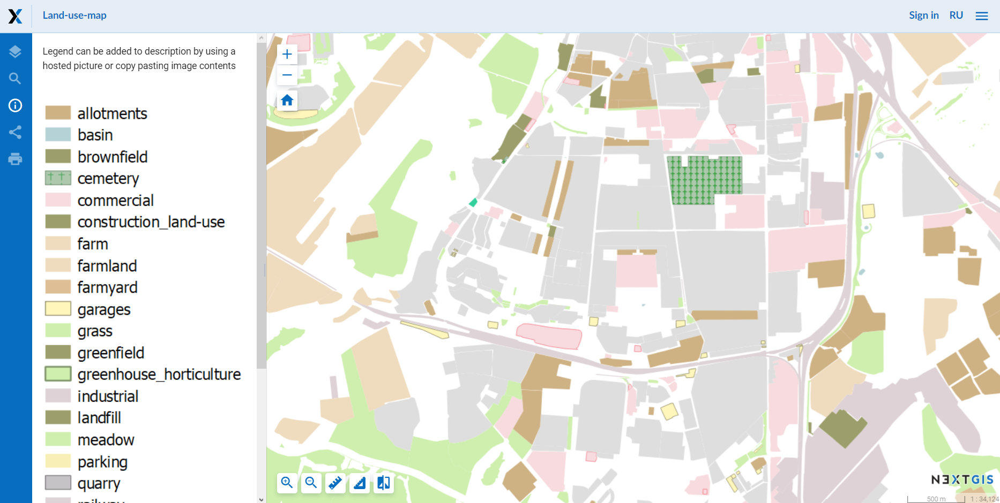

.. _ngcom_webmap_create:

How to create web map
===================================

:ref:`Web GIS <ngcom_description>` allows you to display geodata on Web map and view it through built-in :ref:`web client <ngw_webmaps_client>`.

Create Web map 
----------------------------

.. warning:: 
	Make sure all :ref:`Vector layers <ngcom_vector_layer>`, :ref:`Raster layers <ngcom_raster_layer>` and :ref:`PostGIS layers <ngcom_postgis_layer>` which you want to display on Web map have :ref:`Styles <ngcom_styles>` created for them.

.. note:: 
	Your Web GIS already has one ready-to-use Web map. You can use it for geodata visualization or create an unlimited number of new Web maps. By default there's one basemap added to this Web map - OpenStreetMap Standard. As soon as you add any other additional basemap to the Web map, OpenStreetMap Standard will switch off.

#. Open :ref:`Resource group <ngcom_resources_group>` where you want to create Web map (by default from the main page of Web GIS you can access Main resource group);
#. Select :menuselection:`Create resource --> Web map` on the right side of Web GIS :ref:`admin console <ngw_admin_interface>`;
#. In the opened dialog fill in the field :guilabel:`Display name` in :guilabel:`Resource` tab;
#. Set Web map :term:`extent` in :guilabel:`Extent and bookmarks` tab (optional);
#. Go to :guilabel:`Layers` tab and using :guilabel:`Add layer` dialog window select those resources (:ref:`Basemaps <ngcom_basemap_layer>`, :ref:`Styles <ngcom_styles>` or :ref:`WMS layers <ngcom_wms_layer>`) which you want to display on your Web map;
#. Select layers one-by-one using a layer tree and set their properties in the right section of the dialog window. For :ref:`WMS layers <ngcom_wms_layer>` it is recommended to select :guilabel:`Image` as an adapter. If you select :guilabel:`Tiles` adapter, you will quickly use up all available connections and other layers on the map will not be shown until these connections are free again.
#. Press :guilabel:`Create` button. If Web map is created successfully you'll see its name in :guilabel:`Child resources` pane of the relevant Resource group.

.. note:: 
	You can set the content of geodata attributes displayed on Web map in Vector layers and PostGIS layers settings. Read more about this option :ref:`here <ngw_attributes>`.

.. note:: 
	When data is uploaded to Web GIS :ref:`with desktop app NextGIS QGIS <ngcom_ngqgis_connect_data_upload>` Web map can be created automatically.

Read more about Web map creation :ref:`here <ngw_webmaps_admin>`.

Open Web map
--------------------------------------------------

#. Go to the Properties window of Web map from the relevant :ref:`Resource group <ngcom_resources_group>`;
#. Select :menuselection:`Web map --> Display` on the right side of Web GIS :ref:`admin console <ngw_admin_interface>`. Web map will open in a web client which allows to view and edit geodata.

Read more about Web map web client :ref:`here <ngw_webmaps_client>`.

.. warning::
    We do not recommend turning on more than 1 :ref:`WMS layer <ngcom_wms_layer>` on Free plan and 3 WMS layers on Mini/Premium plan. Otherwise slow connections with external WMS servers might use up all available similtaneous connections which will considerable slow down (or even stop) work of all your Web maps and :ref:`admin console <ngw_admin_interface>`.

Add a description and map legend
--------------------------------

#. Open :ref:`Resource group <how-to-manage-data-storage>` containing Web map;
#. Click on **Update** (pencil icon) next to your Web map;
#. Switch to **Description** tab, set descriptive text, hyperlinks and insert image of map legend via URL or paste it from a clipboard;
#. Click on **Save** button;
#. Display Web map. Menu bar with **Description** button (*info* icon) is located on the left side of the workspace. Information reflects the description you've just set;
#.  To share Web map with description open, copy link from browser address bar. Link should end with **panel=info**. Following such link will load a Web map with description opened.

 `Example <https://demo.nextgis.com/resource/5201/display?panel=info>`_ of a Web map showing a legend.

   
   Description and legend of a Web map
