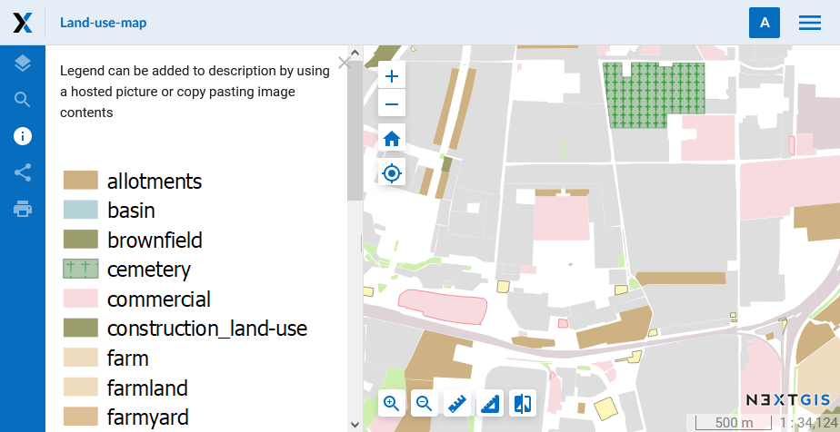

.. _ngcom_webmap_create:

How to create a Web Map
===================================

:ref:`Web GIS <ngcom_description>` allows you to display geodata on Web Map and view it through built-in :ref:`web client <ngw_webmaps_client>`.

Create Web Map 
----------------------------

.. warning:: 
	Make sure all :ref:`Vector layers <ngcom_vector_layer>`, :ref:`Raster layers <ngcom_raster_layer>` and :ref:`PostGIS layers <ngcom_postgis_layer>` which you want to display on the new Web Map have :ref:`Styles <ngcom_styles>` created for them.

.. note:: 
	Your Web GIS already has one ready-to-use Web Map. You can use it for geodata visualization or create an unlimited number of new Web Maps. By default there's one basemap added to this Web Map - OpenStreetMap Standard. As soon as you add any other additional basemap to the Web Map, OpenStreetMap Standard will switch off.

#. Open :ref:`Resource group <ngcom_resources_group>` where you want to create Web Map (by default, from the main page of Web GIS you access the Main resource group);
#. Select :menuselection:`Create resource --> Web Map` on the right side of Web GIS :ref:`admin console <ngw_admin_interface>`;
#. In the opened dialog, go to :guilabel:`Resource` tab and type a name for the new Web Map in the field :guilabel:`Display name`;
#. Set Web Map :term:`extent` in the tab :guilabel:`Extent and Bookmarks` (optional);
#. Go to :guilabel:`Layers` tab and using :guilabel:`Add layer` dialog window select the resources (:ref:`Basemaps <ngcom_basemap_layer>`, :ref:`Styles <ngcom_styles>` or :ref:`WMS layers <ngcom_wms_layer>`) which you want to display on your Web Map;
#. Select layers one-by-one using a layer tree and set their properties in the right section of the dialog window. For :ref:`WMS layers <ngcom_wms_layer>` it is recommended to select :guilabel:`Image` as an adapter. If you select :guilabel:`Tiles` adapter, you will quickly use up all available connections and other layers on the map will not be shown until these connections are free again.
#. The :guilabel:`Settings` tab is used to allow layer editing and enable annotations
#. Press :guilabel:`Create` button. If Web Map is created successfully, you'll see its name in :guilabel:`Child resources` pane of the relevant Resource group.

.. note:: 
	You can set the content of geodata attributes displayed on the Web Map in Vector layers and PostGIS layers settings. Read more about this option :ref:`here <ngw_attributes_edit>`.

.. note:: 
	When data is uploaded to Web GIS :ref:`with desktop app NextGIS QGIS <qgis_project>`, a Web Map can be created automatically.

Read more about Web Map creation :ref:`here <ngw_webmaps_admin>`.

Open Web Map
--------------------------------------------------

#. Go to the Properties window of the created Web Map from the relevant :ref:`Resource group <ngcom_resources_group>`;
#. Select :menuselection:`Web Map --> Display` on the right side of Web GIS :ref:`admin console <ngw_admin_interface>`. Web Map will open in a web client which allows to view and edit geodata.

Read more about Web Map web client :ref:`here <ngw_webmaps_client>`.

.. warning::
    We do not recommend turning on more than 1 :ref:`WMS layer <ngcom_wms_layer>` on Free/Mini plan and 3 WMS layers on Premium plan. Otherwise slow connections with external WMS servers might use up all available similtaneous connections, slowing down considerably (or stopping altogher) the rendering of all your Web Maps and making :ref:`admin console <ngw_admin_interface>` unavailable.

Add a description and map legend
--------------------------------

#. Open :ref:`Resource group <how-to-manage-data-storage>` containing the Web Map;
#. Click on **Update** (pencil icon) next to your Web Map;
#. Switch to **Description** tab, set descriptive text, hyperlinks and insert a map legend image via URL or paste it from the clipboard;
#. Click on **Save** button;
#. Display Web Map. Menu bar with **Description** button (*info* icon) is located on the left side of the workspace. Information presented there reflects the description you've just set;
#.  To share Web Map with the description open, copy the link from your browser address bar. The link should end with **panel=info**. Clicking on such a link will load a Web Map with description opened.

`Example <https://demo.nextgis.com/resource/5201/display?panel=info>`_ of a Web Map showing a legend.

   
   Description and legend for a Web Map
