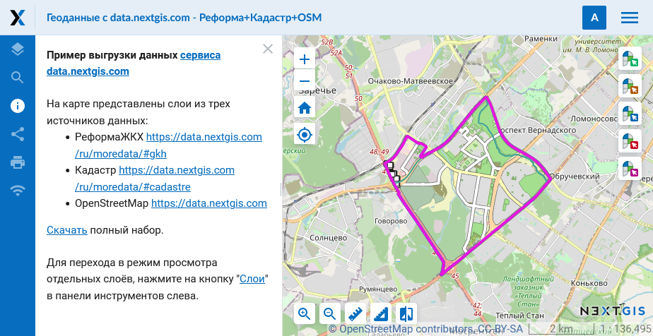

.. _ngcom_webmap:

Как создать Веб-карту
=====================

:ref:`Веб ГИС <ngcom_description>` позволяет отображать геоданные на Веб-карте и просматривать их через встроенный `веб-клиент <https://docs.nextgis.ru/docs_ngweb/source/webmaps_client.html>`_.

.. _ngcom_webmap_create:

Создаём Веб-карту 
-----------------

.. warning:: 
	Убедитесь, что у всех `Векторных слоев <https://docs.nextgis.ru/docs_ngweb/source/layers.html#ngw-create-vector-layer>`_, `Растровых слоев <https://docs.nextgis.ru/docs_ngweb/source/layers.html#ngw-create-raster-layer>`_ и `Слоев PostGIS <https://docs.nextgis.ru/docs_ngweb/source/postgis_details.html#ngw-create-postgis-layer>`_, которые вы хотите добавить на Веб-карту, созданы `Стили <https://docs.nextgis.ru/docs_ngweb/source/mapstyles.html>`_.

.. note:: 
	По умолчанию в вашей Веб ГИС уже создана одна Веб-карта. Вы можете использовать её для отображения и просмотра геоданных, а также создавать неограниченное количество новых Веб-карт. По умолчанию на этой Веб-карте подключена подложка OpenStreetMap Standard. При добавлении на Веб-карту хотя бы одной дополнительной подложки OpenStreetMap Standard отключается.

#. Откройте `Группу ресурсов <https://docs.nextgis.ru/docs_ngweb/source/create_resource.html#ngw-resource-group>`_, в которой вы хотите создать Веб-карту (на главной странице Веб ГИС по умолчанию открыта Основная группа ресурсов);
#. Нажмите кнопку **Создать ресурс** и выберите во всплывающем окне тип ресурса "Веб-карта";
#. В открывшемся окне заполните поле :guilabel:`Наименование` на вкладке :guilabel:`Ресурс`;
#. Перейдите на вкладку :guilabel:`Слои` и через диалог :guilabel:`+ Слой` выберите те ресурсы (`Подложки <https://docs.nextgis.ru/docs_ngweb/source/webmaps_admin.html#ngw-create-basemap>`_, `Стили <https://docs.nextgis.ru/docs_ngweb/source/mapstyles.html>`_ или `Слои WMS <https://docs.nextgis.ru/docs_ngweb/source/connections.html#ngw-create-layer-wms>`_) и `TMS <https://docs.nextgis.ru/docs_ngweb/source/connections.html#ngw-tms-layer>`_, которые вы хотите отобразить на своей Веб-карте;
#. Последовательно выбирая слои в дереве слева, настройте их свойства в панели справа. Для `WMS-слоёв <https://docs.nextgis.ru/docs_ngweb/source/connections.html#ngw-create-layer-wms>`_ рекомендуется в качестве адаптера выбрать :guilabel:`Изображение`. В противном случае (если будет выбран адаптер :guilabel:`Тайлы`) вы быстро исчерпаете лимит на одновременные соединения и остальные слои на карте перестанут отрисовываться до тех пор, пока они не освободятся.
#. На вкладке :guilabel:`Настройки` можно разрешить редактирование слоев и включить аннотации, задать начальный :term:`охват <Охват>` веб-карты и её заголовок, если он должен отличаться от наименования ресурса.
#. Нажмите кнопку **Создать**. Если Веб-карта создалась успешно, то информация о ней появится в блоке :guilabel:`Дочерние ресурсы` соответствующей Группы ресурсов.

.. note:: 
	Вы можете настроить содержание атрибутивной информации, отображаемой на Веб-карте, через настройки Векторных слоев и Слоев PostGIS. Подробнее об этой возможности - :ref:`здесь <ngw_attributes>`.

.. note:: 
	При загрузке данных в Веб ГИС :ref:`с помощью настольного приложения NextGIS QGIS <qgis_project>` Веб-карта может создаваться автоматически.

Больше информации о создании Веб-карт - `здесь <https://docs.nextgis.ru/docs_ngweb/source/webmaps_admin.html>`_.

.. _ngcom_webmap_create_open:

Открываем Веб-карту
-------------------

#. Перейдите в окно свойств созданной Веб-карты из соответствующей `Группы ресурсов <https://docs.nextgis.ru/docs_ngweb/source/create_resource.html#ngw-resource-group>`_;
#. Выберите :menuselection:`Веб-карта --> Открыть` на правой панели :ref:`веб-интерфейса <ngw_admin_interface>` Веб ГИС. Откроется веб-клиент, через который можно просматривать и редактировать геоданные на веб-карте.

Больше информации о веб-клиенте для просмотра карт - `здесь <https://docs.nextgis.ru/docs_ngweb/source/webmaps_client.html>`__.

.. warning::
    Не рекомендуется одновременно включать (делать видимыми) более 1 `слоя WMS <https://docs.nextgis.ru/docs_ngweb/source/connections.html#ngw-create-layer-wms>`_ на планах Free/Mini и более 3 на плане Premium, поскольку в этом случае медленные соединения с внешними :term:`WMS`-серверами займут все доступные одновременные соединения, и остальные слои карты будет нечем отрисовывать (доступ к `веб-интерфейсу <ngw_admin_interface>` в этом случае также будет невозможен).

.. _ngcom_webmap_create_info:

Настраиваем описание
------------------------------

#. Откройте `Группу ресурсов <https://docs.nextgis.ru/docs_ngweb/source/create_resource.html#ngw-resource-group>`_, где находится Веб-карта;
#. Нажмите кнопку **Изменить** (иконка карандаша) напротив ресурса Веб-карты;
#. Перейдите на вкладку **Описание**, задайте текстовое описание, гиперссылки, вставьте изображение легенды с помощью URL или сохраненного в буфере обмена изображения;
#. Нажмите кнопку :guilabel:`Сохранить`;
#. Откройте Веб-карту. В левой части рабочей области находится панель **Описание** (иконка информации - кружок с буквой i). Информация в этой панели будет соответствовать заданной через настройки Веб-карты.
#. Чтобы поделиться Веб-картой с открытым описанием, скопируйте ссылку из адресной строки браузера. Ссылка должна заканчиваться на **panel=info**. При переходе по такой ссылке откроется Веб-карта сразу с полным описанием.

`Пример <https://demo.nextgis.ru/resource/5467/display?panel=info>`_  Веб-карты с легендой.

   
   Описание и легенда Веб-карты

Легенда также отображается в дереве слоёв, о том, как настроить её вид, можно прочитать `в отдельном разделе <https://docs.nextgis.ru/docs_ngcom/source/legend.html>`_.
