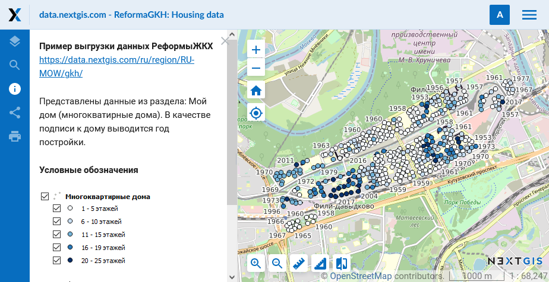

.. _ngcom_webmap_create:

Как создать Веб-карту
=====================

:ref:`Веб ГИС <ngcom_description>` позволяет отображать геоданные на Веб-карте и просматривать их через встроенный :ref:`веб-клиент <ngw_webmaps_client>`.

Создаём Веб-карту 
-----------------

.. warning:: 
	Убедитесь, что у всех :ref:`Векторных слоев <ngcom_vector_layer>`, :ref:`Растровых слоев <ngcom_raster_layer>` и :ref:`Слоев PostGIS <ngcom_postgis_layer>`, которые вы хотите добавить на Веб-карту, созданы :ref:`Стили <ngcom_styles>`.

.. note:: 
	По умолчанию в вашей Веб ГИС уже создана одна Веб-карта. Вы можете использовать её для отображения и просмотра геоданных, а также создавать неограниченное количество новых Веб-карт. По умолчанию на этой Веб-карте подключена подложка OpenStreetMap Standard. При добавлении на Веб-карту хотя бы одной дополнительной подложки OpenStreetMap Standard отключается.

#. Откройте :ref:`Группу ресурсов <ngcom_resources_group>`, в которой вы хотите создать Веб-карту (на главной странице Веб ГИС по умолчанию открыта Основная группа ресурсов);
#. Выберите :menuselection:`Создать ресурс --> Веб-карта` на правой панели :ref:`веб-интерфейса <ngw_admin_interface>` Веб ГИС;
#. В открывшемся окне заполните поле :guilabel:`Наименование` на вкладке :guilabel:`Ресурс`;
#. Задайте начальный :term:`охват <Охват>` веб-карты на вкладке :guilabel:`Охват и закладки` (необязательно);
#. Перейдите на вкладку :guilabel:`Слои` и через диалог :guilabel:`Добавить слой` выберите те ресурсы (:ref:`Подложки <ngcom_basemap_layer>`, :ref:`Стили <ngcom_styles>` или :ref:`Слои WMS <ngcom_wms_layer>`), которые вы хотите отобразить на своей Веб-карте;
#. Последовательно выбирая слои в дереве слева, настройте их свойства в панели справа. Для :ref:`WMS-слоёв <ngcom_wms_layer>` рекомендуется в качестве адаптера выбрать :guilabel:`Изображение`. В противном случае (если будет выбран адаптер :guilabel:`Тайлы`) вы быстро исчерпаете лимит на одновременные соединения и остальные слои на карте перестанут отрисовываться до тех пор, пока они не освободятся.
#. На вкладке :guilabel:`Настройки` можно разрешить редактирование слоев и включить аннотации.
#. Нажмите кнопку :guilabel:`Создать`. Если Веб-карта создалась успешно, то информация о ней появится в блоке :guilabel:`Дочерние ресурсы` соответствующей Группы ресурсов.

.. note:: 
	Вы можете настроить содержание атрибутивной информации, отображаемой на Веб-карте, через настройки Векторных слоев и Слоев PostGIS. Подробнее об этой возможности - :ref:`здесь <ngw_attributes>`.

.. note:: 
	При загрузке данных в Веб ГИС :ref:`с помощью настольного приложения NextGIS QGIS <qgis_project>` Веб-карта может создаваться автоматически.

Больше информации о создании Веб-карт - :ref:`здесь <ngw_webmaps_admin>`.

Открываем Веб-карту
-------------------

#. Перейдите в окно свойств созданной Веб-карты из соответствующей :ref:`Группы ресурсов <ngcom_resources_group>`;
#. Выберите :menuselection:`Веб-карта --> Открыть` на правой панели :ref:`веб-интерфейса <ngw_admin_interface>` Веб ГИС. Откроется веб-клиент, через который можно просматривать и редактировать геоданные на веб-карте.

Больше информации о веб-клиенте для просмотра карт - :ref:`здесь <ngw_webmaps_client>`.

.. warning::
    Не рекомендуется одновременно включать (делать видимыми) более 1 :ref:`слоя WMS <ngcom_wms_layer>` на планах Free/Mini и более 3 на плане Premium, поскольку в этом случае медленные соединения с внешними :term:`WMS`-серверами займут все доступные одновременные соединения, и остальные слои карты будет нечем отрисовывать (доступ к :ref:`веб-интерфейсу <ngw_admin_interface>` в этом случае также будет невозможен).

Настраиваем описание и легенду
-------------------------------

#. Откройте :ref:`Группу ресурсов <ngcom_resources_group>`, где находится Веб-карта;
#. Нажмите кнопку **Изменить** (иконка карандаша) напротив ресурса Веб-карты;
#. Перейдите на вкладку **Описание**, задайте текстовое описание, гиперссылки, вставьте изображение легенды с помощью URL или сохраненного в буфере обмена изображения;
#. Нажмите кнопку :guilabel:`Сохранить`;
#. Откройте Веб-карту. В левой части рабочей области находится панель **Описание** (иконка информации - кружок с буквой i). Информация в этой панели будет соответствовать заданной через настройки Веб-карты.
#. Чтобы поделиться Веб-картой с открытым описанием, скопируйте ссылку из адресной строки браузера. Ссылка должна заканчиваться на **panel=info**. При переходе по такой ссылке откроется Веб-карта сразу с полным описанием.

`Пример <https://demo.nextgis.com/resource/5467/display?panel=info>`_  Веб-карты с легендой.

   
   Описание и легенда Веб-карты
