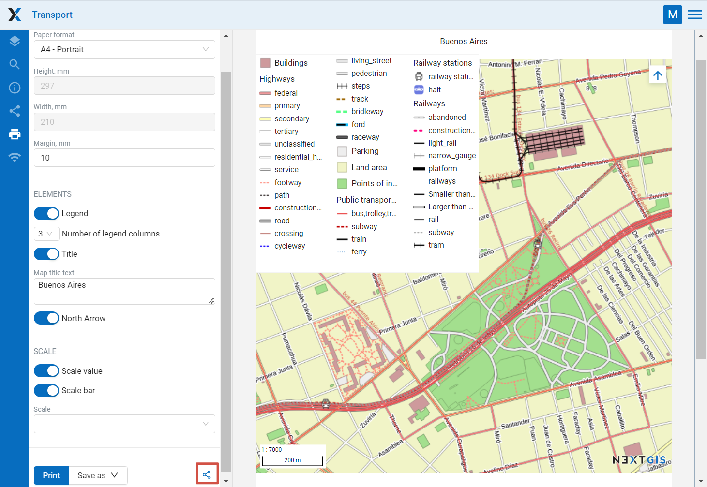

.. _ngcom_webmap_print:

How to print a Web Map
=========================

:ref:`Web GIS <ngcom_description>` allows to print a Web Map or save it as a picture. To do it: 

1. Go to the Properties window of Web Map from the relevant Resource group;
2. Select Web Map ‣ Display on the right side of Web GIS admin console;
3. In the opened web client, which allows to view and edit geodata, press the "Print map" button (see :numref:`ngweb_webmap_client_print`).
 
.. figure:: _static/webmap_client_print_eng_2.png
   :name: ngweb_webmap_client_print
   :align: center
   :width: 20cm
   
   "Print map" button
 
In the opened window you can select the area you would like to print and set up printing parameters:

* Paper format (A3, A4 or custom);
* Margins;
* Scale.

You can also add:

* Legend (includes visible layers of expanded groups if their legend is expanded, it is set up in the Layers tab);
* Title (can be edited, the default is the Web Map resource name);
* North arrow;
* Scale value;
* Scale bar.

The size and placement of the title, the legend and the map itself can be changed.

   
   Printing parameters
   
After you set all parameters press **Print**. 

You can also share the map prepared for printing with all the parameters. Click on the |button_share| symbol (marked in red on the :numref:`ngweb_webmap_client_print2`) to copy the link. Upon opening this link you'll get the same setup and print the map as needed.

.. |button_share| image:: _static/button_share.png

To save a map as a picture press **Save as** and choose a format from the list: JPEG, PNG, TIFF or PDF. Then uploading will begin automatically.

.. figure:: _static/saved_map_en.png
   :name: saved_map_pic
   :align: center
   :width: 20cm 
   
   Example of a Web Map saved as a PNG image
